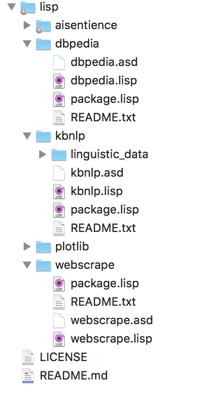

# Appendix A - My Common Lisp Development Setup

I spend some effort getting my Common Lisp development system setup for my tastes. Hopefully you will find some good ideas here that will help you customize your development system.

## Setup for Local Quicklisp Projects {#qlconfig}

I created my setup from a [blog article written by Zach Beane](https://xach.livejournal.com/278047.html). Please read Zach's blog article before continuing to read my setup notes here.

I configure ASDF2 and Quicklisp to look for all of my local Common Lisp projects in my github repo directory common-lisp/lisp; my ~/.config/common-lisp/source-registry.conf.d/projects.conf file looks like:

{lang="lisp",linenos=off}
~~~~~~~~
(:tree
 (:home "GITHUB/common-lisp/lisp/")
)
~~~~~~~~

In my home directory I keep all of my github repos in ~/GITHUB. Here is what my GITHUB/common-lisp/lisp directory looks like at the moment I am writing this:

{width: "80%"}

Note that except for the project for my web site [AIsentience.net](http://aisentience.net), all the libraries in the last figure are from this book.

As an example, from any directory on my laptop I can access any libraries stored as subdirectories of my ~/GITHUB/common-lisp/lisp directory:

{lang="lisp",linenos=off}
~~~~~~~~
  (ql:quickload "plotlib")
  (plotlib:plot-string "test 1 2 3")
  (plotlib:with-canvas (:width 90 :height 90)
    (plotlib:plot-string 10 65 "test 1 2 3")
    (plotlib:save-png "test1.png)))
~~~~~~~~

TBD: fix last example

## Load Data Files Relative to Path of Source File that Uses Data

When you want to use your Common Lisp projects as libraries (e.g., with Quicklisp) there is a potential problem if your code requires static data files. I like to get the directory of the current source file and then use relative path offsets to find data files. For example, in my plotting library in the source file plotlib.lisp I get the current source directory:

{lang="lisp",linenos=off}
~~~~~~~~
(defvar base-pathname-pl #.(or *compile-file-truename* *load-truename*))
(defvar a1 (write-to-string base-pathname-pl))
(defvar *current-directory-pl* (subseq a1 3 (- (length a1) 13)))
~~~~~~~~

Note that this code works both for loading plotlib as a source file and for compiling the source code before loading. Now, when I need access to the font files used by plotlib I then have the correct directory path:

{lang="lisp",linenos=off}
~~~~~~~~
(defun plot-string(x y str)
  (let ((font (get-font
                  (concatenate 'string
                     *current-directory-pl*
                     "OpenSans-Regular.ttf"))))
    (set-font font 12)
    (set-rgb-fill 0 0 0)
    (draw-string x y str)))
~~~~~~~~

I also use this trick for the linguistic files used in the KBnlp example code in this book.
