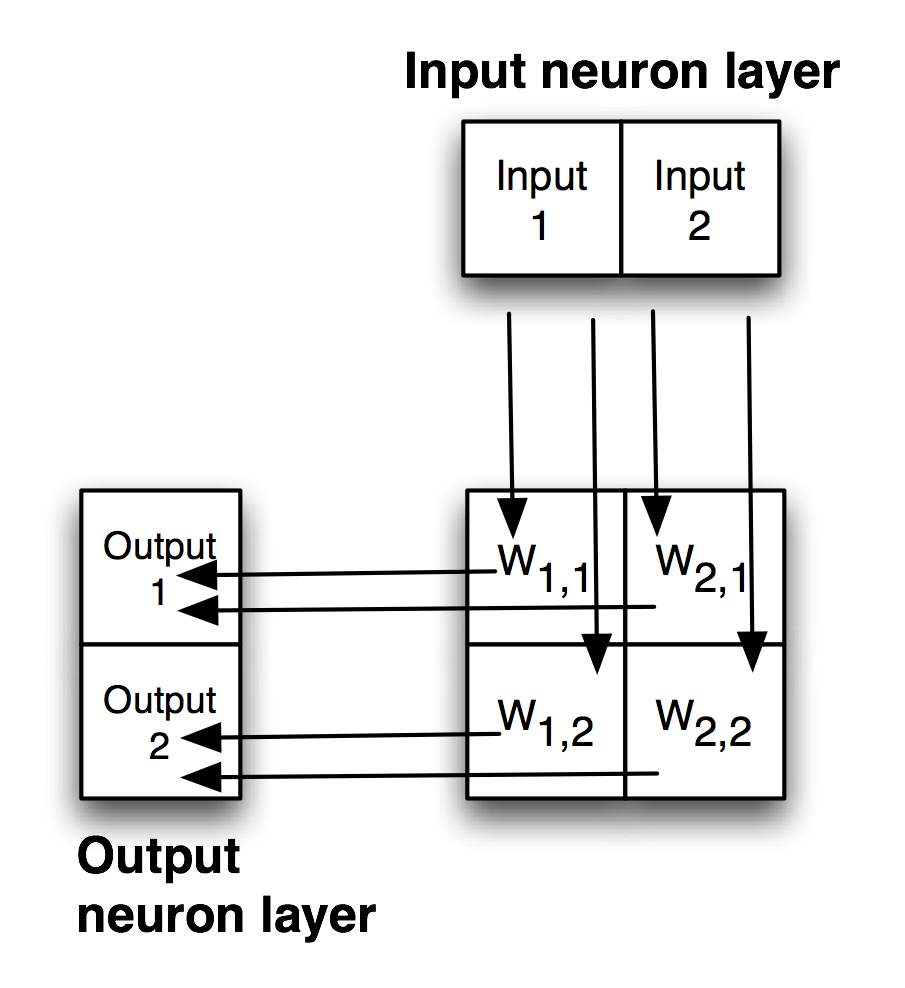
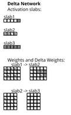

# Backpropagation Neural Networks {#backprop}

Let's start with an overview of how these networks work and then fill in more detail later. Backpropagation networks are trained by applying training inputs to the network input layer, propagate values through the network to the output neurons, compare the errors (or differences) between these propagated output values and the training data output values. These output errors are backpropagated though the network and the magnitude of backpropagated errors are used to adjust the weights in the network.

The example we look at here uses the **plotlib** package from an earlier chapter and the source code for the example is the file **loving_snippet/backprop_neural_network.lisp**.

We will use the following diagram to make this process more clear. There are four weights in this very simple network:

- W^1,1^ is the floating point number representing the connection strength between input_neuron^1^ and output_neuron^1^
- W^2,1^ connects input_neuron^2^ to output_neuron^1^
- W^1,2^ connects input_neuron^1^ to output_neuron^2^
- W^2,2^ connects input_neuron^2^ to output_neuron^2^

{width: "80%"}

Before any training the weight values are all small random numbers.

Consider a training data element where the input neurons have values [0.1, 0.9] and the desired output neuron values are [0.9 and 0.1], that is flipping the input values. If the propagated output values for the current weights are [0.85, 0.5] then the value of the first output neuron has a small error abs(0.85 - 0.9) which is 0.05. However the propagated error of the second output neuron is high: abs(0.5 - 0.1) which is 0.4. Informally we see that the weights feeding input output neuron 1 (W^1,1^ and W^2,1^) don't need to be changed much but the neuron that feeding input neuron 2 (W^1,2^ and W^2,2^) needs modification (the value of W^2,2^ is too large).

Of course, we would never try to manually train a network like this but it is important to have at least an informal understanding of how weights connect the flow of value (we will call this activation value later) between neurons.

In this neural network see in the first figure we have four weights connecting the input and output neurons. Think of these four weights forming a four-dimensional space where the range in each dimension is constrained to small positive and negative floating point values. At any point in this "weight space", the numeric values of the weights defines a model that maps the inputs to the outputs. The error seen at the output neurons is accumulated for each training example (applied to the input neurons). The training process is finding a point in this four-dimensional space that has low errors summed across the training data. We will use gradient descent to start with a random point in the four-dimensional space (i.e., an initial random set of weights) and move the point towards a local minimum that represents the weights in a model that is (hopefully) "good enough" at representing the training data.

This process is simple enough but there are a few practical considerations:

- Sometimes the accumulated error at a local minimum is too large even after many training cycles and it is best to just restart the training process with new random weights.
- If we don't have enough training data then the network may have enough memory capacity to memorize the training examples. This is not what we want: we want a model with just enough memory capacity (as represented by the number of weights) to form a generalized predictive model, but not so specific that it just memorizes the training examples. The solution is to start with small networks (few hidden neurons) and increase the number of neurons until the training data can be learned. In general, having a lot of training data is good and it is also good to use as small a network as possible.

In practice using backpropagation networks is an iterative process of experimenting with the size of a network.

In the example program (in the file *backprop_neural_network.lisp*) we use the plotting library developed earlier to visualize neuron activation and connecting weight values while the network trains.

The following three screen shots from running the function **test3** defined at the bottom of the file *backprop_neural_network.lisp* illustrate the process of starting with random weights, getting random outputs during initial training, and as delta weights are used to adjust the weights in a network, then the training examples are learned:

{width: "80%"}

In the last figure the initial weights are random so we get random mid-range values at the output neurons.

{width: "80%"}

As we start to train the network, adjusting the weights, we start to see variation in the output neurons as a function of what the inputs are.

{width: "80%"}

In the last figure the network is trained sufficiently well to map inputs [0, 0, 0, 1] to output values that are approximately [0.8, 0.2, 0.2, 0.3] which is close to the expected value [1, 0, 0, 0].

The example source file *backprop_neural_network.lisp* is long so we will only look at the more interesting parts here. Specifically we will not look at the code to plot neural networks using **plotlib**.

The activation values of individual neurons are limited to the range [0, 1] by first calculating their values based on the sum activation values of neurons in the previous layer times the values of the connecting weights and then using the **Sigmoid** function to map the sums to the desired range. The Sigmoid function and the derivative of the **Sigmoid** function (**dSigmoid**) look like:

{width: "60%"}

Here are the definitions of these functions:

{lang="lisp",linenos=off}
~~~~~~~~
(defun Sigmoid (x)
  (/ 1.0 (+ 1.0 (exp (- x)))))

(defun dSigmoid (x)
  (let ((temp (Sigmoid x)))
    (* temp (- 1.0 temp)))
~~~~~~~~

The function **NewDeltaNetwork** creates a new neual network object. This code allocates storage for input, hidden, output layers (I sometimes refer to neuron layers as "slabs"), and the connection weights. Connection weights are initialized to small random values.

{lang="lisp",linenos=on}
~~~~~~~~
; (NewDeltaNetwork sizeList)
;       Args:   sizeList = list of sizes of slabs. This also defines
;                          the number of slabs in the network.
;                          (e.g.,  '(10 5 4) ==> a 3-slab network with 10
;                           input neurons, 5 hidden neurons, and 4 output
;                           neurons).
;
;       Returned value = a list describing the network:
;          (nLayers sizeList
;           (activation-array[1] .. activation-array[nLayers])
;           (weight-array[2] .. weight-array[nLayers])
;           (sum-of-products[2] .. sum-of-products[nLayers[nLayers])
;           (back-prop-error[2] .. back-prop-error[nLayers]))
;           (old-delta-weights[2] .. for momentum term

                                       :initial-element 0.0))
           (reverse old-dw-list)))

    ;;
     ;  Initialize values for all activations:
     ;;
    (mapc
     (lambda (x)
        (let ((num (array-dimension x 0)))
          (dotimes (n num)
            (setf (aref x n) (frandom 0.01 0.1)))))
     a-list)

    ;;
     ;  Initialize values for all weights:
     ;;
    (mapc
     (lambda (x)
        (let ((numI (array-dimension x 0))
              (numJ (array-dimension x 1)))
          (dotimes (j numJ)
            (dotimes (i numI)
              (setf (aref x i j) (frandom -0.5 0.5))))))
     w-list)
    (list numLayers sizeList a-list s-list w-list dw-list
          d-list old-dw-list alpha beta)))
~~~~~~~~

In the following listing the function **DeltaLearn** processes one pass through all of the training data. Function **DeltaLearn** is called repeatedly until the return value is below a desired error threshold. The main loop over each training example is implemented in lines 69-187. Inside this outer loop there are two phases of training for each training example: a forward pass propagating activation from the input neurons to the output neurons via any hidden layers (lines 87-143) and then the weight correcting backpropagation of output errors while making small adjustments to weights (lines 148-187):

{lang="lisp",linenos=on}
~~~~~~~~
;;
 ;  Utility function for training a delta rule neural network.
 ;  The first argument is the name of an output PNG plot file
 ;  and a nil value turns off plotting the network during training.
 ;  The second argument is a network definition (as returned from
 ;  NewDeltaNetwork), the third argument is a list of training
 ;  data cases (see the example test functions at the end of this
 ;  file for examples.
 ;;

(defun DeltaLearn (plot-output-file-name
		   netList trainList)
  (let ((nLayers (car netList))
        (sizeList (cadr netList))
        (activationList (caddr netList))
        (sumOfProductsList (car (cdddr netList)))
        (weightList (cadr (cdddr netList)))
        (deltaWeightList (caddr (cdddr netList)))
        (deltaList (cadddr (cdddr netList)))
        (oldDeltaWeightList (cadddr (cdddr (cdr netList))))
        (alpha (cadddr (cdddr (cddr netList))))
        (beta (cadddr (cdddr (cdddr netList))))
        (inputs nil)
        (targetOutputs nil)
        (iDimension nil)
        (jDimension nil)
        (iActivationVector nil)
        (jActivationVector nil)
        (n nil)
        (weightArray nil)
        (sumOfProductsArray nil)
        (iDeltaVector nil)
        (jDeltaVector nil)
        (deltaWeightArray nil)
        (oldDeltaWeightArray nil)
        (sum nil)
        (iSumOfProductsArray nil)
        (error nil)
        (outputError 0)
        (delta nil)
        (eida nil)
        (inputNoise 0))

    ;;
     ; Zero out deltas:
     ;;
    (dotimes (n (- nLayers 1))
      (let* ((dw (nth n deltaList))
             (len1 (array-dimension dw 0)))
        (dotimes (i len1)
          (setf (aref dw i) 0.0))))

    ;;
     ; Zero out delta weights:
     ;;
    (dotimes (n (- nLayers 1))
      (let* ((dw (nth n deltaWeightList))
             (len1 (array-dimension dw 0))
             (len2 (array-dimension dw 1)))
        (dotimes (i len1)
          (dotimes (j len2)
            (setf (aref dw i j) 0.0)))))

    (setq inputNoise *delta-default-input-noise-value*)

    ;;
     ;  Main loop on training examples:
     ;;
    (dolist (tl trainList)

      (setq inputs (car tl))
      (setq targetOutputs (cadr tl))

      (if *delta-rule-debug-flag*
        (print (list "Current targets:" targetOutputs)))

      (setq iDimension (car sizeList)) ; get the size of the input slab
      (setq iActivationVector (car activationList)) ; input activations
      (dotimes (i iDimension) ; copy training inputs to input slab
        (setf
         (aref iActivationVector i)
         (+ (nth i inputs) (frandom (- inputNoise) inputNoise))))
      ;;
       ; Propagate activation through all of the slabs:
       ;;
      (dotimes (n-1 (- nLayers 1))  ; update layer i to layer flowing to layer j
        (setq n (+ n-1 1))
        (setq jDimension (nth n sizeList)) ; get the size of the j'th layer
        (setq jActivationVector (nth n activationList)) ; activation  for slab j
        (setq weightArray (nth n-1 weightList))
        (setq sumOfProductsArray (nth n-1 sumOfProductsList))
        (dotimes (j jDimension) ; process each neuron in slab j
          (setq sum 0.0) ; init sum of products to zero
          (dotimes (i iDimension) ; activation from neurons in previous slab
            (setq
             sum
             (+ sum (* (aref weightArray i j) (aref iActivationVector i)))))
          (setf (aref sumOfProductsArray j) sum) ; save sum of products
          (setf (aref jActivationVector j) (Sigmoid sum)))
        (setq iDimension jDimension)     ; reset index for next slab pair
        (setq iActivationVector jActivationVector))
      ;;
       ; Activation is  spread through the network and sum of products
       ; calculated. Now modify the weights in the network using back
       ; error propagation. Start by calculating the error signal for
       ; each neuron in the output layer:
       ;;
      (setq jDimension (nth (- nLayers 1) sizeList)) ; size of last layer
      (setq jActivationVector (nth (- nLayers 1) activationList))
      (setq jDeltaVector (nth (- nLayers 2) deltaList))
      (setq sumOfProductsArray (nth (- nLayers 2) sumOfProductsList))
      (setq outputError 0)
      (dotimes (j jDimension)
        (setq delta (- (nth j targetOutputs) (aref jActivationVector j)))
        (setq outputError (+ outputError (abs delta)))
        (setf
         (aref jDeltaVector j)
         (+
          (aref jDeltaVector j)
          (* delta (dSigmoid (aref sumOfProductsArray j))))))
      ;;
       ; Now calculate the backpropagated error signal for all hidden slabs:
       ;;
      (dotimes (nn (- nLayers 2))
        (setq n (- nLayers 3 nn))
        (setq iDimension (nth (+ n 1) sizeList))
        (setq iSumOfProductsArray (nth n sumOfProductsList))
        (setq iDeltaVector (nth n deltaList))
        (dotimes (i iDimension)
          (setf (aref iDeltaVector i) 0.0))
        (setq weightArray (nth (+ n 1) weightList))
        (dotimes (i iDimension)
          (setq error 0.0)
          (dotimes (j jDimension)
            (setq error
                  (+ error (* (aref jDeltaVector j) (aref weightArray i j)))))
          (setf
           (aref iDeltaVector i)
           (+
            (aref iDeltaVector i)
            (* error (dSigmoid (aref iSumOfProductsArray i))))))
        (setq jDimension iDimension)
        (setq jDeltaVector iDeltaVector))

      ;;
       ; Update all delta weights in the network:
       ;;
      (setq iDimension (car sizeList))
      (dotimes (n (- nLayers 1))
        (setq iActivationVector (nth n activationList))
        (setq jDimension (nth (+ n 1) sizeList))
        (setq jDeltaVector (nth n deltaList))
        (setq deltaWeightArray (nth n deltaWeightList))
        (setq weightArray (nth n weightList))
        (setq eida (nth n eidaList))

        (dotimes (j jDimension)
          (dotimes (i iDimension)
            (setq delta (* eida (aref jDeltaVector j) (aref iActivationVector i)))
            (setf
             (aref DeltaWeightArray i j)
             (+ (aref DeltaWeightArray i j) delta)))) ; delta weight changes

        (setq iDimension jDimension))

    ;;
     ; Update all weights in the network:
     ;;
    (setq iDimension (car sizeList))
    (dotimes (n (- nLayers 1))
      (setq iActivationVector (nth n activationList))
      (setq jDimension (nth (+ n 1) sizeList))
      (setq jDeltaVector (nth n deltaList))
      (setq deltaWeightArray (nth n deltaWeightList))
      (setq oldDeltaWeightArray (nth n oldDeltaWeightList))
      (setq weightArray (nth n weightList))
      (dotimes (j jDimension)
        (dotimes (i iDimension)
          (setf
           (aref weightArray i j)
           (+ (aref weightArray i j)
              (* alpha (aref deltaWeightArray i j))
              (* beta  (aref oldDeltaWeightArray i j))))
           (setf (aref oldDeltaWeightArray i j) ; save current delta weights
                 (aref deltaWeightArray i j)))) ; ...for next momentum term.
      (setq iDimension jDimension))

    (if plot-output-file-name
        (DeltaPlot netList plot-output-file-name)))

    (/ outputError jDimension)))
~~~~~~~~

The function **DeltaRecall** in the next listing can be used with a trained network to calculate outputs for new input values:

{lang="lisp",linenos=on}
~~~~~~~~
;;
 ;  Utility for using a trained neural network in the recall mode.
 ;  The first argument to this function is a network definition (as
 ;  returned from NewDeltaNetwork) and the second argument is a list
 ;  of input neuron activation values to drive through the network.
 ;  The output is a list of the calculated activation energy for
 ;  each output neuron.
 ;;
(defun DeltaRecall (netList inputs)
  (let ((nLayers (car netList))
        (sizeList (cadr netList))
        (activationList (caddr netList))
        (weightList (cadr (cdddr netList)))
        (iDimension nil)
        (jDimension nil)
        (iActivationVector nil)
        (jActivationVector nil)
        (n nil)
        (weightArray nil)
        (returnList nil)
        (sum nil))
    (setq iDimension (car sizeList)) ; get the size of the input slab
    (setq iActivationVector (car activationList)) ; get input activations
    (dotimes (i iDimension) ; copy training inputs to input slab
      (setf (aref iActivationVector i) (nth i inputs)))
    (dotimes (n-1 (- nLayers 1))  ; update layer j to layer i
      (setq n (+ n-1 1))
      (setq jDimension (nth n sizeList)) ; get the size of the j'th layer
      (setq jActivationVector (nth n activationList)) ; activation for slab j
      (setq weightArray (nth n-1 weightList))
      (dotimes (j jDimension) ; process each neuron in slab j
        (setq sum 0.0) ; init sum of products to zero
        (dotimes (i iDimension) ; get activation from each neuron in last slab
          (setq
           sum
           (+ sum (* (aref weightArray i j) (aref iActivationVector i)))))
        (if *delta-rule-debug-flag*
          (print (list "sum=" sum)))
        (setf (aref jActivationVector j) (Sigmoid sum)))
      (setq iDimension jDimension) ; get ready for next slab pair
      (setq iActivationVector jActivationVector))
      (dotimes (j jDimension)
        (setq returnList (append returnList (list (aref jActivationVector j)))))
      returnList))
~~~~~~~~

We saw three output plots earlier that were produced during a training run using the following code:

{lang="lisp",linenos=on}
~~~~~~~~
(defun test3 (&optional (restart 'yes) &aux RMSerror) ; three layer network
  (if
    (equal restart 'yes)
    (setq temp (newdeltanetwork '(5 4 5))))
  (dotimes (ii 3000)
    (let ((file-name
     (if (equal (mod ii 400) 0)
         (concatenate 'string "output_plot_" (format nil "~12,'0d" ii) ".png")
         nil)))
      (setq
       RMSerror
       (deltalearn
          file-name temp
          '(((1 0 0 0 0) (0 1 0 0 0))
            ((0 1 0 0 0) (0 0 1 0 0))
            ((0 0 1 0 0) (0 0 0 1 0))
            ((0 0 0 1 0) (0 0 0 0 1))
            ((0 0 0 0 1) (1 0 0 0 0)))))
      (if (equal (mod ii 50) 0) ;; print error out every 50 cycles
        (progn
          (princ "....training cycle \#")
          (princ ii)
          (princ " RMS error = ")
          (princ RMSerror)
          (terpri))))))
~~~~~~~~

Here the function **test3** defines training data for a very small test network for a moderately difficult function to learn: to rotate the values in the input neurons to the right, wrapping around to the first neuron. The start of the main loop in line calls the training function 3000 times, creating a plot of the network every 400 times through the main loop.

Backpropagation networks have been used sucessfully in production for about 25 years. In the next chapter we will look at a less practical type of network, Hopfield networks, that are still interesting because the in some sense Hopfield networks model how our brains work. In the final chapter we will look at deep learning neural networks.

