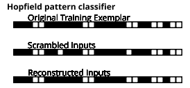
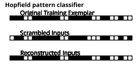
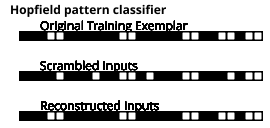

# Hopfield Neural Networks

A [Hopfield network](https://en.wikipedia.org/wiki/Hopfield_network) (named after John Hopfield) is a recurrent network since the flow of activation through the network has loops. These networks are trained by applying input patterns and letting the network settle in a state that stores the input patterns.

The example code is in the file **src/loving_snippets/Hopfield_neural_network.lisp**.

The example we look at recognizes patterns that are similar to the patterns seen in training examples and maps input patterns to a similar training input pattern. The following figure shows output from the example program showing an original training pattern, a similar pattern with one cell turned on and other off, and the reconstructed pattern:

{width: "70%"}

To be clear, we have taken one of the original input patterns the network has learned, slightly altered it, and applied it as input to the network. After cycling the network, the slightly scrambled input pattern we just applied will be used as an associative memory key, look up the original pattern, and rewrite to input values with the original learned pattern. These Hopfield networks are very different than backpropagation networks: neuron activation are forced to values of -1 or +1 and not be differentiable and there are no separate output neurons.
 
The next example has the values of three cells modified from the original and the original pattern is still reconstructed correctly:

{width: "70%"}

This last example has four of the original cells modified:

{width: "70%"}

The following example program shows a type of content-addressable memory. After a Hopfield network learns a set of input patterns then it can reconstruct the original paterns when shown similar patterns. This reconstruction is not always perfecrt.

The following function **Hopfield-Init** (in file *Hopfield_neural_network.lisp*) is passed a list of lists of training examples that will be remembered in the network.  This function returns a list containing the data defining a Hopfield neural network. All data for the network is encapsulated in the list returned by this function, so multiple Hopfield neural networks can be used in an application program.

In lines 9-12 we allocate global arrays for data storage and in lines 14-18 the training data is copied.

The inner function **adjustInput** on lines 20-29 adjusts data values to values of -1.0 or +1.0. In lines 31-33 we are initializing all of the weights in the Hopfield network to zero.

The last nested loop, on lines 35-52, calculates the autocorrelation weight matrix from the input test patterns.

On lines 54-56, the function returns a representation of the Hopfield network that will be used later in the function **HopfieldNetRecall** to find the most similar "remembered" pattern given a new (fresh) input pattern.

{lang="lisp",linenos=on}
~~~~~~~~
(defun Hopfield-Init (training-data
                      &aux temp *num-inputs* *num-training-examples*
                           *training-list* *inputCells* *tempStorage*
                           *HopfieldWeights*)

  (setq *num-inputs* (length (car training-data)))
  (setq *num-training-examples* (length training-data))

  (setq *training-list* (make-array (list *num-training-examples* *num-inputs*)))
  (setq *inputCells* (make-array (list *num-inputs*)))
  (setq *tempStorage* (make-array (list *num-inputs*)))
  (setq *HopfieldWeights* (make-array (list *num-inputs* *num-inputs*)))

  (dotimes (j *num-training-examples*) ;; copy training data
    (dotimes (i *num-inputs*)
      (setf
       (aref *training-list* j i)
       (nth i (nth j training-data)))))

  (defun adjustInput (value)  ;; this function is lexically scoped
    (if (< value 0.1)
      -1.0
      +1.0))

  (dotimes (i *num-inputs*) ;; adjust training data
    (dotimes (n *num-training-examples*)
      (setf
       (aref *training-list* n i)
       (adjustInput (aref *training-list* n i)))))

  (dotimes (i *num-inputs*) ;; zero weights
    (dotimes (j *num-inputs*)
      (setf (aref *HopfieldWeights* i j) 0)))

  (dotimes (j-1 (- *num-inputs* 1)) ;; autocorrelation weight matrix
    (let ((j (+ j-1 1)))
      (dotimes (i j)
        (dotimes (s *num-training-examples*)
          (setq temp
                (truncate
                 (+
                  (*  ;; 2 if's truncate values to -1 or 1:
                   (adjustInput (aref *training-list* s i))
                   (adjustInput (aref *training-list* s j)))
                  (aref *HopfieldWeights* i j))))
          (setf (aref *HopfieldWeights* i j) temp)
          (setf (aref *HopfieldWeights* j i) temp)))))
  (dotimes (i *num-inputs*)
    (setf (aref *tempStorage* i) 0)
    (dotimes (j i)
      (setf (aref *tempStorage* i)
            (+ (aref *tempStorage* i) (aref *HopfieldWeights* i j)))))

  (list ;; return the value of the Hopfield network data object
   *num-inputs* *num-training-examples* *training-list*
   *inputCells* *tempStorage* *HopfieldWeights*))
~~~~~~~~

The following function **HopfieldNetRecall** iterates the network to let it settle in a stable pattern
which we hope will be the original training pattern most closely resembling the noisy test pattern.

The inner (lexically scoped) function **deltaEnergy** defined on lines 9-12 calculates
a change in energy from old input values and the autocorrelation weight matrix.
The main code uses the inner functions 
to iterate over the input cells, possibly modifying the cell at index **i** delta energy is greater than zero. Remember that the lexically scoped inner functions have access to the variables for the number of inputs, the number of training examples, the list of training examples, 
the input cell values, tempoary storage, and the Hopfield network weights.

{lang="lisp",linenos=on}
~~~~~~~~
(defun HopfieldNetRecall (aHopfieldNetwork numberOfIterations)
  (let ((*num-inputs* (nth 0 aHopfieldNetwork))
        (*num-training-examples*  (nth 1 aHopfieldNetwork))
        (*training-list* (nth 2 aHopfieldNetwork))
        (*inputCells* (nth 3 aHopfieldNetwork))
        (*tempStorage* (nth 4 aHopfieldNetwork))
        (*HopfieldWeights* (nth 5 aHopfieldNetwork)))

    (defun deltaEnergy (row-index y &aux (temp 0.0))  ;; lexically scoped
      (dotimes (j *num-inputs*)
        (setq temp (+ temp (* (aref *HopfieldWeights* row-index j) (aref y j)))))
      (- (* 2.0 temp) (aref *tempStorage* row-index)))

    (dotimes (ii numberOfIterations) ;; main code
      (dotimes (i *num-inputs*)
        (setf (aref *inputCells* i)
              (if (> (deltaEnergy i *inputCells*) 0)
                  1
                  0))))))
~~~~~~~~

Function **test** in the next listing uses three different patterns for each test. Note that only the last pattern gets plotted to the output graphics PNG file for the purpose of producing figures for this chapter. If you want to produce plots of other patterns, edit just the third pattern defined on line AAAAA. The following plotting functions are inner lexically scoped so they have access to the data defined in the enclosing **let** expression in lines 16-21:

- **plotExemplar** - plots a vector of data
- **plot-original-inputCells** - plots the original input cells from training data
- **plot-inputCells** - plots the modified input cells (a few cells randomly flipped in value)
- **modifyInput** - scrambles training inputs

{lang="lisp",linenos=on}
~~~~~~~~
(defun test (&aux aHopfieldNetwork)
  (let ((tdata '(  ;; sample sine wave data with different periods:
                 (1 0 0 0 1 0 0 0 1 0 0 0 1 0 0 0 1 0 0 0 0 0 1 1 0 0 0)
                 (0 1 1 0 0 0 0 0 1 0 0 1 0 0 0 0 0 1 0 0 0 1 1 0 0 1 0)
                 (0 0 0 1 1 0 0 0 0 0 0 1 1 0 0 0 0 0 1 1 0 0 1 1 0 1 1)))
        (width 300)
        (height 180))
    (vecto::with-canvas (:width width :height height)
      (plotlib:plot-string-bold 10 (- height 14) "Hopfield pattern classifier")

      ;; Set up network:
      (print tdata)
      (setq aHopfieldNetwork (Hopfield-Init tdata))

      ;; lexically scoped variables are accesible by inner functions:
      (let ((*num-inputs* (nth 0 aHopfieldNetwork))
            (*num-training-examples*  (nth 1 aHopfieldNetwork))
            (*training-list* (nth 2 aHopfieldNetwork))
            (*inputCells* (nth 3 aHopfieldNetwork))
            (*tempStorage* (nth 4 aHopfieldNetwork))
            (*HopfieldWeights* (nth 5 aHopfieldNetwork)))

        (defun plotExemplar (row &aux (dmin 0.0) (dmax 1.0) (x 20) (y 40))
          (let ((YSize (array-dimension *training-list* 1)))
            (plotlib:plot-string (+ x 20) (- height (- y 10))
                                 "Original Training Exemplar")
            (dotimes (j Ysize)
              (plotlib:plot-fill-rect
               (+ x (* j plot-size+1)) (- height y) plot-size plot-size
               (truncate (*
                           (/  (- (aref *training-list* row j) dmin)
                               (- dmax dmin))
                           5)))
              (plotlib:plot-frame-rect (+ x (* j plot-size+1))
                                       (- height y) plot-size plot-size))))

        (defun plot-original-inputCells (&aux (dmin 0.0) (dmax 1.0) (x 20) (y 80))
          (let ((Xsize (array-dimension *inputCells* 0)))
            (plotlib:plot-string (+ x 20) (- height (- y 10)) "Scrambled Inputs")
            (dotimes (j Xsize)
              (plotlib:plot-fill-rect
               (+ x (* j plot-size+1)) (- height y) plot-size plot-size
               (truncate (*
                           (/  (- (aref *inputCells* j) dmin) (- dmax dmin))
                           5)))
              (plotlib:plot-frame-rect (+ x (* j plot-size+1))
                                       (- height y) plot-size plot-size))))

        (defun plot-inputCells (&aux (dmin 0.0) (dmax 1.0) (x 20) (y 120))
          (let ((Xsize (array-dimension *inputCells* 0)))
            (plotlib:plot-string (+ x 20) (- height (- y 10))
                                 "Reconstructed Inputs")
            (dotimes (j Xsize)
              (plotlib:plot-fill-rect
               (+ x (* j plot-size+1)) (- height y) plot-size plot-size
               (truncate (* (/
                             (- (aref *inputCells* j) dmin)
                             (- dmax dmin))
                            5)))
              (plotlib:plot-frame-rect
                 (+ x (* j plot-size+1)) (- height y) plot-size plot-size))))

        (defun modifyInput (arrSize arr)  ;; modify input array for testing
          (dotimes (i arrSize)
            (if (< (random 50) 5)
                (if (> (aref arr i) 0)
                    (setf (aref arr i) -1)
                    (setf (aref arr i) 1)))))

        ;; Test network on training data that is randomly modified:

        (dotimes (iter 10) ;; cycle 10 times and make 10 plots
          (dotimes (s *num-training-examples*)
            (dotimes (i *num-inputs*)
              (setf (aref *inputCells* i) (aref *training-list* s i)))
            (plotExemplar s)
            (modifyInput *num-inputs* *inputCells*)
            (plot-original-inputCells)
            (dotimes (call-net 5) ;; iterate Hopfield net 5 times
              (HopfieldNetRecall aHopfieldNetwork 1)  ;; calling with 1 iteration
              (plot-inputCells)))

          (vecto::save-png
           (concatenate
            'string
            "output_plot_hopfield_nn_" (format nil "~5,'0d" iter) ".png")))))))
~~~~~~~~

The plotting functions in lines 23-62 use the *plotlib* library to make the plots you saw earlier. The function **modifyInput** in lines 64-69 randomly flips the values of the input cells, taking an original pattern and slightly modifying it.

Hopfield neural networks, at least to some extent, seem to model some aspects of human brains in the sense that they can function as content-addressable (also called associative) memories. Ideally a partial input pattern from a remembered input can reconstruct the complete original pattern. Another interesting feature of Hopfield networks is that these memories really are stored in a distributed fashion: some of the weights can be randomly altered and patterns are still remembered, but with more recall errors.
