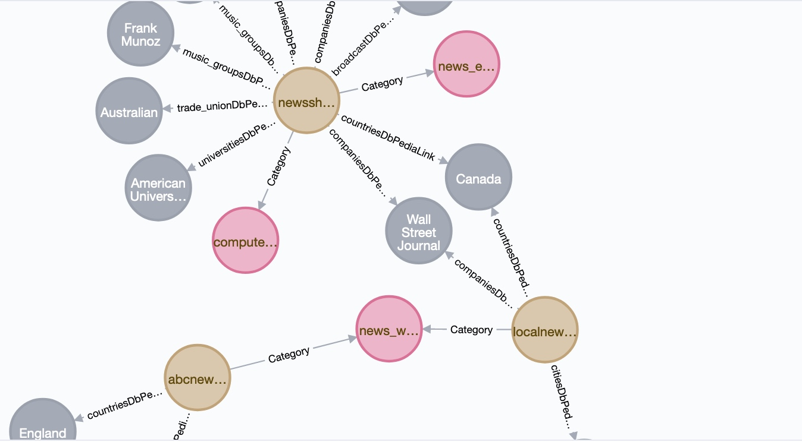

# Automatically Generating Data for Knowledge Graphs {#kgcreator}

We develop a complete application. The Knowledge Graph Creator (KGcreator) is a tool for automating the generation of data for Knowledge Graphs from raw text data. We will see how to create a single standalone executable file using SBCL Common Lisp. The application can also be run during development from a repl. This application also implements a web application interface. In addition to the KGcreator application we will close the chapter with a utiity library that processes a file of RDF in N-Triple format and generates an extention file with triples pulled from DBedia defining URIs found in the input data file.

Data created by KGcreator generates data in two formats:

- Neo4j graph database format (text format)
- RDF triples suitable for loading into any linked data/semantic web data store.

This example application works by identifying entities in text. Example entity types are people, companies, country names, city names, broadcast network names, political party names, and university names. We saw earlier code for detecting entities in the chapter on natural language processing (NLP) and we will reuse this code. We will discuss later three strategies for reusing code from different projects.

When I originally wrote KGCreator I intended to develop a commercial product. I wrote two research prototypes, one in Common Lisp (the example in this chapter) and one in Haskell (which I also use as an example in my book [Haskell Tutorial and Cookbook](https://leanpub.com/haskell-cookbook/). I decided to open source both versions of KGCreator and if you work with Knowledge Graphs I hope you find KGCreator useful in your work.

The following figure shows part of a Neo4j Knowledge Graph created with the example code. This graph has shortened labels in displayed nodes but Neo4j offers a web browser-based console that lets you interactively explore Knowledge Graphs. We don't cover setting up Neo4j here so please use the [Neo4j documentation](https://neo4j.com/docs/operations-manual/current/introduction/). As an introduction to RDF data, the semantic web, and linked data you can get free copies of my two books [Practical Semantic Web and Linked Data Applications, Common Lisp Edition](http://markwatson.com/opencontentdata/book_lisp.pdf) and [Practical Semantic Web and Linked Data Applications, Java, Scala, Clojure, and JRuby Edition](http://markwatson.com/opencontentdata/book_java.pdf).

{width=80%}

Here is a detail view:

{width=50%}

## Implementation Notes

As seen in the file **src /kgcreator/package.lisp** this application uses several other packages:

{lang="lisp",linenos=on}
~~~~~~~~
(defpackage #:kgcreator
  (:use #:cl
        #:entities_dbpedia #:categorize_summarize #:myutils
        #:cl-who #:hunchentoot #:parenscript)
  (:export kgcreator))
~~~~~~~~

The implementation of the packages shown on line 3 were in a previous chapter. The package **myutils** are mostly miscellaneous string utilities that we won't look at here; I leave it to you to read the source code.

As seen in the configuration file **src/kgcreator/kgcreator.asd** we split the implementation of the application into four source files:

{lang="lisp",linenos=on}
~~~~~~~~
;;;; kgcreator.asd

(asdf:defsystem #:kgcreator
  :description "Describe plotlib here"
  :author "Mark Watson <mark.watson@gmail.com>"
  :license "AGPL version 3"
  :depends-on (#:entities_dbpedia #:categorize_summarize
               #:myutils #:unix-opts #:cl-who
               #:hunchentoot #:parenscript)
  :components
    ((:file "package")
                (:file "kgcreator")
                (:file "neo4j")
                (:file "rdf")
                (:file "web"))
                 )
~~~~~~~~

The application is separated into four source files:

- kgcreator.lisp: top level APIs and functionality. Uses the code in neo4j.lisp and rdf.lisp. Later we will generate a standalone application that uses these top level APIs
- neo4j.lisp: generates Cyper text files that can be imported into Neo4j
- - rdf.lisp: generates RDF text data that can be loaded or imported into RDF data stores
- web.lisp: a simple web application for running KGCreator

## Generating RDF Data

I leave it to you find a tutorial on RDF data on the web, or you can get a [PDF for my book "Practical Semantic Web and Linked Data Applications, Common Lisp Edition"](http://markwatson.com/opencontentdata/book_lisp.pdf) and read the tutorial sections on RDF.

RDF data is comprised of triples, where the value for each triple are a subject, a predicate, and an object. Subjects are URIs, predicates are usually URIs, and objects are either literal values or URIs. Here are two triples written by this example application:

{linenos=off}
~~~~~~~~
<http://dbpedia.org/resource/The_Wall_Street_Journal> 
  <http://knowledgebooks.com/schema/aboutCompanyName> 
  "Wall Street Journal" .
<https://newsshop.com/june/z902.html>
  <http://knowledgebooks.com/schema/containsCountryDbPediaLink>
  <http://dbpedia.org/resource/Canada> .
~~~~~~~~

The following listing of the file **src/kgcreator/rdf.lisp** generates RDF data:

{lang="lisp",linenos=on}
~~~~~~~~
(in-package #:kgcreator)

(let ((*rdf-nodes-hash*))
  
  (defun rdf-from-files (output-file-path text-and-meta-pairs)
    (setf *rdf-nodes-hash* (make-hash-table :test #'equal :size 200))
    (print (list "==> rdf-from-files" output-file-path text-and-meta-pairs ))
    (with-open-file
        (str output-file-path
             :direction :output
             :if-exists :supersede
             :if-does-not-exist :create)

      (defun rdf-from-files-handle-single-file (text-input-file meta-input-file)
        (let* ((text (file-to-string text-input-file))
               (words (myutils:words-from-string text))
               (meta (file-to-string meta-input-file)))
                         
          (defun generate-original-doc-node-rdf ()
            (let ((node-name (node-name-from-uri meta)))
              (if (null (gethash node-name *rdf-nodes-hash*))
                  (let* ((cats (categorize words))
                         (sum (summarize words cats)))
		    (print (list "$$$$$$  cats:" cats))
                    (setf (gethash node-name *rdf-nodes-hash*) t)
		    (format str (concatenate 'string "<" meta
					     "> <http:knowledgebooks.com/schema/summary> \""
					     sum "\" . ~%"))
                    (dolist (cat cats)
                      (let ((hash-check (concatenate 'string node-name (car cat))))
                        (if (null (gethash hash-check *rdf-nodes-hash*))
                            (let ()
                              (setf (gethash hash-check *rdf-nodes-hash*) t)
			      (format str
				      (concatenate 'string "<" meta
						   "> <http://knowledgebooks.com/schema/"
						   "topicCategory> "
						   "<http://knowledgebooks.com/schema/"
						   (car cat) "> . ~%"))))))))))
          
          (defun generate-dbpedia-contains-rdf (key value)
            (generate-original-doc-node-rdf)
            (let ((relation-name (concatenate 'string key "DbPediaLink")))
              (dolist (entity-pair value)
                (let* ((node-name (node-name-from-uri meta))
                       (object-node-name (node-name-from-uri (cadr entity-pair)))
                       (hash-check (concatenate 'string node-name object-node-name)))
                  (if (null (gethash hash-check *rdf-nodes-hash*))
                      (let ()
                        (setf (gethash hash-check *rdf-nodes-hash*) t)
			(format str (concatenate 'string "<" meta
					       "> <http://knowledgebooks.com/schema/contains/"
					       key "> " (cadr entity-pair) " .~%"))))))))))

      
      ;; start code for rdf-from-files (output-file-path text-and-meta-pairs)
      (dolist (pair text-and-meta-pairs)
        (rdf-from-files-handle-single-file (car pair) (cadr pair))
        (let ((h (entities_dbpedia:find-entities-in-text (file-to-string (car pair)))))
          (entities_dbpedia:entity-iterator #'generate-dbpedia-contains-rdf h))))))

(defvar test_files '((#P"~/GITHUB/common-lisp/kgcreator/test_data/test3.txt"
                      #P"~/GITHUB/common-lisp/kgcreator/test_data/test3.meta")))
(defvar test_filesZZZ '((#P"~/GITHUB/common-lisp/kgcreator/test_data/test3.txt"
                         #P"~/GITHUB/common-lisp/kgcreator/test_data/test3.meta")
                        (#P"~/GITHUB/common-lisp/kgcreator/test_data/test2.txt"
                         #P"~/GITHUB/common-lisp/kgcreator/test_data/test2.meta")
                        (#P"~/GITHUB/common-lisp/kgcreator/test_data/test1.txt"
                         #P"~/GITHUB/common-lisp/kgcreator/test_data/test1.meta")))

(defun test3a ()
  (rdf-from-files "out.rdf" test_files))
~~~~~~~~

You can load all of KGCreator but just execute the test function at the end of this file using:

{lang="lisp",linenos=off}
~~~~~~~~
(ql:quickload "kgcreator")
(in-package #:kgcreator)
(kgcreator:test3a)
~~~~~~~~

This code works on a list of paired files for text data and the meta data for each text file. As an example, if there is an input text file test123.txt then there would be a matching meta file test123.meta that contains the source of the data in the file test123.txt. This data source will be a URI on the web or a local file URI. The top level function **rdf-from-files** takes an output file path for writing the generated RDF data and a list of pairs of text and meta file paths.

A global variable **\*rdf-nodes-hash\*** will be used to remember the nodes in the RDF graph as it is generated. Please note that the function **rdf-from-files** is not re-entrant: it uses the global **\*rdf-nodes-hash\*** so if you are writing multi-threaded applications it will not work to execute the function **rdf-from-files** simultaneously in multiple threads of execution.

The function **rdf-from-files** (and the nested functions) are straightforward. I left a few debug printout statements in the code and when you run the test code that I left in the bottom of the file, hopefully it will be clear what rdf.lisp is doing. 

## Generating Data for the Neo4j Graph Database

Now we will generate Neo4J Cypher data. In order to keep the implementation simple, both the RDF and Cypher generation code starts with raw text and performs the NLP analysis to find entities. This example could be refactored to perform the NLP analysis just one time but in practice you will likely be working with either RDF or NEO4J and so you will probably extract just the code you need from this example (i.e., either the RDF or Cypher generation code).

Before we look at the code, let's start with a few lines of generated Neo4J Cypher import data:

{linenos=off}
~~~~~~~~
CREATE (newsshop_com_june_z902_html_news)-[:ContainsCompanyDbPediaLink]->(Wall_Street_Journal)
CREATE (Canada:Entity {name:"Canada", uri:"<http://dbpedia.org/resource/Canada>"})
CREATE (newsshop_com_june_z902_html_news)-[:ContainsCountryDbPediaLink]->(Canada)
CREATE (summary_of_abcnews_go_com_US_violent_long_lasting_tornadoes_threaten_oklahoma_texas_storyid63146361:Summary {name:"summary_of_abcnews_go_com_US_violent_long_lasting_tornadoes_threaten_oklahoma_texas_storyid63146361", uri:"<https://abcnews.go.com/US/violent-long-lasting-tornadoes-threaten-oklahoma-texas/story?id=63146361>", summary:"Part of the system that delivered severe weather to the central U.S. over the weekend is moving into the Northeast today, producing strong to severe storms -- damaging winds, hail or isolated tornadoes can't be ruled out. Severe weather is forecast to continue on Tuesday, with the western storm moving east into the Midwest and parts of the mid-Mississippi Valley."})
~~~~~~~~

The following listing of file **src/kgcreator/neo4j.lisp** is similar to the code that generated RDF in the last section:

{lang="lisp",linenos=on}
~~~~~~~~
(in-package #:kgcreator)

(let ((*entity-nodes-hash*))
  
  (defun cypher-from-files (output-file-path text-and-meta-pairs)
    (setf *entity-nodes-hash* (make-hash-table :test #'equal :size 200))
    ;;(print (list "==> cypher-from-files"output-file-path text-and-meta-pairs ))
    (with-open-file
	(str output-file-path
	     :direction :output
	     :if-exists :supersede 
	     :if-does-not-exist :create)

      (defun generateNeo4jCategoryNodes ()
	(let* ((names categorize_summarize::categoryNames))
	  (dolist (name names)
	    (format str
		    (myutils:replace-all
		     (concatenate
		      'string "CREATE (" name ":CategoryType {name:\"" name "\"})~%")
		     "/" "_"))))
	(format str "~%"))
      

      (defun cypher-from-files-handle-single-file (text-input-file meta-input-file)
	(let* ((text (file-to-string text-input-file))
	       (words (myutils:words-from-string text))
	       (meta (file-to-string meta-input-file)))
	       	  
	  (defun generate-original-doc-node ()
	    (let ((node-name (node-name-from-uri meta)))
	      (if (null (gethash node-name *entity-nodes-hash*))
		  (let* ((cats (categorize words))
			 (sum (summarize words cats)))
		    (setf (gethash node-name *entity-nodes-hash*) t)
		    (format str (concatenate 'string "CREATE (" node-name ":News {name:\""
					     node-name "\", uri: \"" meta
               "\", summary: \"" sum "\"})~%"))
		    (dolist (cat cats)
		      (let ((hash-check (concatenate 'string node-name (car cat))))
			(if (null (gethash hash-check *entity-nodes-hash*))
			    (let ()
			      (setf (gethash hash-check *entity-nodes-hash*) t)
			      (format str (concatenate 'string "CREATE (" node-name
                                     ")-[:Category]->("
						       (car cat) ")~%"))))))))))
	  
	  (defun generate-dbpedia-nodes (key entity-pairs)
	    (dolist (entity-pair entity-pairs)
	      (if (null (gethash (node-name-from-uri (cadr entity-pair))
                           *entity-nodes-hash*))
		  (let ()
		    (setf (gethash (node-name-from-uri (cadr entity-pair)) *entity-nodes-hash*) t)
		    (format str
			    (concatenate 'string "CREATE (" (node-name-from-uri (cadr entity-pair)) ":"
					 key " {name: \"" (car entity-pair)
					 "\", uri: \"" (cadr entity-pair) "\"})~%"))))))
	  
	  (defun generate-dbpedia-contains-cypher (key value)
	    (generate-original-doc-node)
	    (generate-dbpedia-nodes key value)
	    (let ((relation-name (concatenate 'string key "DbPediaLink")))
	      (dolist (entity-pair value)
		(let* ((node-name (node-name-from-uri meta))
		       (object-node-name (node-name-from-uri (cadr entity-pair)))
		       (hash-check (concatenate 'string node-name object-node-name)))
		  (if (null (gethash hash-check *entity-nodes-hash*))
		      (let ()
			(setf (gethash hash-check *entity-nodes-hash*) t)
			(format str (concatenate 'string
						 "CREATE (" node-name ")-[:"
						 relation-name "]->(" object-node-name ")~%"))))))))))

      
      ;; start code for cypher-from-files (output-file-path text-and-meta-pairs)
      (generateNeo4jCategoryNodes) ;; just once, not for every input file
      (dolist (pair text-and-meta-pairs)
	(cypher-from-files-handle-single-file (car pair) (cadr pair))
	(let ((h (entities_dbpedia:find-entities-in-text (file-to-string (car pair)))))
	  (entities_dbpedia:entity-iterator #'generate-dbpedia-contains-cypher h))))))

(defvar test_files '((#P"~/GITHUB/common-lisp/kgcreator/test_data/test3.txt"
		      #P"~/GITHUB/common-lisp/kgcreator/test_data/test3.meta")
		     (#P"~/GITHUB/common-lisp/kgcreator/test_data/test2.txt"
		      #P"~/GITHUB/common-lisp/kgcreator/test_data/test2.meta")
		     (#P"~/GITHUB/common-lisp/kgcreator/test_data/test1.txt"
		      #P"~/GITHUB/common-lisp/kgcreator/test_data/test1.meta")))

(defun test2a ()
  (cypher-from-files "out.cypher" test_files))
~~~~~~~~

You can load all of KGCreator but just execute the test function at the end of this file using:

{lang="lisp",linenos=off}
~~~~~~~~
(ql:quickload "kgcreator")
(in-package #:kgcreator)
(kgcreator:test2a)
~~~~~~~~

## Implementing the Top Level Application APIs

The code in the file **src/kgcreator/kgcreator.lisp** uses both rdf.lisp and neo4j.lisp that we saw in the last two sections. The function **get-files-and-meta** looks at the contents of an input directory to generate a list of pairs, each pair containing the path to a text file and the meta file for the corresponding text file.

We are using the **opts** package to parse command line arguments. This will be used when we build a single file standalone executable file for the entire KGCreator application, including the web application that we will see in a later section.

{lang="lisp",linenos=on}
~~~~~~~~
;; KGCreator main program

(in-package #:kgcreator)

(ensure-directories-exist "temp/")

(defun get-files-and-meta (fpath)
  (let ((data (directory (concatenate 'string fpath "/" "*.txt")))
	      (meta (directory (concatenate 'string fpath "/" "*.meta"))))
    (if (not (equal (length data) (length meta)))
	(let ()
	  (princ "Error: must be matching *.meta files for each *.txt file")
	  (terpri)
	  '())
	(let ((ret '()))
	  (dotimes (i (length data))
	    (setq ret (cons (list (nth i data) (nth i meta)) ret)))
	  ret))))

(opts:define-opts
    (:name :help
	   :description
     "KGcreator command line example: ./KGcreator -i test_data -r out.rdf -c out.cyper"
	   :short #\h
	   :long "help")
    (:name :rdf
	   :description "RDF output file name"
	   :short #\r
	   :long "rdf"
	   :arg-parser #'identity ;; <- takes an argument
	   :arg-parser #'identity) ;; <- takes an argument
  (:name :cypher
	 :description "Cypher output file name"
	 :short #\c
	 :long "cypher"
	 :arg-parser #'identity) ;; <- takes an argument
  (:name :inputdir
	 :description "Cypher output file name"
	 :short #\i
	 :long "inputdir"
	 :arg-parser #'identity)) ;; <- takes an argument

(defun kgcreator () ;; don't need: &aux args sb-ext:*posix-argv*)
  (handler-case
      (let* ((opts (opts:get-opts))
	     (input-path
	      (if (find :inputdir opts)
		  (nth (1+ (position :inputdir opts)) opts)))
	     (rdf-output-path
	      (if (find :rdf opts)
		  (nth (1+ (position :rdf opts)) opts)))
	     (cypher-output-path
	      (if (find :cypher opts)
		  (nth (1+ (position :cypher opts)) opts))))
	(format t "input-path: ~a  rdf-output-path: ~a cypher-output-path:~a~%"
		input-path rdf-output-path cypher-output-path)
	(if (not input-path)
	    (format t "You must specify an input path.~%")
	    (locally
		(declare #+sbcl(sb-ext:muffle-conditions sb-kernel:redefinition-warning))
	      (handler-bind
		  (#+sbcl(sb-kernel:redefinition-warning #'muffle-warning))
		;; stuff that emits redefinition-warning's
		(let ()
		  (if rdf-output-path
		      (rdf-from-files rdf-output-path (get-files-and-meta input-path)))
		  (if cypher-output-path
		      (cypher-from-files cypher-output-path (get-files-and-meta input-path))))))))
    (t (c)
      (format t "We caught a runtime error: ~a~%" c)
      (values 0 c)))
  (format t "~%Shutting down KGcreator - done processing~%~%"))

(defun test1 ()
    (get-files-and-meta
     "~/GITHUB/common-lisp/kgcreator/test_data"))

(defun print-hash-entry (key value)
  (format t "The value associated with the key ~S is ~S~%" key value))

(defun test2 ()
  (let ((h (entities_dbpedia:find-entities-in-text "Bill Clinton and George Bush went to Mexico and England and watched Univision. They enjoyed Dakbayan sa Dabaw and shoped at Best Buy and listened to Al Stewart. They agree on República de Nicaragua and support Sweden Democrats and Leicestershire Miners Association and both sent their kids to Darul Uloom Deoband.")))
    (entities_dbpedia:entity-iterator #'print-hash-entry h)))

(defun test7 ()
  (rdf-from-files "out.rdf" (get-files-and-meta "test_data")))
~~~~~~~~

You can load all of KGCreator but just execute the three test functions at the end of this file using:

{lang="lisp",linenos=off}
~~~~~~~~
(ql:quickload "kgcreator")
(in-package #:kgcreator)
(kgcreator:test1)
(kgcreator:test2)
(kgcreator:test7)
~~~~~~~~

## Implementing The Web Interface

When we build a standalone single file application for KGCreator, we include a simple web application interface that allows users to enter input text and see generated RDF and Neo4j Cypher data.

The file **src/kgcreator/web.lisp** uses the libraries **cl-who** **hunchentoot** **parenscript** that we used earlier. The function write-files-run-code** (lines 8-43) takes raw text, and  writes generated RDF and Neo4j Cypher data to local temporary files that are then read and formatted to HTML for display. The code in rdf.lisp and neo4j.lisp is file oriented, and I wrote web.lisp as an afterthought so it was easier writing temporary files than refactoring rdf.lisp and neo4j.lisp to write to strings.

{lang="lisp",linenos=on}
~~~~~~~~
(in-package #:kgcreator)

(ql:quickload '(cl-who hunchentoot parenscript))

(setf (html-mode) :html5)

(defun write-files-run-code (a-uri raw-text)
  (if (< (length raw-text) 10)
      (list "not enough text" "not enough text")
    ;; generate random file number
    (let* ((filenum (+ 1000 (random 5000)))
	   (meta-name (concatenate 'string "temp/" (write-to-string filenum) ".meta"))
	   (text-name (concatenate 'string "temp/" (write-to-string filenum) ".txt"))
	   (rdf-name (concatenate 'string "temp/" (write-to-string filenum) ".rdf"))
	   (cypher-name (concatenate 'string "temp/" (write-to-string filenum) ".cypher"))
	   ret)
      ;; write meta file
      (with-open-file (str meta-name
			   :direction :output
			   :if-exists :supersede
			   :if-does-not-exist :create)
		      (format str a-uri))
      ;; write text file
      (with-open-file (str text-name
			   :direction :output
			   :if-exists :supersede
			   :if-does-not-exist :create)
	(format str raw-text))
      ;; generate rdf and cypher files
      (rdf-from-files rdf-name (list (list text-name meta-name)))
      (cypher-from-files cypher-name (list (list text-name meta-name)))
      ;; read files and return results
      (setf ret
	    (list
	     (replace-all
	      (replace-all
	       (uiop:read-file-string rdf-name)
	       ">" "&gt;")
	      "<" "&lt;")
	     (uiop:read-file-string cypher-name)))
      (print (list "ret:" ret))
      ret)))
  
(defvar *h* (make-instance 'easy-acceptor :port 3000))

;; define a handler with the arbitrary name my-greetings:

(define-easy-handler (my-greetings :uri "/") (text)
  (setf (hunchentoot:content-type*) "text/html")
  (let ((rdf-and-cypher (write-files-run-code "http://test.com/1" text)))
    (print (list "*** rdf-and-cypher:" rdf-and-cypher))
    (with-html-output-to-string
     (*standard-output* nil :prologue t)
     (:html
      (:head (:title "KGCreator Demo")
	     (:link :rel "stylesheet" :href "styles.css" :type "text/css"))
      (:body
       :style "margin: 90px"
       (:h1 "Enter plain text for the demo to create RDF and Cypher")
       (:p "For more information on the KGCreator product please visit the web site:"
	   (:a :href "https://markwatson.com/products/" "Mark Watson's commercial products"))
       (:p "The KGCreator product is a command line tool that processes all text "
	   "web applications and files in a source directory and produces both RDF data "
	   "triples for semantic Cypher input data files for the Neo4j graph database. "
	   "For the purposes of this demo the URI for your input text is hardwired to "
	   "&lt;http://test.com/1&gt; but the KGCreator product offers flexibility "
		 "for assigning URIs to data sources and further, "
	   "creates links for relationships between input sources.")
       (:p :style "text-align: left"
	   "To try the demo paste plain text into the following form that contains "
		 "information on companies, news, politics, famous people, broadcasting "
		 "networks, political parties, countries and other locations, etc. ")
       (:p "Do not include and special characters or character sets:")
       (:form
	:method :post
	(:textarea
	 :rows "20"
	 :cols "90"
	 :name "text"
	 :value text)
	(:br)
	(:input :type :submit :value "Submit text to process"))
       (:h3 "RDF:")
       (:pre (str (car rdf-and-cypher)))
       (:h3 "Cypher:")
       (:pre (str (cadr rdf-and-cypher))))))))

(defun kgcweb ()
  (hunchentoot:start *h*))
~~~~~~~~

You can load all of KGCreator and start the web application using:

{lang="lisp",linenos=off}
~~~~~~~~
(ql:quickload "kgcreator")
(in-package #:kgcreator)
(kgcweb)
~~~~~~~~

You can access the web app at [http://localhost:3000](http://localhost:3000).

## Creating a Standalone Application Using SBCL

When I originally wrote KGCreator I intended to develop a commercial product so it was important to be able to create standalone single file executables. This is simple to do using SBCL:

{lang="lisp",linenos=on}
~~~~~~~~
$ sbcl
(ql:quickload "kgcreator")
(in-package #:kgcreator)
(sb-ext:save-lisp-and-die "KGcreator"
  :toplevel #'kgcreator :executable t)
~~~~~~~~

As an example, you could run the application on the command line using:

{linenos=of}
~~~~~~~~
./KGcreator -i test_data -r out.rdf -c out.cyper
~~~~~~~~

## Augmenting RDF Triples in a Knowledge Graph Using DBPedia

You can augment RDF-based Knowledge Graphs that you build with the KGcreator application by using the library in the directory **kg-add-dbpedia-triples**.

As seen in the **kg-add-dbpedia-triples.asd** and **package.lisp** configuration files, we use two other libraries developed in this book:

{lang="lisp",linenos=off}
~~~~~~~~
;;;; kg-add-dbpedia-triples.asd

(asdf:defsystem #:kg-add-dbpedia-triples
  :description "Add DBPedia triples from an input N-Triples RDF file"
  :author "markw@markwatson.com"
  :license "Apache 2"
  :depends-on (#:myutils #:sparql)
  :components ((:file "package")
               (:file "add-dbpedia-triples")))
~~~~~~~~

{lang="lisp",linenos=off}
~~~~~~~~
;;;; package.lisp

(defpackage #:kg-add-dbpedia-triples
  (:use #:cl #:myutils #:sparql)
  (:export #:add-triples))
~~~~~~~~

The library is implemented in the file **kg-add-dbpedia-triples.lisp**:

{lang="lisp",linenos=on}
~~~~~~~~
(in-package #:kg-add-dbpedia-triples)

(defun augmented-triples (a-uri ostream)
  (let ((results
         (sparql:dbpedia
          (format nil "construct { ~A ?p ?o } where { ~A ?p ?o } limit 5" a-uri a-uri))))
    (dolist (x results)
      (dolist (sop x)
        (let ((val (second sop)))
          (if (and
               (stringp val)
               (> (length val) 9)
               (or
                (equal (subseq val 0 7) "http://")
                (equal (subseq val 0 8) "https://")))
              (format ostream "<~A> " val)
            (format ostream "~A " val))))
      (format ostream " .~%"))))

(defun add-triples (in-file-name out-file-name)
  (let* ((nt-data (myutils:file-to-string in-file-name))
         (tokens (myutils:tokenize-string-keep-uri nt-data))
         (uris
          (remove-duplicates
           (mapcan #'(lambda (s) (if
                                     (and
                                      (stringp s)
                                      (> (length s) 19)
                                      (equal (subseq s 0 19) "<http://dbpedia.org"))
                                     (list s)))
                   tokens)
           :test #'equal)))
    (with-open-file (str out-file-name
                         :direction :output
                         :if-exists :supersede
                         :if-does-not-exist :create)
    (dolist (uri uris)
      (augmented-triples uri str)))))
~~~~~~~~

TBD

{lang="lisp",linenos=on}
~~~~~~~~
~~~~~~~~

## KGCreator Wrap Up

When developing applications or systems using Knowledge Graphs it is useful to be able to quickly generate test data which is the primary purpose of KGCreator. A secondary use is to generate  Knowledge Graphs for production use using text data sources. In this second use case you will want to manually inspect the generated data to verify its correctness or usefulness for your application.