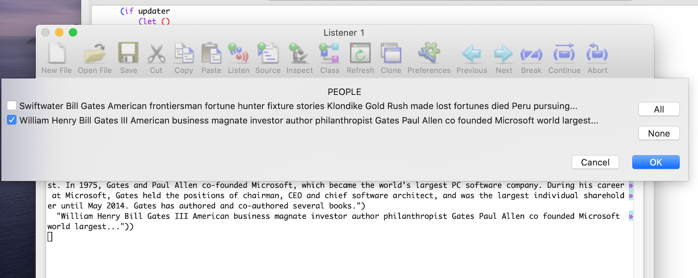
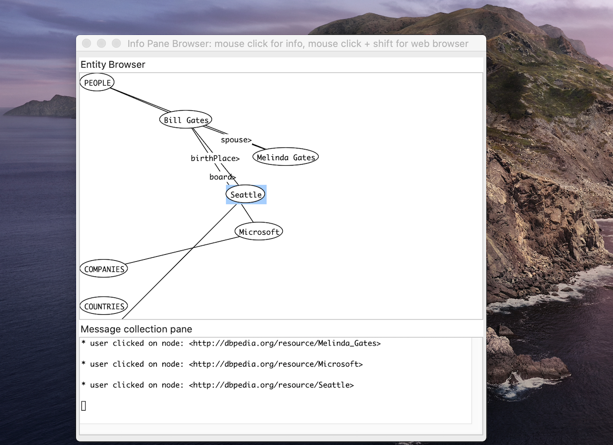

# Knowledge Graph Navigator User Interface Using LispWorks CAPI {#kgncapi}

As we have seen in the last two chapters the Knowledge Graph Navigator (which I will often refer to as KGN) is a tool for processing a set of entity names and automatically exploring the public Knowledge Graph [DBPedia](http://dbpedia.org) using SPARQL queries. I started to write KGN for my own use, to automate some things I used to do manually when exploring Knowledge Graphs, and later thought that KGN might also be useful for educational purposes. KGN shows the user the auto-generated SPARQL queries so hopefully the user will learn by seeing examples. KGN uses NLP code developed in earlier chapters and we will reuse that code with a short review of using the APIs. Here is a screenshot showing the application we develop here:

{width=90%}

We will use the [KGN common library](#kgncommon) developed earlier. This example replaces the text bases UI from the last chapter and requires either the free or professional version of LispWorks to run.

The code for the CAPI user interface is found in the GitHub repository [https://github.com/mark-watson/kgn-capi-ui](https://github.com/mark-watson/kgn-capi-ui).

## Project Configuration and Running the Application

The following listing of **kgn.asd** shows the five packages this example depends on in addition to **#:kgn-common** that was developed in an earlier chapter that is referenced in the file **package.lisp**:

{lang="lisp",linenos=on}
~~~~~~~~
;;;; knowledgegraphnavigator.asd

(asdf:defsystem #:kgn-capi-ui
  :description "top level Knowledge Graph Navigator package"
  :author "Mark Watson <markw@markwatson.com>"
  :license "Apache 2"
  :depends-on (#:kgn-common #:sparql #:kbnlp #:lw-grapher #:trivial-open-browser)
  :components ((:file "package")
                (:file "kgn-capi-ui")
                (:file "option-pane")
                (:file "colorize")
                (:file "user-interface")))
~~~~~~~~

Other dependency libraries specified in **project.lisp** are **trivial-open-browser** which we will use to open a web browser to URIs for human readable information on DBPedia and **sparql** that was developed in an earlier chapter.

Listing of **package.lisp**:

{lang="lisp",linenos=on}
~~~~~~~~
;;;; package.lisp

(defpackage #:kgn-capi-ui
  (:use #:cl)
  (:use #:kgn-common #:sparql #:lw-grapher #:trivial-open-browser)
  (:export #:kgn-capi-ui))
~~~~~~~~

The free personal edition of LispWorks does not support initialization files so you must manually load Quicklisp from the Listener Window when you first start LispWorks Personal as seen in the following repl listing (edited to remove some output for brevity). Once Quicklisp is loaded we then use **ql:quickload** to load the example in this chapter (some output removed for brevity):

{lang="lisp",linenos=off}
~~~~~~~~
CL-USER 1 > (load "~/quicklisp/setup.lisp")
; Loading text file /Users/markw/quicklisp/setup.lisp
; Loading /Applications/LispWorks Personal 7.1/...
;; Creating system "COMM"
#P"/Users/markw/quicklisp/setup.lisp"

CL-USER 2 > (ql:quickload "kgn")
To load "kgn":
  Load 1 ASDF system:
    kgn
; Loading "kgn"
.
"Starting to load data...." 
"....done loading data." 
"#P\"/Users/markw/GITHUB/common-lisp/entity-uris/entity-uris.lisp\"" 
"current directory:" 
"/Users/markw/GITHUB/common-lisp/entity-uris" 
"Starting to load data...." 
"....done loading data."
[package kgn]
To load "sqlite":
  Load 1 ASDF system:
    sqlite
; Loading "sqlite"
To load "cl-json":
  Load 1 ASDF system:
    cl-json
; Loading "cl-json"
To load "drakma":
  Load 1 ASDF system:
    drakma
; Loading "drakma"
.To load "entity-uris":
  Load 1 ASDF system:
    entity-uris
; Loading "entity-uris"
("kgn")
CL-USER 3 > (kgn:kgn)
#<KGN::KGN-INTERFACE "Knowledge Graph Navigator" 40201E91DB>
~~~~~~~~

Please note that I assume you have configured all of the examples for this book for discoverability by Quicklisp as per the section [Setup for Local Quicklisp Projects](#qlconfig) in Appendix A.

When the KGN application starts a sample query is randomly chosen. Queries with many entities can take a while to process, especially when you first start using this application. Every time KGN makes a web service call to DBPedia the query and response are cached in a SQLite database in **~/.kgn_cache.db** which can greatly speed up the program, especially in development mode when testing a set of queries. This caching also takes some load off of the public DBPedia endpoint, which is a polite thing to do.

I use LispWorks Professional and add two utility functions to the bottom on my **~/.lispworks** configuration file (you can't do this with LispWorks Personal):

{lang="lisp",linenos=on}
~~~~~~~~
;;; The following lines added by ql:add-to-init-file:
#-quicklisp
(let ((quicklisp-init
         (merge-pathnames
           "quicklisp/setup.lisp"
           (user-homedir-pathname))))
  (when (probe-file quicklisp-init)
    (load quicklisp-init)))

(defun ql (x) (ql:quickload x))
(defun qlp (x)
  (ql:quickload x)
  (SYSTEM::%IN-PACKAGE (string-upcase x) :NEW T))
~~~~~~~~

Function **ql** is just a short alias to avoid frequently typing **ql:quickload** and **qlp** loads a Quicklisp project and then performs an **in-package** of the Common Lisp package with the same name as the Quicklisp project.

## Utilities to Colorize SPARQL and Generated Output

When I first had the basic functionality of KGN with a CAPI UI working, I was disappointed by how the application looked as all black text on a white background. Every editor and IDE I use colorizes text in an appropriate way so I took advantage of the function **capi::write-string-with-properties** to easily implement color hilting SPARQL queries.

The code in the following listing is in the file **kgn/colorize.lisp**. When I generate SPARQL queries to show the user I use the characters "@@" as placeholders for end of lines in the generated output. In line 5 I am ensuring that there are spaces around these characters so they get tokenized properly. In the loop starting at line 7 I process the tokens checking each one to see if it should have a color associated with it when it is written to the output stream.

{lang="lisp",linenos=on}
~~~~~~~~
(in-package #:kgn)

(defun colorize-sparql (s  &key (stream nil))
  (let ((tokens (tokenize-string-keep-uri
                    (replace-all s "@@" " @@ ")))
        in-var)
    (dolist (token tokens)
      (if (> (length token) 0)
          (if (or in-var (equal token "?"))
              (capi::write-string-with-properties
                token
                '(:highlight :compiler-warning-highlight)
                stream)
            (if (find token '("where" "select" "distinct" "option" "filter"
                              "FILTER" "OPTION" "DISTINCT"
                              "SELECT" "WHERE")
                      :test #'equal)
                (capi::write-string-with-properties 
                  token
                  '(:highlight :compiler-note-highlight)
                  stream)
              (if (equal (subseq token 0 1) "<")
                  (capi::write-string-with-properties
                    token
                    '(:highlight :bold)
                    stream)
                (if (equal token "@@")
                    (terpri stream)
                  (if (not (equal token "~")) (write-string token stream)))))))
      (if (equal token "?")
          (setf in-var t)
        (setf in-var nil))
      (if (and
           (not in-var)
           (not (equal token "?")))
          (write-string " " stream)))
    (terpri stream)))
~~~~~~~~

Here is an example call to function **colorize-sparql**:

{lang="sparql",linenos=off}
~~~~~~~~
KGN 25 > (colorize-sparql "select ?s ?p  where {@@  ?s ?p \"Microsoft\" } @@  FILTER (lang(?comment) = 'en')")
select ?s ?p where { 
 ?s ?p "Microsoft" } 
 FILTER ( lang ( ?comment ) = 'en' ) 
~~~~~~~~

## Main Implementation File kgn-capi-ui.lisp

{lang="lisp",linenos=on}
~~~~~~~~
;;----------------------------------------------------------------------------
;; To try it, compile and load this file and then execute:
;;
;;      (kgn::kgn)
;;
;;----------------------------------------------------------------------------
;; Copyright (c) 2020-2022 Mark Watson. All rights reserved.
;;----------------------------------------------------------------------------

(in-package #:kgn-capi-ui)

(defvar *width* 1370)
(defvar *best-width* 1020)
(defvar *show-info-pane* t)

(defvar *pane2-message*
  "In order to process your query a series of SPARQL queries will be formed based on the query. These generated SPARQL queries will be shown here and the reuslts of the queries will be formatted and displayed in the results display pane below.")

(defvar *pane3-message*
  "Enter a query containing entities like people's names, companys, places, etc. following by the RETURN key to start processing your query. You can also directly use a DBPedia URI for an entity, for example: <http://dbpedia.org/resource/Apple_Inc.> When you start this application, a sample query is randomly chosen to get you started.")

(defun test-callback-click (selected-node-name)
  (ignore-errors
    (format nil "* user clicked on node: ~A~%" selected-node-name)))

(defun test-callback-click-shift (selected-node-name)
  (ignore-errors
    (if (equal (subseq selected-node-name 0 5) "<http")
        (trivial-open-browser:open-browser 
         (subseq selected-node-name 1 (- (length selected-node-name) 1))))
    (format nil "* user shift-clicked on node: ~A - OPEN WEB BROWSER~%" selected-node-name)))

(defun cache-callback (&rest x) (declare (ignore x))
  (if *USE-CACHING*
      (capi:display (make-instance 'options-panel-interface))))

(defun website-callback (&rest x) (declare (ignore x)) (trivial-open-browser:open-browser "http://www.knowledgegraphnavigator.com/"))

(defun toggle-grapher-visibility (&rest x)
  (declare (ignore x))
  (setf *show-info-pane* (not *show-info-pane*)))

(defvar *examples*)
(setf *examples* '("Bill Gates and Melinda Gates at Microsoft in Seattle"
                   "Bill Clinton <http://dbpedia.org/resource/Georgia_(U.S._state)>"
                   "Bill Gates and Steve Jobs visited IBM and Microsoft in Berlin, San Francisco, Toronto, Canada"
                   "Steve Jobs lived near San Francisco and was a founder of <http://dbpedia.org/resource/Apple_Inc.>"
                   "<http://dbpedia.org/resource/Bill_Gates> visited IBM"
                   "<http://dbpedia.org/resource/Bill_Gates> visited <http://dbpedia.org/resource/Apple_Inc.>"
                   "Bill Gates visited <http://dbpedia.org/resource/Apple_Inc.>"))

(capi:define-interface kgn-interface ()
  ()
  (:menus
   (action-menu 
    "Actions"
    (
     ("Copy generated SPARQL to clipboard"
      :callback
      #'(lambda (&rest x) (declare (ignore x))
          (let ((messages (capi:editor-pane-text text-pane2)))
            (capi::set-clipboard text-pane2 (format nil "---- Generated SPARQL and comments:~%~%~A~%~%" messages) nil))))
     ("Copy results to clipboard"
      :callback
      #'(lambda (&rest x) (declare (ignore x))
          (let ((results (capi:editor-pane-text text-pane3)))
            (capi::set-clipboard text-pane2 (format nil "---- Results:~%~%~A~%" results) nil))))
     ("Copy generated SPARQL and results to clipboard"
      :callback
      #'(lambda (&rest x) (declare (ignore x))
          (let ((messages (capi:editor-pane-text text-pane2))
                (results (capi:editor-pane-text text-pane3)))
            (capi::set-clipboard
             text-pane2
             (format nil "---- Generated SPARQL and comments:~%~%~A~%~%---- Results:~%~%~A~%" messages results) nil))))
     ("Visit Knowledge Graph Navigator Web Site" :callback 'website-callback)
     ("Clear query cache" :callback 'cache-callback)
     ((if *show-info-pane*
          "Stop showing Grapher window for new results"
        "Start showing Grapher window for new results")
      :callback 'toggle-grapher-visibility)
     )))
  (:menu-bar action-menu)
  (:panes
   (text-pane1
    capi:text-input-pane
    :text (nth (random (length *examples*)) *examples*)
    :title "Query"
    :min-height 80
    :max-height 100
    :max-width *width*
    ;;:min-width (- *width* 480)
    :width *best-width*
    :callback 'start-background-thread)

   (text-pane2
    capi:collector-pane
    :font "Courier"
    :min-height 210
    :max-height 250
    :title "Generated SPARQL queries to get results"
    :text "Note: to answer queries, this app makes multipe SPARQL queries to DBPedia. These SPARQL queries will be shown here."
    :vertical-scroll t
    :create-callback #'(lambda (&rest x)
                         (declare (ignore x))
                         (setf (capi:editor-pane-text text-pane2) *pane2-message*))
    :max-width *width*
    :width *best-width*
    :horizontal-scroll t)

   (text-pane3
    capi:collector-pane ;; capi:display-pane ;; capi:text-input-pane
    :text *pane3-message*
    :font "Courier"
    :line-wrap-marker nil
    :wrap-style :split-on-space
    :vertical-scroll :with-bar
    :title "Results"
    :horizontal-scroll t
    :min-height 220
    :width *best-width*
    :create-callback #'(lambda (&rest x)
                         (declare (ignore x))
                         (setf (capi:editor-pane-text text-pane3) *pane3-message*))
    :max-height 240
    :max-width *width*)
   (info
    capi:title-pane
    :text "Use natural language queries to generate SPARQL"))
  (:layouts
   (main-layout
    capi:grid-layout
    '(nil info
      nil text-pane1
      nil text-pane2
      nil text-pane3)
     :x-ratios '(1 99)
    :has-title-column-p t))
  (:default-initargs
   :layout 'main-layout
   :title "Knowledge Graph Navigator"
   :best-width *best-width*
   :max-width *width*))

(defun start-background-thread (query-text self)
  (format t "~%** ** entering start-progress-bar-test-from-background-thread:~%~%self=~S~%~%" self)
  (with-slots (text-pane2 text-pane3) self
    (print text-pane2)
    (mp:process-run-function "progress-bar-test-from-background-thread"
                              '()
                              'run-and-monitor-progress-background-thread
                              query-text text-pane2 text-pane3)))

;; This function runs in a separate thread.

(defun run-and-monitor-progress-background-thread (text text-pane2 text-pane3)
  (unwind-protect
      (setf (capi:editor-pane-text text-pane2) "")
    (setf (capi:editor-pane-text text-pane3) "")
    ;;(capi:display-message "done")
    (let ((message-stream (capi:collector-pane-stream text-pane2))
          (results-stream (capi:collector-pane-stream text-pane3)))
      (format message-stream "# Starting to process query....~%")
      (format results-stream *pane3-message*)
      (let ((user-selections (prompt-selection-list (get-entity-data-helper text :message-stream message-stream))))
        (print "***** from prompt selection list:") (print user-selections)
        (setf (capi:editor-pane-text text-pane3) "")
        (dolist (ev user-selections)
          (if (> (length (cadr ev)) 0)
              (let ()
                (terpri results-stream)
                (capi::write-string-with-properties
                 (format nil "- - - ENTITY TYPE: ~A - - -" (car ev))
                 '(:highlight :compiler-error-highlight) results-stream)
                ;;(terpri results-stream)
                (dolist (uri (cadr ev))
                  (setf uri (car uri))
                  (case (car ev)
                    (:people
                     (pprint-results 
                      (kgn-common:dbpedia-get-person-detail  uri :message-stream message-stream :colorize-sparql-function #'colorize-sparql)
                      :stream results-stream))
                    (:companies
                     (pprint-results 
                      (kgn-common:dbpedia-get-company-detail uri :message-stream message-stream :colorize-sparql-function #'colorize-sparql)
                      :stream results-stream))
                    (:countries
                     (pprint-results
                      (kgn-common:dbpedia-get-country-detail uri :message-stream message-stream :colorize-sparql-function #'colorize-sparql)
                      :stream results-stream))
                    (:cities
                     (pprint-results
                      (kgn-common:dbpedia-get-city-detail    uri :message-stream message-stream :colorize-sparql-function #'colorize-sparql)
                      :stream results-stream))
                    (:products
                     (pprint-results
                      (kgn-common:dbpedia-get-product-detail uri :message-stream message-stream :colorize-sparql-function #'colorize-sparql)
                      :stream results-stream)))))))

        (let (links x)
          (dolist (ev user-selections)
            (dolist (uri (second ev))
              (setf uri (car uri))
              (if (> (length ev) 2)
                  (setf x (caddr ev)))
              (setf links (cons (list (symbol-name (first ev)) uri x) links)))

          (setf
           links
           (append
            links
            (entity-results->relationship-links
             user-selections
             :message-stream message-stream))))

          (if
              *show-info-pane*
              (lw-grapher:make-info-panel-grapher '("PEOPLE" "COMPANIES" "COUNTRIES" "CITIES" "PRODUCTS" "PLACES")
                                                  links 'test-callback-click 'test-callback-click-shift))) ;; do  not use #' !!
        (terpri results-stream)
        (princ "** Done wih query **" results-stream)))))

   

;; MAIN entry point for application:

(defun kgn-capi-ui ()
  ;;(ignore-errors (create-dbpedia))
  (capi:display (make-instance 'kgn-interface)))
~~~~~~~~

## User Interface Utilites File user-interface.lisp

In the previous chapter, the function **prompt-selection-list** was defined in the file **kgn-text-ui/kgn-text-ui.lisp** for text based (console) UIs. Here it is implemented in a separate file **user-interface.lisp** in the project directory **kgn-capi-ui**.

{lang="lisp",linenos=on}
~~~~~~~~
(in-package #:kgn-capi-ui)

;; (use-package "CAPI")

(defun prompt-selection-list (a-list-of-choices) 
  (let (ret)
    (dolist (choice a-list-of-choices)
      (setf choice (remove-if #'null choice))
      (let* ((topic-type (car choice))
             (choice-list-full (rest choice))
             (choice-list (remove-duplicates
                           (map 'list #'(lambda (z)
                                          (list
                                           z ;; (first z)
                                           (string-shorten
                                            (kgn-common:clean-comment
                                             (kgn-common:clean-comment (cadr z)))
                                            140 :first-remove-stop-words t)))
                                (apply #'append choice-list-full))
                           :test #'equal)))
        (let ((dialog-results (alexandria:flatten
                               (capi:prompt-with-list ;; SHOW SELECTION LIST
                                   (map 'list #'second choice-list)
                                   (symbol-name topic-type)
                                   :interaction :multiple-selection
                                   :choice-class 'capi:button-panel
                                   :pane-args '(:visible-min-width 910
                                   :layout-class capi:column-layout))))
              (ret2))
          (dolist (x choice-list)
            (if (find (second x) dialog-results)
                (setf ret2 (cons (car x) ret2))))
          (if (> (length ret2) 0)
              (setf ret (cons (list topic-type (reverse ret2)) ret))))))
    (reverse ret)))

;; (get-entity-data-helper "Bill Gates went to Seattle to Microsoft")
;; (prompt-selection-list
;;   (get-entity-data-helper
;;     "Bill Gates went to Seattle to Microsoft"))
~~~~~~~~

## User Interface CAPI Options Panes Definition File option-pane.lisp

In the following listing we define functions to implement CAPI menus:

{lang="lisp",linenos=on}
~~~~~~~~
(in-package #:kgn-capi-ui)

;; options for:
;;  1. programming language to generate code snippets for
;;  2. colorization options (do we really need this??)
;;  3. show disk space used by caching
;;  4. option to remove local disk cache

(defvar *width-options-panel* 800)

(defun get-cache-disk-space ()
  (let ((x (ignore-errors
             (floor
               (/
                (with-open-file
                  (file "~/Downloads/knowledge_graph_navigator_cache.db")
                 (file-length file)) 1000)))))
    (or x  0))) ;; units in megabytes

(defun clear-cache-callback (&rest val)
  (declare (ignore val))
  (ignore-errors (delete-file "~/Downloads/knowledge_graph_navigator_cache.db")))

(defvar *code-snippet-language* nil)
(defun set-prog-lang (&rest val)
  (format t "* set-prog-lang: val=~S~%" val)
  (setf *code-snippet-language* (first val)))

(capi:define-interface options-panel-interface ()
  ()
  (:panes
   #|
   (prog-lang-pane
    capi:option-pane
    :items '("No language set" "Python" "Common Lisp")
    :visible-items-count 6
    :selection (if (equal *code-snippet-language* nil)
                   0
                 (if (equal *code-snippet-language* "No language set")
                     0
                   (if (equal *code-snippet-language* "Python")
                       1
                     (if (equal *code-snippet-language* "Common Lisp")
                         2
                       0))))
    :interaction :single-selection
    :selection-callback
    'set-prog-lang)|#
   (disk-space-pane
     capi:text-input-pane
    :text (format nil "~A (megabytes)"
                  (let ((x
                         (ignore-errors
                           (floor
                             (/
                               (with-open-file (file "~/.kgn_cache.db")
                                 (file-length file))
                                1000)))))
                    (if x
                        x
                      0)))
    :title "Current size of cache:"
    :min-width 170
    :max-width *width-options-panel*)
   (clear-disk-cache-pane
    capi:push-button-panel
    ;;:title "Clear local query cache:"
    :items 
    '("Clear local query cache")
    :selection-callback 
    #'(lambda (&rest val)
        (declare (ignore val))
        (ignore-errors (delete-file "~/.kgn_cache.db"))
        (ignore-errors (setf (capi:text-input-pane-text disk-space-pane)
                             "0 (megabytes)"))))
   (toggle-graph-display
    capi:option-pane
    :items '("Show Graph Info Pane Browser" "Hide Graph Info Pane Browser")
    :selected-item (if *show-info-pane* 0 1)
    ;;:title ""
    :selection-callback 'toggle-grapher-visibility))

  (:layouts
   (main-layout
    capi:grid-layout
    '(nil disk-space-pane
    nil clear-disk-cache-pane)
    :x-ratios '(1 99)
    :has-title-column-p nil))
  (:default-initargs
   :layout 'main-layout
   :title "Knowledge Graph Navigator Options"
   :max-width *width-options-panel*))

;; MAIN entry point for application:

;;         (capi:display (make-instance 'options-panel-interface))

(defun ui2 () (capi:display (make-instance 'options-panel-interface)))
~~~~~~~~

 
The popup list in the last example looks like:

{width=90%}

In this example there were two "Bill Gates" entities, one an early American frontiersman, the other the founder of Microsoft and I chose the latter person to continue finding information about.

## Using LispWorks CAPI UI Toolkit

You can use the free LispWorks Personal Edition for running KGN. Using other Common Lisp implementations like Clozure-CL and SBCL will not work because the CAPI user interface library is proprietary to LispWorks. I would like to direct you to three online resources for learning CAPI:

- [LispWorks' main web page [introducing CAPI](http://www.lispworks.com/products/capi.html)
- [LispWorks' comprehensive CAPI documentation](http://www.lispworks.com/products/capi.html) for LispWorks version 7.1
- An older web site (last updated in 2011 but I find it useful for ideas): [CAPI Cookbook](http://capi.plasticki.com/show?O4)

I am not going to spend too much time in this chapter explaining my CAPI-based code. If you use LispWorks (either the free Personal or the Professional editions) you are likely to use CAPI and spending time on the official documentation and especially the included example programs is strongly recommended.

In the next section I will review the KGN specific application parts of the CAPI-based UI.

The following figure shows a popup window displaying a graph of discovered entities and relationships:

{width=70%}

Since I just showed the **info-pane-grapher** this is a good time to digress to its implementation. This is in a different package and you will find the source code in **src/lw-grapher/info-pane-grapher.lisp**. I used the graph layout algorithm from [ISI-Grapher Manual (by Gabriel Robbins)](http://www.cs.virginia.edu/~robins/papers/The_ISI_Grapher_Manual.pdf). There is another utility in **src/lw-grapher/lw-grapher.lisp** that also displays a graph without mouse support and an attached information pane that is not used here but you might prefer it for reuse in your projects if you don't need mouse interactions.

The graph nodes are derived from the class **capi:pinboard-object**:
 
{lang="lisp",linenos=on}
~~~~~~~~
(defclass text-node (capi:pinboard-object)
  ((text :initarg :text :reader text-node-text)
   (string-x-offset :accessor text-node-string-x-offset)
   (string-y-offset :accessor text-node-string-y-offset)))
~~~~~~~~

I customized how my graph nodes are drawn in a graph pane (this is derived from LispWorks example code):

{lang="lisp",linenos=on}
~~~~~~~~
(defmethod capi:draw-pinboard-object (pinboard (self text-node)
                                               &key &allow-other-keys)
  (multiple-value-bind (X Y  width height)
      (capi:static-layout-child-geometry self)
    (let* ((half-width  (floor (1- width)  2))
           (half-height (floor (1- height) 2))
           (circle-x (+ X half-width))
           (circle-y (+ Y half-height))
           (background :white)
           (foreground (if background
                           :black
                         (capi:simple-pane-foreground pinboard)))
           (text (text-node-text self)))
        (gp:draw-ellipse pinboard
                           circle-x circle-y
                           half-width half-height
                           :filled t
                           :foreground background)
        (gp:draw-ellipse pinboard
                         circle-x circle-y
                         half-width half-height
                         :foreground foreground)
        (gp:draw-string pinboard
                        text
                        (+ X (text-node-string-x-offset self))
                        (+ Y (text-node-string-y-offset self))
                        :foreground foreground))))
~~~~~~~~

Most of the work is done in the graph layout method that uses Gabriel Robbins' algorithm. Here I just show the signature and we won't go into implementation. If you are interested in modifying the layout code, I include a screen shot from ISI-Grapher manual showing the algorithm in a single page; see the file **src/lw-grapher/Algorithm from ISI-Grapher Manual.png**.
 
The following code snippets show the method signature for the layout algorithm function in the file **src/lw-grapher/grapher.lisp**. I also include the call to **capi:graph-pane-nodes** that is the CLOS reader method for getting the list of node objects in a graph pane:
 
{lang="lisp",linenos=on}
~~~~~~~~
(defun graph-layout (self &key force)
  (declare (ignore force))
  (let* ((nodes (capi:graph-pane-nodes self))
    ...
~~~~~~~~

The CAPI graph node model uses a function that is passed a node object and returns a list of this node's child node objects. There are several examples of this in the CAPI graph examples that are included with LispWorks (see the CAPI documentation).

In **src/lw-grapher/lw-grapher.lisp** I wrote a function that builds a graph layout and instead of passing in a "return children" function I found it more convenient to wrap this process, accepting a list of graph nodes and graph edges as function arguments:

{lang="lisp",linenos=on}
~~~~~~~~
(in-package :lw-grapher)

;; A Grapher (using the layout algorithm from the ISI-Grapher
;; user guide) with an info panel

(defun make-info-panel-grapher (h-root-name-list h-edge-list
                                h-callback-function-click
                                h-callback-function-shift-click)
  (let (edges roots last-selected-node node-callback-click
	  node-callback-click-shift output-pane)
    (labels
        ((handle-mouse-click-on-pane (pane x y)
           (ignore-errors
             (let ((object (capi:pinboard-object-at-position pane x y)))
               (if object
                   (let ()
                     (if last-selected-node
                         (capi:unhighlight-pinboard-object pane
                             last-selected-node))
                     (setf last-selected-node object)
                     (capi:highlight-pinboard-object pane object)
                     (let ((c-stream (collector-pane-stream output-pane))) 
                       (format c-stream
                         (funcall node-callback-click
                           (text-node-full-text object)))
                       (terpri c-stream)))))))
         (handle-mouse-click-shift-on-pane (pane x y)
           (ignore-errors
             (let ((object
                    (capi:pinboard-object-at-position pane x y)))
               (if object
                   (let ()
                     (if last-selected-node
                         (capi:unhighlight-pinboard-object
                           pane last-selected-node))
                     (setf last-selected-node object)
                     (capi:highlight-pinboard-object pane object)
                     (let ((c-stream
                             (collector-pane-stream output-pane)))
                       (format c-stream
                         (funcall node-callback-click-shift
                           (text-node-full-text object)))
                       (terpri c-stream)))))))
         
         (info-panel-node-children-helper (node-text)
           (let (ret)
             (dolist (e edges)
               (if (equal (first e) node-text)
                   (setf ret (cons (second e) ret))))
             (reverse ret)))
         
         (make-info-panel-grapher-helper
           (root-name-list edge-list callback-function-click
            callback-function-click-shift)
           ;; example: root-name-list: '("n1") edge-list:
           ;;   '(("n1" "n2") ("n1" "n3"))
           (setf edges edge-list
                 roots root-name-list
                 node-callback-click callback-function-click
                 node-callback-click-shift callback-function-click-shift)
           (capi:contain 

            (make-instance
             'column-layout
             :title "Entity Browser"
             :description
             (list
              (make-instance 'capi:graph-pane
                             :min-height 330
                             :max-height 420
                             :roots roots
                             :layout-function 'graph-layout
                             :children-function #'info-panel-node-children-helper
                             :edge-pane-function 
                             #'(lambda(self from to)
                                 (declare (ignore self))
                                 (let ((prop-name ""))
                                   (dolist (edge edge-list)
                                     (if (and
                                          (equal from (first edge))
                                          (equal to (second edge)))
                                         (if (and (> (length edge) 2) (third edge))
                                             (let ((last-index
                                                     (search
                                                      "/" (third edge) 
                                                      :from-end t)))
                                               (if last-index
                                                   (setf prop-name 
                                                    (subseq (third edge) 
                                                    (1+ last-index)))
                                                 (setf prop-name (third edge)))))))
                                   (make-instance 
                                    'capi:labelled-arrow-pinboard-object
                                    :data (format nil "~A" prop-name))))
                             :node-pinboard-class 'text-node
                             :input-model `(((:button-1 :release)
                                             ,#'(lambda (pane x y)
                                                  (handle-mouse-click-on-pane 
                                                    pane x y)))
                                            ((:button-1 :release :shift) ;; :press)
                                             ,#'(lambda (pane x y)
                                                  (handle-mouse-click-shift-on-pane 
                                                    pane x y))))
                             :node-pane-function 'make-text-node)
              (setf
               output-pane
               (make-instance 'capi:collector-pane
                              :min-height 130
                              :max-height 220
                              :title "Message collection pane"
                              :text "..."
                              :vertical-scroll t
                              :horizontal-scroll t))))
            :title 
    "Info Pane Browser: mouse click for info, mouse click + shift for web browser"
            
            :best-width 550 :best-height 450)))
      (make-info-panel-grapher-helper h-root-name-list
        h-edge-list h-callback-function-click
        h-callback-function-shift-click))))
  ~~~~~~~~

## Wrap-up

This is a long example application for a book so I did not discuss all of the code in the project. If you enjoy running and experimenting with this example and want to modify it for your own projects then I hope that I provided a sufficient road map for you to do so.

I got the idea for the KGN application because I was spending quite a bit of time manually setting up SPARQL queries for DBPedia (and other public sources like WikiData) and I wanted to experiment with partially automating this process. I wrote the CAPI user interface for fun since this example application could have had similar functionality as a command line tool.
