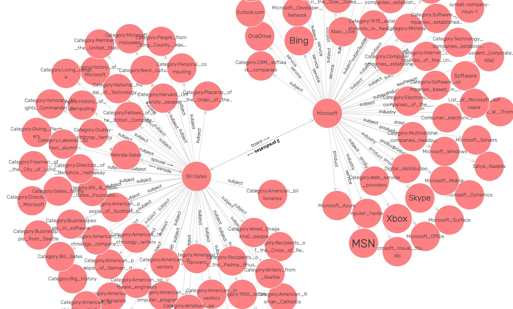

# Knowledge Graph Sampler for Creating Small Custom Knowledge Graphs {#kgsampler}

I find it convenient to be able to "sample" small parts of larger knowledge graphs. The example program in this chapter accepts a list of DBPedia entity URIs, attempts top find links between these entities, and writes these nodes and discovered edges to a RDF triples file.

The code is in the directory **src/kgsampler**. As seen in the configuration files **kg-add-dbpedia-triples.asd** and **package.lisp**, we will use the **sparql** library we developed earlier as well as the libraries **uiop** and **drakma**:

{lang="lisp",linenos=off}
~~~~~~~~
;;;; kgsampler.asd

(asdf:defsystem #:kgsampler
  :description "sample knowledge graphs"
  :author "Mark Watson markw@markwatson.com"
  :license "Apache 2"
  :depends-on (#:uiop #:drakma #:sparql)
  :components ((:file "package")
               (:file "kgsampler")))
~~~~~~~~

{lang="lisp",linenos=off}
~~~~~~~~
;;;; package.lisp

(defpackage #:kgsampler
  (:use #:cl #:uiop #:sparql)
  (:export #:sample))
~~~~~~~~

The program starts with a list of entities and tries to find links on DBPedia between the entities. A small sample graph of the input entities and any discovered links is written to a file. The function **dbpedia-as-nt** spawns a process to use the *curl* utility to make a HTTP request to DBPedia. The function **construct-from-dbpedia** takes a list of entities and writes SPARQL CONSTRUCT statements with the entity as the subject and the object filtered to a string value in the English language to an output stream. The function **find-relations** runs at **O(N^2)** where **N** is the number of input entities so you should avoid using this program with a large number of input entities.

I offer this code with little explanation since much of it is similar to the techniques you saw in the previous chapter Knowledge Graph Navigator.

{lang="lisp",linenos=off}
~~~~~~~~
;; kgsampler main program

(in-package #:kgsampler)

(defun dbpedia-as-nt (query)
  (print query)
  (uiop:run-program 
   (list
    "curl" 
    (concatenate 'string
                 "https://dbpedia.org/sparql?format=text/ntriples&query="
                 ;; formats that work: csv, text/ntriples, text/ttl
                 (drakma:url-encode query :utf-8)))
   :output :string))

(defun construct-from-dbpedia (entity-uri-list &key (output-stream t))
  (dolist (entity-uri entity-uri-list)
    (format output-stream "~%~%# ENTITY NAME: ~A~%~%" entity-uri)
    (format
     output-stream
     (dbpedia-as-nt
      (format nil
              "CONSTRUCT { ~A ?p ?o } where { ~A ?p ?o  . FILTER(lang(?o) = 'en') }"  
              entity-uri entity-uri)))))

(defun ensure-angle-brackets (s)
  "make sure URIs have angle brackets"
  (if (equal #\< (char s 0))
      s
      (concatenate 'string "<" s ">")))

(defun find-relations (entity-uri-list &key (output-stream t))
  (dolist (entity-uri1 entity-uri-list)
    (dolist (entity-uri2 entity-uri-list)
      (if (not (equal entity-uri1 entity-uri2))
          (let ((possible-relations
                 (mapcar #'cadar
                         (sparql::dbpedia
                          (format nil 
                                  "select ?p where { ~A ?p ~A . filter(!regex(str(?p), \"page\", \"i\"))} limit 50"
                                  entity-uri1 entity-uri2)))))
            (print "** possible-relations:") (print possible-relations)
            (dolist (pr possible-relations)
              (format output-stream "~A ~A ~a .~%"
		      entity-uri1
		      (ensure-angle-brackets pr)
		      entity-uri2)))))))

(defun sample (entity-uri-list output-filepath)
  (with-open-file (ostream  (pathname output-filepath) :direction :output :if-exists :supersede)
    (construct-from-dbpedia entity-uri-list :output-stream ostream)
    (find-relations entity-uri-list :output-stream ostream)))
~~~~~~~~

Let's start by running the two helper functions interactively so you can see their output (output edited for brevity). The top level function **kgsampler:sample** for this example takes a list of entity URIs and an output file name, and uses the functions **construct-from-dbpedia entity-uri-list** and **find-relations** to write triples for the entities and then for the relationships discovered between entities. The following listing also calls the helper function **kgsampler::find-relations** to show you what its output looks like.

{lang="lisp",linenos=off}
~~~~~~~~
$ sbcl
* (ql:quickload "kgsampler")
*   (kgsampler::construct-from-dbpedia '("<http://dbpedia.org/resource/Bill_Gates>" "<http://dbpedia.org/resource/Steve_Jobs>") :output-stream nil)

"CONSTRUCT { <http://dbpedia.org/resource/Bill_Gates> ?p ?o } where { <http://dbpedia.org/resource/Bill_Gates> ?p ?o  . FILTER (lang(?o) = 'en') }" 
"CONSTRUCT { <http://dbpedia.org/resource/Bill_Gates> <http://purl.org/dc/terms/subject> ?o } where { <http://dbpedia.org/resource/Bill_Gates> <http://purl.org/dc/terms/subject> ?o  }" 

 ...

* (kgsampler::find-relations '("<http://dbpedia.org/resource/Bill_Gates>" "<http://dbpedia.org/resource/Microsoft>") :output-stream nil)

("dbpedia SPARQL:"
 "select ?p where { <http://dbpedia.org/resource/Bill_Gates> ?p <http://dbpedia.org/resource/Microsoft> . filter(!regex(str(?p), \"page\", \"i\"))} limit 50"
 "n") 
"** possible-relations:" 
("http://dbpedia.org/ontology/knownFor") 
"http://dbpedia.org/ontology/knownFor" 
("dbpedia SPARQL:"
 "select ?p where { <http://dbpedia.org/resource/Microsoft> ?p <http://dbpedia.org/resource/Bill_Gates> . filter(!regex(str(?p), \"page\", \"i\"))} limit 50"
 "n") 
"** possible-relations:" 
("http://dbpedia.org/property/founders" "http://dbpedia.org/ontology/foundedBy") 
"http://dbpedia.org/property/founders" 
"http://dbpedia.org/ontology/foundedBy" 
nil
~~~~~~~~

We now use the main function to generate an output RDF triple file:

{lang="lisp",linenos=on}
~~~~~~~~
$ sbcl
* (ql:quickload "kgsampler")
* (kgsampler:sample '("<http://dbpedia.org/resource/Bill_Gates>" "<http://dbpedia.org/resource/Steve_Jobs>" "<http://dbpedia.org/resource/Microsoft>")  "test.nt")
"CONSTRUCT { <http://dbpedia.org/resource/Bill_Gates> ?p ?o } where { <http://dbpedia.org/resource/Bill_Gates> ?p ?o  . FILTER (lang(?o) = 'en') }" 
("ndbpedia SPARQL:n"
 "select ?p where { <http://dbpedia.org/resource/Bill_Gates> ?p <http://dbpedia.org/resource/Microsoft> . filter(!regex(str(?p), \"page\", \"i\"))} limit 50"
 "n") 
"** possible-relations:" 
("http://dbpedia.org/ontology/board") 
("dbpedia SPARQL:"
 "select ?p where { <http://dbpedia.org/resource/Steve_Jobs> ?p <http://dbpedia.org/resource/Bill_Gates> . filter(!regex(str(?p), \"page\", \"i\"))} limit 50"
 "n") 
~~~~~~~~

Output RDF N-Triple data is written to the file **sample-KG.nt**. A very small part of this file is listed here:

{lang="lisp",linenos=on}
~~~~~~~~

# ENTITY NAME: <http://dbpedia.org/resource/Bill_Gates>

<http://dbpedia.org/resource/Bill_Gates>        <http://dbpedia.org/ontology/abstract>  "William Henry \"Bill\" Gates III (born October 28, 1955) is an American business magnate,...."@en .
<http://dbpedia.org/resource/Bill_Gates>
        <http://xmlns.com/foaf/0.1/name>
        "Bill Gates"@en .
<http://dbpedia.org/resource/Bill_Gates>
        <http://xmlns.com/foaf/0.1/surname>
        "Gates"@en .
<http://dbpedia.org/resource/Bill_Gates>
        <http://dbpedia.org/ontology/title>
        "Co-Chairmanof theBill & Melinda Gates Foundation"@en .
~~~~~~~~

The same data in Turtle RDF format can be seen in the file **sample-KG.ttl** that was produced by importing the triples file into the free edition of GraphDB exporting it to the Turtle file **sample-KG.ttl** that I find easier to read. GraphDB has visualization tools which I use here to generate an interactive graph display of this data:

{width: "90%"}

This example is also set up for people and companies. I may expand it in the future to other types of entities as I need them.

This example program takes several minutes to run since many SPARQL queries are made to DBPedia. I am a non-corporate member of the DBPedia organization. [Here is a membership application](https://www.dbpedia.org/members/membership/) if you are interested in joining me there.

