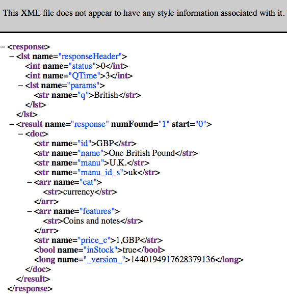

# Using MongoDB, CouchDB, Solr, and Neo4J NoSQL Data Stores {#nosql_chapter}

Non-relational data stores are commonly used for applications that don't need either full relational algebra or must scale.

Brewer's CAP theorem states that a distributed data storage system comprised of multiple nodes can be robust to two of three of the following guarantees: all nodes always have a **C**onsistent view of the state of data, general **A**vailablity of data if not all nodes are functioning, and **P**artition tolerance so clients can still communicate with the data storage system when parts of the system are unavailable because of network failures. The basic idea is that different applications have different requirements and sometimes it makes sense to reduce system cost or improve scalability by easing back on one of these requirements.

A good example is that some applications may not need transactions (the first guarantee) because it is not important if clients sometimes get data that is a few seconds out of date.

MongoDB allows you to choose consistency vs. availability vs. efficiency. 

I cover the Solr indexing and search service (based on Lucene) both because a Solr indexed document store is a type of NoSQL data store and also because I believe that you will find Solr very useful for building systems, if you don't already use it.

We will design the examples in this chapter so that they can be reused in the last chapter in this book on [Information Gathering](#information_gathering).

## MongoDB

The following discussion of MongoDB is based on just my personal experience, so I am not covering all use cases. I have used MongoDB for:

- Small clusters of MongoDB nodes to analyze social media data, mostly text mining and sentiment analysis. In all cases for each application I ran MongoDB with one write master (i.e., I wrote data to this one node but did not use it for reads) and multiple read-only slave nodes. Each slave node would run on the same server that was usually performing a single bit of analytics.
- Multiple very large independent clusters for web advertising. Problems faced included trying to have some level of consistency across data centers. Replica sets were used within each data center.
- Running a single node MongoDB instance for low volume data collection and analytics.

One of the advantages of MongoDB is that it is very "developer friendly" because it supports ad-hoc document schemas and interactive queries. I mentioned that MongoDB allows you to choose consistency vs. availability vs. efficiency. When you perform MongoDB writes you can specify some granularity of what constitutes a "successful write" by requiring that a write is performed at a specific number of nodes before the client gets acknowledgement that the write was successful.  This requirement adds overhead to each write operation and can cause writes to fail if some nodes are not available.

The [MongoDB online documentation](http://docs.mongodb.org/manual/) is very good. You don't have to read it in order to have fun playing with the following Common Lisp and MongoDB examples, but if you find that MongoDB is a good fit for your needs after playing with these examples then you should read the documentation. I usually install MongoDB myself but it is sometimes convenient to use a hosting service.

At this time there is no official Common Lisp support for accessing MongoDB but there is a useful project by Alfons Haffmans' [cl-mongo](https://github.com/fons/cl-mongo) that will allow us to write Common Lisp client applications and have access to most of the capabilities of MongoDB. 

The file **src/mongo_news.lisp** contains the example code used in the next three sessions.

### Adding Documents

The following repl listing shows the **cl-mongo** APIs for creating a new document, adding elements (attributes) to it, and inserting it in a MongoDB data store:

{lang="lisp",linenos=off}
~~~~~~~~
(ql:quickload "cl-mongo")

(cl-mongo:db.use "news")

(defun add-article (uri title text)
  (let ((doc (cl-mongo:make-document)))
	(cl-mongo:add-element "uri" uri doc)
	(cl-mongo:add-element "title" title doc)
	(cl-mongo:add-element "text" text doc)
	(cl-mongo:db.insert "article" doc)))

;; add a test document:
(add-article "http://test.com" "article title 1" "article text 1")
~~~~~~~~

In this example, three string attributes were added to a new document before it was saved.

### Fetching Documents by Attribute

We will start by fetchng and pretty-printing all documents in the collection **articles** and fetching all articles a list of nested lists where the inner nested lists are document URI, title, and text:

{lang="lisp",linenos=on}
~~~~~~~~
(defun print-articles ()
  (cl-mongo:pp (cl-mongo:iter (cl-mongo:db.find "article" :all))))

;; for each document, use the cl-mongo:get-element on
;; each element we want to save:
(defun article-results->lisp-data (mdata)
  (let ((ret '()))
    ;;(print (list "size of result=" (length mdata)))
    (dolist (a mdata)
      ;;(print a)
      (setf 
       ret
       (cons
         (list
          (cl-mongo:get-element "uri" a)
          (cl-mongo:get-element "title" a)
          (cl-mongo:get-element "text" a))
         ret)))
     ret))

(defun get-articles ()
  (article-results->lisp-data
    (cadr (cl-mongo:db.find "article" :all))))
~~~~~~~~

Output for these two functions looks like:

~~~~~~~~
* (print-articles)

{
  "_id" -> objectid(99778A792EBB4F76B82F75C6)
  "uri"  ->  http://test.com/3
  "title"  ->  article title 3
  "text"  ->  article text 3
}

{
  "_id" -> objectid(D47DEF3CFDB44DEA92FD9E56)
  "uri"  ->  http://test.com/2
  "title"  ->  article title 2
  "text"  ->  article text 2
}

* (get-articles)

(("http://test.com/2" "article title 2" "article text 2")
 ("http://test.com/3" "article title 3" "article text 3"))
~~~~~~~~

### Fetching Documents by Regular Expression Text Search

By reusing the function **article-results->lisp-data** defined in the last section, we can also search for JSON documents using regular expressions matching attribute values:

{lang="lisp",linenos=on}
~~~~~~~~
;; find documents where substring 'str' is in the title:
(defun search-articles-title (str)
  (article-results->lisp-data
    (cadr
      (cl-mongo:iter
       (cl-mongo:db.find
         "article"
         (cl-mongo:kv
            "title"     // TITLE ATTRIBUTE
            (cl-mongo:kv "$regex" str)) :limit 10)))))

;; find documents where substring 'str' is in the text element:
(defun search-articles-text (str) 
  (article-results->lisp-data
    (cadr
      (cl-mongo:db.find
        "article"
        (cl-mongo:kv
           "text"        // TEXT ATTRIBUTE
           (cl-mongo:kv "$regex" str)) :limit 10))))
~~~~~~~~

I set the limit to return a maximum of ten documents. If you do not set the limit, this example code only returns one search result. The following repl listing shows the results from calling function **search-articles-text**:

~~~~~~~~
* (SEARCH-ARTICLES-TEXT "text")

(("http://test.com/2" "article title 2" "article text 2")
 ("http://test.com/3" "article title 3" "article text 3"))
* (SEARCH-ARTICLES-TEXT "3")

(("http://test.com/3" "article title 3" "article text 3"))
~~~~~~~~

I find using MongoDB to be especially effective when experimenting with data and code. The schema free JSON document format, using interactive queries using the [mongo shell](http://docs.mongodb.org/manual/mongo/), and easy to use client libraries like **clouchdb** for Common Lisp will let you experiment with a lot of ideas in a short period of time. The following listing shows the use of the interactive **mongo** **shell**. The database **news** is the database used in the MongoDB examples in this chapter; you will notice that I also have other databases for other projects on my laptop:

~~~~~~~~
->  src git:(master) mongo
MongoDB shell version: 2.4.5
connecting to: test
> show dbs
kbsportal	0.03125GB
knowledgespace	0.03125GB
local	(empty)
mark_twitter	0.0625GB
myfocus	0.03125GB
news	0.03125GB
nyt	0.125GB
twitter	0.125GB
> use news
switched to db news
> show collections
article
system.indexes
> db.article.find()
{ "uri" : "http://test.com/3",
 "title" : "article title 3",
 "text" : "article text 3",
 "_id" : ObjectId("99778a792ebb4f76b82f75c6") }
{ "uri" : "http://test.com/2",
 "title" : "article title 2",
 "text" : "article text 2",
 "_id" : ObjectId("d47def3cfdb44dea92fd9e56") }
> 
~~~~~~~~

Line 1 of this listing shows starting the mongo shell. Line 4 shows how to list all databases in the data store. In line 13 I select the database "news" to use. Line 15 prints out the names of all collections in the current database "news". Line 18 prints out all documents in the "articles" collection. You can read the [documentation for the mongo shell](http://docs.mongodb.org/manual/mongo/) for more options like selective queries, adding indices, etc.

When you run a MongoDB service on your laptop, also try the [admin interface on http://localhost:28017/](http://localhost:28017/).

## CouchDB

CouchDB provides replication services so JSON documents you store with a CouchDB service on your laptop, for instance, can replicate to CouchDB services on your remote servers. For the rest of this chapter we will look at some code examples for using CouchDB from Common Lisp applications.

Building CouchDB from source takes a while since you need Erlang and Javascript dependencies. You can [download prebuilt binaries for Windows and Mac OS X](https://couchdb.apache.org/) and on Linux use **sudo** **apt-get** **install** **couchdb**. I also have found it useful to use the CouchDB hosting service [Cloudant](http://cloudant.com). Cloudant has open sourced a major piece of their infrastructure, a distributed version of CouchDB called BigCouch that you might want to consider if you need a very large distributed document data store.

### Getting CouchDB Set Up

After you run a CouchDB service you can then use the web administration interface [http://127.0.0.1:5984/_utils/index.html](http://127.0.0.1:5984/_utils/index.html) to create a new database **news** that we will use in these examples.

To install and use the [clouchdb](http://common-lisp.net/project/clouchdb) CouchDB client library and use the new **news** database:

{lang="lisp",linenos=on}
~~~~~~~~
(ql:quickload "clouchdb")
* clouchdb:*couchdb*

#S(CLOUCHDB::DB
   :HOST "localhost"
   :PORT "5984"
   :NAME "default"
   :PROTOCOL "http"
   :USER NIL
   :PASSWORD NIL
   :DOCUMENT-FETCH-FN NIL
   :DOCUMENT-UPDATE-FN NIL)
* (setf clouchdb:*couchdb*
        (clouchdb:make-db :name "news" :host "localhost"))

#S(CLOUCHDB::DB
   :HOST "localhost"
   :PORT "5984"
   :NAME "news"
   :PROTOCOL "http"
   :USER NIL
   :PASSWORD NIL
   :DOCUMENT-FETCH-FN NIL
   :DOCUMENT-UPDATE-FN NIL)
~~~~~~~~

Notice that in line 7 that the database name is "default." We want to change the database to "news" which we do in line 13. You can in a similar way change any other attributes in the **couchdb::*couchdb*** connection structure.

### Adding Documents

CouchDB documents are stored as JSON data. The **clouchdb** library lets us deal with documents as Lisp lists and converts to and from JSON for us.

We can create a document passing a list of lists to the function **clouchdb:create-document**. The sub-lists are treated as hash table key/value pairs:

~~~~~~~~
(defvar *d1*
  (clouchdb:create-document
   '(("uri" . "test.com/news")
     ("title" . "Fishing Season")
     ("text" . "Fishing season opens tomorrow"))))
* *d1*

((:|ok| . T) (:|id| . "7ae9bee63100a7b449d4ae7a6c000b9c")
 (:|rev| . "1-3497880f631bd2cea12cdbf8c7d7553f"))
* (clouchdb:get-document "7ae9bee63100a7b449d4ae7a6c000b9c")

((:|_id| . "7ae9bee63100a7b449d4ae7a6c000b9c")
 (:|_rev| . "1-3497880f631bd2cea12cdbf8c7d7553f")
 (:|uri| . "test.com/news")
 (:|title| . "Fishing Season")
 (:|text| . "Fishing season opens tomorrow"))
~~~~~~~~

If you are still running the web administration interface you can look at database **news**, see one document that we just created, and inspect the data in the document:

{#couch1}
{width: "80%"}

### Fetching Documents

CouchDB uses **views** that are pre-computed using map reduce programs written in Javascript. You don't need to look at it right now, but if after experimenting with the examples in this chapter you decide to use CouchDB for your projects then you will need to read the [CouchDB View Documentation](https://wiki.apache.org/couchdb/Introduction_to_CouchDB_views).

The clouchdb documentation has several examples for using the **parenscript** library to convert Lisp to Javascript for **views** but I prefer just using Javascript. One reason for this is that I experiment with writing map reduce functions for creating views while inside the CouchDB Admin Web App in Javascript. I find that using **parenscript** is an unnecessary extra level of abstraction. The map reduce view functions I need are relatively simple, and I don't mind writing them in Javascript.

The following listing shows a temporary view to return all documents that have an attribute **title**. The Javascript code in the call to **clouchdb:ad-hoc-view** should be all on one line, I manually reformatted it here for readability:

~~~~~~~~
* (clouchdb:ad-hoc-view
   "function(doc) {
	 if (doc.title) {
	   emit(null,doc.title)
	 }
	}")

((:|total_rows| . 1) (:|offset| . 0)
 (:|rows|
  ((:|id| . "7ae9bee63100a7b449d4ae7a6c000b9c") (:|key|)
   (:|value| . "Fishing Season"))))
~~~~~~~~

You can also match on substrings. The following call to **clouchdb:ad-hoc-view** should be all on one line (once again, I manually reformatted it here for readability):

~~~~~~~~
* (clouchdb:ad-hoc-view
   "function(doc) {
	 if (doc.title.indexOf('Season') != -1) {
		 emit(null,doc.title)
	 }
	}")

((:|total_rows| . 1) (:|offset| . 0)
 (:|rows|
  ((:|id| . "7ae9bee63100a7b449d4ae7a6c000b9c")
   (:|key|)
   (:|value| . "Fishing Season"))))
~~~~~~~~

Please note that ad-hoc views are very inefficient but useful during development. In production you will create named views for specific queries. The CouchDB service will keep the view up to date for you automatically as documents are created, modified, and removed. The following listing shows a "design" document that is used to define a view:

~~~~~~~~
{
  "_id": "_design/titleview",
  "_rev": "4-3ce2dfe67576066c94da9fb5e80b8fdc",
  "language": "javascript",
  "views": {
    "season": {
      "map":
      "function(doc) {
	     if (doc.title.indexOf('Season')!=-1) emit(null, doc)
	   }"
    }
  }
}
~~~~~~~~

Note the form of the attribute **_id** which is important: the string "_design/" followed by the name of the view. In general, you might define multiple views in a single "design" document, but I only defined one here named "season." Also note that the "season" view only has a map function, not a reduce function. The pattern of using only a map function is common when you want to select a set of documents based on some selection criteria. Using map and reduce functions is useful when you are aggregating data from many documents together.

The following figure shows the CouchDB admin web app while I was editing this view:

{#couch2}
{width: "80%"}

You can run this view using:

~~~~~~~~
* (clouchdb:invoke-view "titleview" "season")

((:|total_rows| . 1) (:|offset| . 0)
 (:|rows|
  ((:|id| . "7ae9bee63100a7b449d4ae7a6c000b9c") (:|key|)
   (:|value| (:|_id| . "7ae9bee63100a7b449d4ae7a6c000b9c")
    (:|_rev| . "1-3497880f631bd2cea12cdbf8c7d7553f")
    (:|uri| . "test.com/news")
    (:|title| . "Fishing Season")
    (:|text| . "Fishing season opens tomorrow")))))
~~~~~~~~

The call to function **clouchdb:invoke-view** on line 1 references the name of the design documents without the prefix "_design/" and the name of the view "season" that was defined in this "design" document.

### Accessing Document Attributes

If we add an additional test document with "Season" in its title and re-run the view from the last section, we now have two matching results when calling the function **clouchdb:invoke-view**:

~~~~~~~~
* (defvar *results* (clouchdb:invoke-view "titleview" "season"))

*RESULTS*
* *results*

((:|total_rows| . 2) (:|offset| . 0)
 (:|rows|
  ((:|id| . "7ae9bee63100a7b449d4ae7a6c000b9c") (:|key|)
   (:|value| (:|_id| . "7ae9bee63100a7b449d4ae7a6c000b9c")
    (:|_rev| . "1-3497880f631bd2cea12cdbf8c7d7553f")
    (:|uri| . "test.com/news")
    (:|title| . "Fishing Season")
    (:|text| . "Fishing season opens tomorrow")))
  ((:|id| . "7ae9bee63100a7b449d4ae7a6c0019c6") (:|key|)
   (:|value| (:|_id| . "7ae9bee63100a7b449d4ae7a6c0019c6")
    (:|_rev| . "1-1c213a425457a470cad1892e5cf10c1d")
    (:|uri| . "test.com/news")
    (:|title| . "Fishing Season")
    (:|text| . "Fishing season opens tomorrow 3")))))
* (cdaddr *results*)

(((:|id| . "7ae9bee63100a7b449d4ae7a6c000b9c") (:|key|)
  (:|value| (:|_id| . "7ae9bee63100a7b449d4ae7a6c000b9c")
   (:|_rev| . "1-3497880f631bd2cea12cdbf8c7d7553f")
   (:|uri| . "test.com/news")
   (:|title| . "Fishing Season")
   (:|text| . "Fishing season opens tomorrow")))
 ((:|id| . "7ae9bee63100a7b449d4ae7a6c0019c6") (:|key|)
  (:|value| (:|_id| . "7ae9bee63100a7b449d4ae7a6c0019c6")
   (:|_rev| . "1-1c213a425457a470cad1892e5cf10c1d")
   (:|uri| . "test.com/news")
   (:|title| . "Fishing Season")
   (:|text| . "Fishing season opens tomorrow 3"))))
* (dolist (r (cdaddr *results*))
   (print r)
   (terpri))

((:|id| . "7ae9bee63100a7b449d4ae7a6c000b9c") (:|key|)
 (:|value| (:|_id| . "7ae9bee63100a7b449d4ae7a6c000b9c")
  (:|_rev| . "1-3497880f631bd2cea12cdbf8c7d7553f")
  (:|uri| . "test.com/news")
  (:|title| . "Fishing Season")
  (:|text| . "Fishing season opens tomorrow"))) 

((:|id| . "7ae9bee63100a7b449d4ae7a6c0019c6") (:|key|)
 (:|value| (:|_id| . "7ae9bee63100a7b449d4ae7a6c0019c6")
  (:|_rev| . "1-1c213a425457a470cad1892e5cf10c1d")
  (:|uri| . "test.com/news")
  (:|title| . "Fishing Season")
  (:|text| . "Fishing season opens tomorrow 3"))) 
NIL
* (defun print-doc (doc) (print (cdddr (caddr doc))))

PRINT-DOC
* (dolist (r (cdaddr *results*)) (print-doc r) (terpri))

((:|uri| . "test.com/news")
 (:|title| . "Fishing Season")
 (:|text| . "Fishing season opens tomorrow")) 

((:|uri| . "test.com/news")
 (:|title| . "Fishing Season")
 (:|text| . "Fishing season opens tomorrow 3")) 
NIL
* (defun print-doc (doc)
   (let ((x (cdddr (caddr doc))))
    (print
      (list
       "title:"
       (cdadr x) "text:" (cdaddr x)))))
STYLE-WARNING: redefining COMMON-LISP-USER::PRINT-DOC in DEFUN

PRINT-DOC
* (dolist (r (cdaddr *results*))
    (print-doc r)
    (terpri))

("title:" "Fishing Season" "text:" "Fishing season opens tomorrow") 

("title:" "Fishing Season" "text:" "Fishing season opens tomorrow 3") 
NIL
~~~~~~~~

## A Common Lisp Solr Client

The Lucene project is one of the most widely used Apache Foundation projects. Lucene is a flexible library for preprocessing and indexing text, and searching text. I have personally used Lucene on so many projects that it would be difficult to count them. The [Apache Solr Project](https://lucene.apache.org/solr/) adds a network interface to the Lucene text indexer and search engine. Solr also adds other utility features to Lucene:

- While Lucene is a library to embed in your programs, Solr is a complete system.
- Solr provides good defaults for preprocessing and indexing text and also provides rich support for managing structured data.
- Provides both XML and JSON APIs using HTTP and REST.
- Supports faceted search, geospatial search, and provides utilities for highlighting search terms in surrounding text of search results.
- If your system ever grows to a very large number of users, Solr supports scaling via replication.

I hope that you will find the Common Lisp example Solr client code in the following sections helps you make Solr part of large systems that you write using Common Lisp.

### Installing Solr

Download a [binary Solr distribution](https://lucene.apache.org/solr/downloads.html) and un-tar or un-zip this Solr distribution, cd to the distribution directory, then cd to the example directory and run:

~~~~~~~~
 ~/solr/example>  java -jar start.jar
~~~~~~~~

You can access the Solr Admin Web App at [http://localhost:8983/solr/#/](http://localhost:8983/solr/#/). This web app can be seen in the following screen shot:

{#solr1}
{width: "80%"}

There is no data in the Solr example index yet, so following the Solr tutorial instructions:

~~~~~~~~
 ~/> cd ~/solr/example/exampledocs
 ~/solr/example/exampledocs> java -jar post.jar *.xml
SimplePostTool version 1.5
Posting files to base url http://localhost:8983/solr/update
        using content-type application/xml..
POSTing file gb18030-example.xml
POSTing file hd.xml
POSTing file ipod_other.xml
POSTing file ipod_video.xml
POSTing file manufacturers.xml
POSTing file mem.xml
POSTing file money.xml
POSTing file monitor.xml
POSTing file monitor2.xml
POSTing file mp500.xml
POSTing file sd500.xml
POSTing file solr.xml
POSTing file utf8-example.xml
POSTing file vidcard.xml
14 files indexed.
COMMITting Solr index changes
           to http://localhost:8983/solr/update..
Time spent: 0:00:00.480
~~~~~~~~

You will learn how to add documents to Solr directly in your Common Lisp programs in a later section.

Assuming that you have a fast Internet connection so that downloading Solr was quick, you have hopefully spent less than five or six minutes getting Solr installed and running with enough example search data for the Common Lisp client examples we will play with. Solr is a great tool for storing, indexing, and searching data. I recommend that you put off reading the official Solr documentation for now and instead work through the Common Lisp examples in the next two sections. Later, if you want to use Solr then you will need to carefully read the Solr documentation.

### Solr's REST Interface

The [Solr REST Interface Documentation](https://wiki.apache.org/solr/SolJSON) documents how to perform search using HTTP GET requests. All we need to do is implement this in Common Lisp which you will see is easy.

Assuming that you have Solr running and the example data loaded, we can try searching for documents with, for example, the word "British" using the URL [http://localhost:8983/solr/select?q=British](http://localhost:8983/solr/select?q=British). This is a REST request URL and you can use utilities like **curl** or **wget** to fetch the XML data. I fetched the data in a web browser, as seen in the following screen shot of a Firefox web browser (I like the way Firefox formats and displays XML data):

{#solr2}
{width: "80%"}

The attributes in the returned search results need some explanation. We indexed several example XML data files, one of which contained the following XML element that we just saw as a search result:

~~~~~~~~
<doc>
  <field name="id">GBP</field>
  <field name="name">One British Pound</field>
  <field name="manu">U.K.</field>
  <field name="manu_id_s">uk</field>
  <field name="cat">currency</field>
  <field name="features">Coins and notes</field>
  <field name="price_c">1,GBP</field>
  <field name="inStock">true</field>
</doc>
~~~~~~~~

So, the search result has the same attributes as the structured XML data that was added to the Solr search index. Solr's capability for indexing structured data is a superset of just indexing plain text. If for example we were indexing news stories, then example input data might look like:

~~~~~~~~
<doc>
  <field name="id">new_story_0001</field>
  <field name="title">Fishing Season Opens</field>
  <field name="text">Fishing season opens on Friday in Oak Creek.</field>
</doc>
~~~~~~~~

With this example, a search result that returned this document as a result would return attributes **id**, **title**, and **text**, and the values of these three attributes.

By default the Solr web service returns XML data as seen in the last screen shot. For our examples, I prefer using JSON so we are going to always add a request parameter **wt=json** to all REST calls. The following screen shot shows the same data returned in JSON serialization format instead of XML format of a Chrome web browser (I like the way Chrome formats and displays JSON data with the JSONView Chrome Browser extension):

{#solr3}
{width: "80%"}

You can read the full JSON REST Solr documentation later, but for our use here we will use the following search patterns:

- http://localhost:8983/solr/select?q=British+One&wt=json - search for documents with either of the words "British" or "one" in them. Note that in URIs that the "+" character is used to encode a space character. If you wanted a "+" character you would encode it with "%2B" and a space character is encoded as "%20". The default Solr search option is an OR of the search terms, unlike, for example, Google Search.
- http://localhost:8983/solr/select?q=British+AND+one&wt=json - search for documents that contain both of the words "British" and "one" in them. The search term in plain text is "British AND one".

### Common Lisp Solr Client for Search

As we saw in the earlier in [Network Programming](#network_prog) it is fairly simple to use the **drakma** and **cl-json** Common Lisp libraries to call REST services that return JSON data. The function **do-search** defined in the next listing (all the Solr example code is in the file **src/solr-client.lisp**) constructs a query URI as we saw in the last section and uses the **Drackma** library to perform an HTTP GET operation and the **cl-json library** to parse the returned string containing JSON data into Lisp data structures: 

{lang="lisp",linenos=off}
~~~~~~~~
(ql:quickload :drakma)
(ql:quickload :cl-json)

(defun do-search (&rest terms)
  (let ((query-string (format nil "~{~A~^+AND+~}" terms)))
   (cl-json:decode-json-from-string
     (drakma:http-request
       (concatenate 
        'string
        "http://localhost:8983/solr/select?q="
        query-string
        "&wt=json")))))
~~~~~~~~

This example code does return the search results as Lisp list data; for example:

~~~~~~~~
* (do-search "British" "one")

((:RESPONSE-HEADER (:STATUS . 0) (:*Q-TIME . 1)
  (:PARAMS (:Q . "British+AND+one") (:WT . "json")))
 (:RESPONSE (:NUM-FOUND . 6) (:START . 0)
  (:DOCS
   ((:ID . "GBP") (:NAME . "One British Pound") (:MANU . "U.K.")
    (:MANU--ID--S . "uk") (:CAT "currency")
    (:FEATURES "Coins and notes")
    (:PRICE--C . "1,GBP") (:IN-STOCK . T)
    (:--VERSION-- . 1440194917628379136))
   ((:ID . "USD") (:NAME . "One Dollar")
    (:MANU . "Bank of America")
    (:MANU--ID--S . "boa") (:CAT "currency")
    (:FEATURES "Coins and notes")
    (:PRICE--C . "1,USD") (:IN-STOCK . T)
    (:--VERSION-- . 1440194917624184832))
   ((:ID . "EUR") (:NAME . "One Euro")
    (:MANU . "European Union")
    (:MANU--ID--S . "eu") (:CAT "currency")
    (:FEATURES "Coins and notes")
    (:PRICE--C . "1,EUR") (:IN-STOCK . T)
    (:--VERSION-- . 1440194917626281984))
   ((:ID . "NOK") (:NAME . "One Krone")
    (:MANU . "Bank of Norway")
    (:MANU--ID--S . "nor") (:CAT "currency")
    (:FEATURES "Coins and notes")
    (:PRICE--C . "1,NOK") (:IN-STOCK . T)
    (:--VERSION-- . 1440194917631524864))
   ((:ID . "0579B002")
    (:NAME . "Canon PIXMA MP500 All-In-One Photo Printer")
    (:MANU . "Canon Inc.")
    (:MANU--ID--S . "canon")
    (:CAT "electronics" "multifunction printer"
     "printer" "scanner" "copier")
    (:FEATURES "Multifunction ink-jet color photo printer"
     "Flatbed scanner, optical scan resolution of 1,200 x 2,400 dpi"
     "2.5\" color LCD preview screen" "Duplex Copying"
     "Printing speed up to 29ppm black, 19ppm color" "Hi-Speed USB"
     "memory card: CompactFlash, Micro Drive, SmartMedia,
      Memory Stick, Memory Stick Pro, SD Card, and MultiMediaCard")
    (:WEIGHT . 352.0) (:PRICE . 179.99)
    (:PRICE--C . "179.99,USD")
    (:POPULARITY . 6) (:IN-STOCK . T)
    (:STORE . "45.19214,-93.89941")
    (:--VERSION-- . 1440194917651447808))
   ((:ID . "SOLR1000")
    (:NAME . "Solr, the Enterprise Search Server")
    (:MANU . "Apache Software Foundation")
    (:CAT "software" "search")
    (:FEATURES "Advanced Full-Text Search Capabilities using Lucene"
     "Optimized for High Volume Web Traffic"
     "Standards Based Open Interfaces - XML and HTTP"
     "Comprehensive HTML Administration Interfaces"
     "Scalability - Efficient Replication to other Solr Search Servers"
     "Flexible and Adaptable with XML configuration and Schema"
     "Good unicode support: héllo (hello with an accent over the e)")
    (:PRICE . 0.0) (:PRICE--C . "0,USD") (:POPULARITY . 10) (:IN-STOCK . T)
    (:INCUBATIONDATE--DT . "2006-01-17T00:00:00Z")
    (:--VERSION-- . 1440194917671370752)))))
~~~~~~~~

I might modify the search function to return just the fetched documents as a list, discarding the returned Solr meta data:

~~~~~~~~
* (cdr (cadddr (cadr (do-search "British" "one"))))

(((:ID . "GBP") (:NAME . "One British Pound") (:MANU . "U.K.")
  (:MANU--ID--S . "uk") (:CAT "currency") (:FEATURES "Coins and notes")
  (:PRICE--C . "1,GBP") (:IN-STOCK . T)
  (:--VERSION-- . 1440194917628379136))
 ((:ID . "USD") (:NAME . "One Dollar") (:MANU . "Bank of America")
  (:MANU--ID--S . "boa") (:CAT "currency") (:FEATURES "Coins and notes")
  (:PRICE--C . "1,USD") (:IN-STOCK . T)
  (:--VERSION-- . 1440194917624184832))
 ((:ID . "EUR") (:NAME . "One Euro") (:MANU . "European Union")
  (:MANU--ID--S . "eu") (:CAT "currency") (:FEATURES "Coins and notes")
  (:PRICE--C . "1,EUR") (:IN-STOCK . T)
  (:--VERSION-- . 1440194917626281984))
 ((:ID . "NOK") (:NAME . "One Krone") (:MANU . "Bank of Norway")
  (:MANU--ID--S . "nor") (:CAT "currency")
  (:FEATURES "Coins and notes")
  (:PRICE--C . "1,NOK") (:IN-STOCK . T)
  (:--VERSION-- . 1440194917631524864))
 ((:ID . "0579B002")
  (:NAME . "Canon PIXMA MP500 All-In-One Photo Printer")
  (:MANU . "Canon Inc.") (:MANU--ID--S . "canon")
  (:CAT "electronics" "multifunction printer" "printer"
   "scanner" "copier")
  (:FEATURES "Multifunction ink-jet color photo printer"
   "Flatbed scanner, optical scan resolution of 1,200 x 2,400 dpi"
   "2.5\" color LCD preview screen" "Duplex Copying"
   "Printing speed up to 29ppm black, 19ppm color" "Hi-Speed USB"
   "memory card: CompactFlash, Micro Drive, SmartMedia, Memory Stick,
    Memory Stick Pro, SD Card, and MultiMediaCard")
  (:WEIGHT . 352.0) (:PRICE . 179.99) (:PRICE--C . "179.99,USD")
  (:POPULARITY . 6) (:IN-STOCK . T) (:STORE . "45.19214,-93.89941")
  (:--VERSION-- . 1440194917651447808))
 ((:ID . "SOLR1000") (:NAME . "Solr, the Enterprise Search Server")
  (:MANU . "Apache Software Foundation") (:CAT "software" "search")
  (:FEATURES "Advanced Full-Text Search Capabilities using Lucene"
   "Optimized for High Volume Web Traffic"
   "Standards Based Open Interfaces - XML and HTTP"
   "Comprehensive HTML Administration Interfaces"
   "Scalability - Efficient Replication to other Solr Search Servers"
   "Flexible and Adaptable with XML configuration and Schema"
   "Good unicode support: héllo (hello with an accent over the e)")
  (:PRICE . 0.0) (:PRICE--C . "0,USD") (:POPULARITY . 10) (:IN-STOCK . T)
  (:INCUBATIONDATE--DT . "2006-01-17T00:00:00Z")
  (:--VERSION-- . 1440194917671370752)))
~~~~~~~~

There are a few more important details if you want to add Solr search to your Common Lisp applications. When there are many search results you might want to fetch a limited number of results and then "page" through them. The following strings can be added to the end of a search query:

- &rows=2 this example returns a maximum of two "rows" or two query results.
- &start=4 this example skips the first 4 available results

A query that combines skipping results and limiting the number of returned results looks like this:

~~~~~~~~
http://localhost:8983/solr/select?q=British+One&wt=json&start=2&rows=2
~~~~~~~~

### Common Lisp Solr Client for Adding Documents

In the last example we relied on adding example documents to the Solr search index using the directions for setting up a new Solr installation. In a real application, in addition to performing search requests for indexed documents you will need to add new documents from your Lisp applications. Using the Drakma we will see that it is very easy to add documents.

We need to construct a bit of XML containing new documents in the form:

{lang="xml"}
~~~~~~~~
<add>
    <doc>
        <field name="id">123456</field>
        <field name="title">Fishing Season</field>
    </doc>
</add>
~~~~~~~~

You can specify whatever field names (attributes) that are required for your application. You can also pass multiple **\<doc>\</doc>** elements in one add request. We will want to specify documents in a Lisp like way: a list of cons values where each cons value is a field name and a value. For the last XML document example we would like an API that lets us just deal with Lisp data like:

{lang="lisp",linenos=off}
~~~~~~~~
 (do-add '(("id" . "12345")
           ("title" . "Fishing Season")))
~~~~~~~~

One thing to note: the attribute names and values must be passed as strings. Other data types like integers, floating point numbers, structs, etc. will not work.

This is nicer than having to use XML, right? The first thing we need is a function to convert a list of cons values to XML. I could have used the XML Builder functionality in the **cxml** library that is available via Quicklisp, but for something this simple I just wrote it in pure Common Lisp with no other dependencies (also in the example file **src/solr-client.lisp**) :

{lang="lisp",linenos=on}
~~~~~~~~
(defun keys-values-to-xml-string  (keys-values-list)
 (with-output-to-string (stream)
   (format stream "<add><doc>")
   (dolist (kv keys-values-list)
     (format stream "<field name=\"")
     (format stream (car kv))
     (format stream "\">")
     (format stream (cdr kv))
     (format stream "\"</field>"))
   (format stream "</doc></add>")))
~~~~~~~~

The macro **with-output-to-string** on line 2 of the listing is my favorite way to generate strings. Everything written to the variable **stream** inside the macro call is appended to a string; this string is the return value of the macro.

The following function adds documents to the Solr document input queue but does not actually index them:

{lang="lisp",linenos=on}
~~~~~~~~
(defun do-add (keys-values-list)
  (drakma:http-request
   "http://localhost:8983/solr/update"
   :method :post
   :content-type "application/xml"
   :content ( keys-values-to-xml-string  keys-values-list)))
~~~~~~~~

You have noticed in line 3 that I am accessing a Solr server running on **localhost** and not a remote server. In an application using a remote Solr server you would need to modify this to reference your server; for example:

~~~~~~~~
"http://solr.knowledgebooks.com:8983/solr/update"
~~~~~~~~

For efficiency Solr does not immediately add new documents to the index until you commit the additions. The following function should be called after you are done adding documents to actually add them to the index:

{lang="lisp",linenos=off}
~~~~~~~~
(defun commit-adds ()
  (drakma:http-request
   "http://localhost:8983/solr/update"
   :method :post
   :content-type "application/xml"
   :content "<commit></commit>"))
~~~~~~~~

Notice that all we need is an empty element **\<commit>\</commit>** that signals the Solr server that it should index all recently added documents. The following repl listing shows everything working together (I am assuming that the contents of the file **src/solr-client.lisp** has been loaded); not all of the output is shown in this listing:

~~~~~~~~
* (do-add '(("id" . "12345") ("title" . "Fishing Season")))

200
((:CONTENT-TYPE . "application/xml; charset=UTF-8")
 (:CONNECTION . "close"))
#<PURI:URI http://localhost:8983/solr/update>
#<FLEXI-STREAMS:FLEXI-IO-STREAM {1009193133}>
T
"OK"
* (commit-adds)

200
((:CONTENT-TYPE . "application/xml; charset=UTF-8")
 (:CONNECTION . "close"))
#<PURI:URI http://localhost:8983/solr/update>
#<FLEXI-STREAMS:FLEXI-IO-STREAM {10031F20B3}>
T
"OK"
* (do-search "fishing")

((:RESPONSE-HEADER (:STATUS . 0) (:*Q-TIME . 2)
  (:PARAMS (:Q . "fishing") (:WT . "json")))
 (:RESPONSE (:NUM-FOUND . 1) (:START . 0)
  (:DOCS
   ((:ID . "12345\"") (:TITLE "Fishing Season\"")
    (:--VERSION-- . 1440293991717273600)))))
*
~~~~~~~~

### Common Lisp Solr Client Wrap Up

Solr has a lot of useful features that we have not used here like supporting faceted search (drilling down in previous search results), geolocation search, and looking up indexed documents by attribute. In the examples I have shown you, all text fields are indexed but Solr optionally allows you fine control over indexing, spelling correction, word stemming, etc.

Solr is a very capable tool for storing, indexing, and searching data. I have seen Solr used effectively on projects as a replacement for a relational database or other NoSQL data stores like CouchDB or MongoDB. There is a higher overhead for modifying or removing data in Solr so for applications that involve frequent modifications to stored data Solr might not be a good choice.

## Neo4J

[Neo4J](http://www.neo4j.org/) is a graph database that is available in both community open source and also enterprise versions. The enterprise version supports distributing a large graph database across multiple servers. For this chapter we will use the open source community edition. Please install the [Neo4J community edition](http://neo4j.com/community/) now.

Neo4J is optimized for graph traversal -- given a node in a graph, we can efficiently traverse connected nodes.
Properties are associated with nodes in Neo4j and relationships connect nodes so when you traverse a graph you are following relationships between nodes. I will ofter refer to relationships as *edges*.

I think that you will find general purpose graph databases like Neo4j are powerful tools for representing information. I also use RDF databases for applications and when I was working at Google I used their Knowledge Graph. If you are new to using graph databases then Neo4J is a great place to start.

There are many resources for learning about Neo4j on the [Neo4j learning web page](http://www.neo4j.org/learn). In this chapter I am going to give you a short overview, some examples, and provide some code for using Neo4j in Common Lisp applications. After working through the material in this chapter, if you think that Neo4j is a good fit foryour projects then you may want to watch the videos on the Neo4j learning web page and use the documentation there for reference.

## A Quick Overview of Graph Databases

While we are going to use Neo4J in the examples for this chapter it is worthwhile discussing other options and providing some insight into why you may want to use graph databases. RDF datastores are useful for storing statements about information resources, general purpose graph databases like Neo4j tend to be both self contained (i.e., data in one Neo4j database is unlikely to refer to data in another database) and optimized for exploring a graph from a starting node.

Graph databases can scale to very large numbers of nodes with the most well known examples being Google's Pregel and Knowledge Graph, Facebook's open graph, and Flickr's FlockDB. The commercial enterprise version of Neo4j is capable of scaling across multiple servers to handle very large graphs.

A graph database consists of nodes connected by edges. Typically both nodes and edges can have properties comprised of key/value pairs.

Because graph databases are optimized for exploration from a starting node, it is common to have some external indexing and search capability. Neo4J embeds the Lucene indexing and search library.

The most up to date query interface for Neo4j is the Cypher query language that unfortunately is not supported in the Common Lisp Neo4j client library that we will use in this chapter.

## Starting the Neo4J Server

Assuming that you have installed the Neo4J community edition and that you have Java (version 7 or 8) installed, follow these steps to start the server:

{linenos=off}
~~~~~~~~
➜  WORK  cd neo4j-community-2.1.4 
➜  neo4j-community-2.1.4  bin/neo4j start
Using additional JVM arguments:  -server -XX:+DisableExplicitGC -Dorg.neo4j.server.properties=conf/neo4j-server.properties -Djava.util.logging.config.file=conf/logging.properties -Dlog4j.configuration=file:conf/log4j.properties -XX:+UseConcMarkSweepGC -XX:+CMSClassUnloadingEnabled
Starting Neo4j Server...WARNING: not changing user
process [1614]... waiting for server to be ready........ OK.
http://localhost:7474/ is ready.
~~~~~~~~

After working through the examples in this chapter you can shut down the Neo4j server using:

{linenos=off}
~~~~~~~~
➜  neo4j-community-2.1.4  bin/neo4j stop 
Stopping Neo4j Server [1614].... done
~~~~~~~~

## Installing the cl-neo4j Package

We will use QuickLisp to find and install the Neo4J Common Lisp library written and maintained by Mikhail Novikov and Kevin Raison: 

{linenos=off}
~~~~~~~~
* (ql:system-apropos "neo4j")
#<SYSTEM cl-neo4j / cl-neo4j-release-b8ad637a-git / quicklisp 2013-11-11>
#<SYSTEM cl-neo4j.tests / cl-neo4j-release-b8ad637a-git / quicklisp 2013-11-11>
* (ql:quickload "cl-neo4j")
To load "cl-neo4j":
  Load 7 ASDF systems:
    alexandria anaphora babel cl-json cl-ppcre drakma
    split-sequence
  Install 1 Quicklisp release:
    cl-neo4j
; Fetching #<URL "http://beta.quicklisp.org/archive/cl-neo4j/2013-01-28/cl-neo4j-release-b8ad637a-git.tgz">
; 8.98KB
==================================================
9,194 bytes in 0.01 seconds (1122.31KB/sec)
; Loading "cl-neo4j"
[package json]....................................
[package json-rpc]................................
[package cl-neo4j]................................
[package cl-neo4j-wrapper]...........
("cl-neo4j")
* 
~~~~~~~~

I also suggest that you also fetch the [github repository for neo4j-cl](https://github.com/kraison/cl-neo4j) for reference. Before trying the following examples, start a local Neo4J server server, go to the web interface [http://localhost:7474/](http://localhost:7474/browser/), change the admin password, and create some sample data by entering the following text into the admin web console and hitting the green "play" arrow button the following is copied from the online tutorial, which you should follow and try the examples in the tutorial:

{linenos=off}
~~~~~~~~
CREATE (ee:Person { name: "Emil", from: "Sweden", klout: 99 });

MATCH (ee:Person) WHERE ee.name = "Emil"
CREATE (js:Person { name: "Johan", from: "Sweden", learn: "surfing" }),
(ir:Person { name: "Ian", from: "England", title: "author" }),
(rvb:Person { name: "Rik", from: "Belgium", pet: "Orval" }),
(ally:Person { name: "Allison", from: "California", hobby: "surfing" }),
(ee)-[:KNOWS {since: 2001}]->(js),(ee)-[:KNOWS {rating: 5}]->(ir),
(js)-[:KNOWS]->(ir),(js)-[:KNOWS]->(rvb),
(ir)-[:KNOWS]->(js),(ir)-[:KNOWS]->(ally),
(rvb)-[:KNOWS]->(ally)
~~~~~~~~

{linenos=off}
~~~~~~~~
MATCH (ee:Person)-[:KNOWS]-(friends)
~~~~~~~~

In the web app, you can see the simple graph created in the tutorial:

{width: "80%"}

## Common Lisp Client Examples for Neo4j

The following listing shows the file *neo4j-test1.lisp*:

{lang="lisp",linenos=on}
~~~~~~~~
;; utility function from the cl-neo4j-tests package:
(defun get-id-from-data (data)
  (cl-neo4j-wrapper::extract-id-from-link
   (cdr (assoc :self data))))

(let ((node-id (get-id-from-data (cl-neo4j:create-node))))
  (print node-id)
  (let ((same-node (cl-neo4j:get-node :node-id node-id)))
    (print same-node)
    (cl-neo4j:set-node-properties
     :node-id node-id
     :properties '((:my-dog . "Rover")))
    (print "Print all properties on node:")
    (print (cl-neo4j:get-node-properties :node-id node-id))
    ;; create a second test node:
    (let* ((second-node-id (get-id-from-data (cl-neo4j:create-node)))
           (test-relationship-id
            (get-id-from-data
             (cl-neo4j:create-relationship :node-id node-id
                                           :to-node-id second-node-id
                                           :relationship-type
                                           "node-with-no-dog"))))
      (print "A relationship between two nodes:")
      (print (cl-neo4j:get-relationship :relationship-id test-relationship-id))
      ;; remove test relationship from graph database:
      (cl-neo4j:delete-relationship :relationship-id test-relationship-id)
      ;; remove second test node:
      (cl-neo4j:delete-node :node-id second-node-id))
      
    ;; delete the first test  node:
    (cl-neo4j:delete-node :node-id node-id)))
~~~~~~~~

~~~~~~~~
~~~~~~~~

## NoSQL Wrapup

There are more convenient languages than Common Lisp to use for accessing MongoDB and CouchDB. To be honest, my favorites are Ruby and Clojure. That said, for applications where the advantages of Common Lisp are compelling, it is good to know that your Common Lisp applications can play nicely with MongoDB and CouchDB.

I am a polyglot programmer: I like to use the best programming language for any specific job. When we design and build systems with more than one programming language, there are several options to share data:

- Use foreign function interfaces to call one language from another from inside one process.
- Use a service architecture and send requests using REST or SOAP.
- Use shared data stores, like relational databases, MongoDB, CouchDB, Neo4J and Solr.

Hopefully this chapter and the last chapter will provide most of what you need for the last option.

