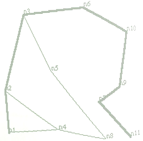

TBD: no longer in book

# Heuristically Guided Search

We represent search space as a graph: nodes and links between the nodes. The following figure shows the simple graph that we use as an example, finding a route from node **n1** to node **n11**:

{width: "80%"}

The following example code uses a heuristic for determining which node to try first from any specific location: move to the node that is closest spatially to the goal node. We see that this heuristic will not always work to produce the most efficient search but we will still get to the goal node. As an example in which the heuristic does not work, consider when we start at node **n1** in the lower left corner of the figure. The search algorithm can add nodes **n2** and **n4** to the nodes to search list and will search using node **n4** first since **n4** is closer to the goal node **n11** than node **n2**. In this case, the search will eventually need to back up trying the path **n1** to **n2**. Despite this example of the heuristic not working to decrease search time, in general, for large search spaces (i.e., graphs with many nodes and edges) it can dramatically decrease search time.

The main function **A\*search** starting in line 5 extends to line 151 because all search utility functions are nested (lexically scoped) inside the mani function. The actual code for the main function **A\*search** is in lines 150 and 151.

The data representing nodes in this implementation is globally scoped (see the definitions on lines 155-165 in the "throw away test code" near the bottom of the file) and we set the property **path-list** to store the nodes directy connected to each node (set in function **init-path-list** in lines 36-52). I originally wrote this code in 1990 which explains it non-functional style using globally scoped node variables.

{lang="lisp",linenos=on}
~~~~~~~~
;; Perform a heuristic A* search between the start and goal nodes:
;;
;; Copyright 1990, 2017 by Mark Watson

(defun A*search (nodes paths start goal &aux possible-paths best)

  (defun Y-coord (x) (truncate (cadr x)))
  (defun X-coord (x) (truncate (car x)))

  (defun dist-between-points (point1 point2)
    (let ((x-dif (- (X-coord point2) (X-coord point1)))
          (y-dif (- (Y-coord point2) (Y-coord point1))))
      (sqrt (+ (* x-dif x-dif)  (* y-dif y-dif)))))

  (setq possible-paths
        (list
         (list
          (dist-between-points
           (eval start)
           (eval goal))
          0
          (list start))))

  (defun init-network ()
    (setq paths (init-lengths paths))
    (init-path-list nodes paths))

  (defun init-lengths (pathlist)
    (let (new-path-list pathlength path-with-length)
      (dolist (path pathlist)
        (setq pathlength (slow-path-length path))
        (setq path-with-length (append path (list pathlength)))
        (setq new-path-list (cons path-with-length new-path-list)))
      new-path-list))

  (defun init-path-list (nodes paths)
    (dolist (node nodes)
      (setf
       (get node 'path-list)
       ;; let returns all paths connected to node:
       (let (path-list)
         (dolist (path paths)
           (if (equal node (start-node-name path))
               (setq path-list
                     (cons (list (end-node-name path)
                                 (path-length path))
                           path-list))
               (if (equal node (end-node-name path))
                   (setq path-list (cons (list (start-node-name path)
                                               (path-length path))
                                         path-list)))))
         path-list ))))

  (defun slow-path-length (path)
    (dist-between-points (start-node path) (end-node path)))

  (defun path-length (x) (caddr x))

  (defun start-node (path) (eval (car path)))
  (defun end-node (path) (eval (cadr path)))
  (defun start-node-name (x) (car x))
  (defun end-node-name (x) (cadr x))
  (defun first-on-path (x) (caddr x))
  (defun goal-node (x) (car x))
  (defun distance-to-that-node (x) (cadr x))

  (defun enumerate-children (node goal)
    (let* ((start-to-lead-node-dist (cadr node)) ;; distance already calculated
           (path (caddr node))
           (lead-node (car path)))
      (if (get-stored-path lead-node goal)
          (consider-best-path lead-node goal path start-to-lead-node-dist)
          (consider-all-nodes lead-node goal path start-to-lead-node-dist))))

  (defun consider-best-path (lead-node goal path distance-to-here)
    (let* (
           (first-node (get-first-node-in-path lead-node goal))
           (dist-to-first (+ distance-to-here
                             (get-stored-dist lead-node first-node)))
           (total-estimate (+ distance-to-here
                              (get-stored-dist lead-node goal)))
           (new-path (cons first-node path)))
      (list (list total-estimate dist-to-first new-path))))

  (defun get-stored-path (start goal)
    (if (equal start goal)
        (list start 0)
        (assoc goal (get start 'path-list))))

  (defun node-not-in-path (node path)
    (if (null path)
        t
        (if (equal node (car path))
            nil
            (node-not-in-path node (cdr path)))))

  (defun consider-all-nodes (lead-node goal path start-to-lead-node-dist)
    (let (dist-to-first total-estimate new-path new-nodes)
      (dolist (node (collect-linked-nodes lead-node))
        (if (node-not-in-path node path)
            (let ()
              (setq dist-to-first (+ start-to-lead-node-dist
                                     (get-stored-dist lead-node node)))
              (setq total-estimate (+ dist-to-first
                                      (dist-between-points
                                       (eval node)
                                       (eval  goal))))
              (setq new-path (cons node path))
              (setq new-nodes (cons (list total-estimate
                                          dist-to-first
                                          new-path)
                                    new-nodes)))))
      new-nodes))

  (defun collect-linked-nodes (node)
    (let (links)
      (dolist (link (get node 'path-list))
        (if (null (first-on-path link))
            (setq links (cons (goal-node link) links))))
      links))

  (defun get-stored-dist (node1 node2)
    (distance-to-that-node (get-stored-path node1 node2)))

  (defun collect-ascending-search-list-order (a l)
    (if (null l)
        (list a)
        (if (< (car a) (caar l))
            (cons a l)
            (cons (car l) (Collect-ascending-search-list-order a (cdr l))))))

  (defun get-first-node-in-path (start goal)
    (let (first-node)
      (setq first-node  (first-on-path (get-stored-path start goal)))
      (if first-node first-node goal)))

  (defun a*-helper ()
    (if possible-paths
        (let ()
          (setq best (car possible-paths))
          (setq possible-paths (cdr possible-paths))
          (if (equal (first (caddr best)) goal)
              best
              (let ()
                (dolist (child (enumerate-children best goal))
                  (setq possible-paths
                        (collect-ascending-search-list-order
                         child possible-paths)))
                (a*-helper))))))
  (init-network)
  (reverse (caddr (a*-helper))))

;;      Throw away test code:

(defvar n1 '(30 201))
(defvar  n2 '(25 140))
(defvar  n3 '(55 30))
(defvar  n4 '(105 190))
(defvar  n5 '(95 110))
(defvar  n6 '(140 22))
(defvar  n7 '(160 150))
(defvar  n8 '(170 202))
(defvar  n9 '(189 130))
(defvar  n10 '(200 55))
(defvar  n11 '(205 201))

(print (A*search
        '(n1 n2 n3 n4 n5 n6 n7 n8 n9 n10 n11) ;; nodes
        '((n1 n2) (n2 n3) (n3 n5) (n3 n6) (n6 n10) ;; paths
          (n9 n10) (n7 n9) (n1 n4) (n4 n2) (n5 n8)
          (n8 n4) (n7 n11))
        'n1 'n11)) ;; starting and goal nodes
~~~~~~~~

The following example in the repl shows the calculation of the path that we saw in the figure of the graph search space.

~~~~~~~~
$ sbcl
* (load "astar_search.lisp")

(N1 N2 N3 N6 N10 N9 N7 N11) 
T
* 
~~~~~~~~

There are many types of search: breadth first as we used here, depth first, with heuristics to optimize search dependent on the type of search space.

