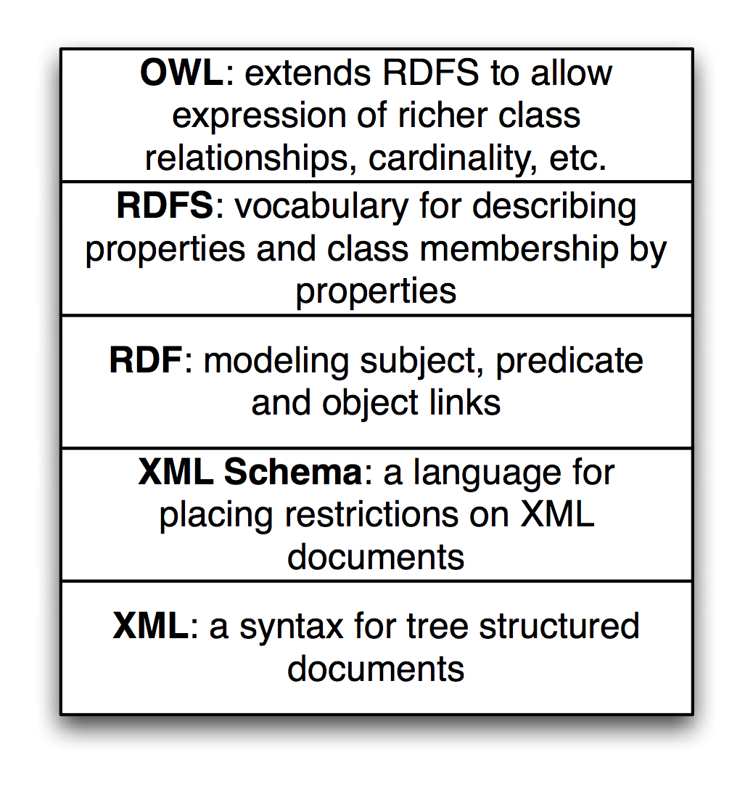

# Semantic Web and Linked Data

I have written two previous books on the semantic web and linked data and most of my programming books have semantic web examples. Please note that the background material here on the semantic web standards RDF, RDFS, and SPARQL is shared with my book [Practical Artificial Intelligence Programming With Java](https://leanpub.com/javaai) so if you have read that book then the first several pages of this chapter will seem familiar.

Construction of Knowledge Graphs, as we will do in later chapters, is a core technology at many corporations and organizations to prevent data silos where different database systems are poorly connected and not as useful in combination than they could be. The use of RDF data stores is a powerful technique for data interoperability within organizations. Semantic Web standards like RDF, RDFS, and SPARQL support both building Knowledge Graphs and also key technologies for automating the collection and use of web data.

I worked as a contractor at Google on an internal Knowledge Graph project and I currently work at [Olive AI](https://oliveai.com) on their Knowledge Graph team.

The semantic web is intended to provide a massive linked set of data for use by software systems just as the World Wide Web provides a massive collection of linked web pages for human reading and browsing. The semantic web is like the web in that anyone can generate any content that they want. This freedom to publish anything works for the web because we use our ability to understand natural language to interpret what we read – and often to dismiss material that based upon our own knowledge we consider to be incorrect.

Semantic web and linked data technologies are also useful for smaller amounts of data, an example being a Knowledge Graph containing information for a business. We will further explore Knowledge Graphs in the next two chapters.

The core concept for the semantic web is data integration and use from different sources. As we will soon see, the tools for implementing the semantic web are designed for encoding data and sharing data from many different sources.

I cover the semantic web in this book because I believe that semantic web technologies are complementary to AI systems for gathering and processing data on the web. As more web pages are generated by applications (as opposed to simply showing static HTML files) it becomes easier to produce both HTML for human readers and semantic data for software agents.

There are several very good semantic web toolkits for the Java language and platform. Here we use Apache Jena because it is what I often use in my own work and I believe that it is a good starting technology for your first experiments with semantic web technologies. This chapter provides an incomplete coverage of semantic web technologies and is intended as a gentle introduction to a few useful techniques and how to implement those techniques in Java. This chapter is the start of a journey in the technology that I think is as important as technologies like deep learning that get more public mindshare.

The following figure shows a layered hierarchy of data models that are used to implement semantic web applications. To design and implement these applications we need to think in terms of physical models (storage and access of RDF, RDFS, and perhaps OWL data), logical models (how we use RDF and RDFS to define relationships between data represented as unique URIs and string literals and how we logically combine data from different sources) and conceptual modeling (higher level knowledge representation and reasoning using OWL). Originally RDF data was serialized as XML data but other formats have become much more popular because they are easier to read and manually create. The top three layers in the figure might be represented as XML, or as LD-JSON (linked data JSON) or formats like N-Triples and N3 that we will use later.

{#semantic-web-data-models}
{width: "80%"}

## Resource Description Framework (RDF) Data Model

The Resource Description Framework (RDF) is used to encode information and the RDF Schema (RDFS) facilitates using data with different RDF encodings without the need to convert one set of schemas to another. Later, using OWL we can simply declare that one predicate is the same as another, that is, one predicate is a sub-predicate of another (e.g., a property **containsCity** can be declared to be a sub-property of **containsPlace** so if something contains a city then it also contains a place), etc. The predicate part of an RDF statement often refers to a property.

RDF data was originally encoded as XML and intended for automated processing. In this chapter we will use two simple to read formats called "N-Triples" and "N3." Apache Jena can be used to convert between all RDF formats so we might as well use formats that are easier to read and understand. RDF data consists of a set of triple values:

-   subject
-   predicate
-   object

Some of my work with semantic web technologies deals with processing news stories, extracting semantic information from the text, and storing it in RDF. I will use this application domain for the examples in this chapter and the next chapter when we implement code to automatically generate RDF for Knowledge Graphs. I deal with triples like:

-   subject: a URL (or URI) of a news article.
-   predicate: a relation like "containsPerson".
-   object: a literal value like "Bill Clinton" or a URI representing Bill Clinton.

In the next chapter we will use the entity recognition library we developed in an earlier chapter to create RDF from text input.

We will use either URIs or string literals as values for objects. We will always use URIs for representing subjects and predicates. In any case URIs are usually preferred to string literals. We will see an example of this preferred use but first we need to learn the N-Triple and N3 RDF formats.

I proposed the idea that RDF was more flexible than Object Modeling in programming languages, relational databases, and XML with schemas. If we can tag new attributes on the fly to existing data, how do we prevent what I might call “data chaos” as we modify existing data sources? It turns out that the solution to this problem is also the solution for encoding real semantics (or meaning) with data: we usually use unique URIs for RDF subjects, predicates, and objects, and usually with a preference for not using string literals. The definitions of predicates are tied to a namespace and later with OWL we will state the equivalence of predicates in different namespaces with the same semantic meaning. I will try to make this idea more clear with some examples and [Wikipedia has a good writeup on RDF](https://en.wikipedia.org/wiki/Resource_Description_Framework).

Any part of a triple (subject, predicate, or object) is either a URI or a string literal. URIs encode namespaces. For example, the containsPerson predicate in the last example could be written as:

{lang="sparql",linenos=off}
~~~~~~~~
http://knowledgebooks.com/ontology/#containsPerson
~~~~~~~~

The first part of this URI is considered to be the namespace for this predicate “containsPerson.” When different RDF triples use this same predicate, this is some assurance to us that all users of this predicate understand to the same meaning. Furthermore, we will see later that we can use RDFS to state equivalency between this predicate (in the namespace http://knowledgebooks.com/ontology/) with predicates represented by different URIs used in other data sources. In an “artificial intelligence” sense, software that we write does not understand predicates like "containsCity",  "containsPerson", or "isLocation" in the way that a human reader can by combining understood common meanings for the words "contains", "city", "is", "person", and "location" but for many interesting and useful types of applications that is fine as long as the predicate is used consistently. We will see shortly that we can define abbreviation prefixes for namespaces which makes RDF and RDFS files shorter and easier to read.

The Jena library supports most serialization formats for RDF:

- Turtle
- N3
- N-Triples
- NQuads
- TriG
- JSON-LD
- RDF/XML
- RDF/JSON
- TriX
- RDF Binary

A statement in N-Triple format consists of three URIs (two URIs and a string literals for the object) followed by a period to end the statement. While statements are often written one per line in a source file they can be broken across lines; it is the ending period which marks the end of a statement. The standard file extension for N-Triple format files is \*.nt and the standard format for N3 format files is \*.n3.

My preference is to use N-Triple format files as output from programs that I write to save data as RDF. N-Triple files don't use any abbreviations and each RDF statement is self-contained. I often use tools like the command line commands in Jena or RDF4J to convert N-Triple files to N3 or other formats if I will be reading them or even hand editing them. Here is an example using the N3 syntax:

{lang="sparql",linenos=off}
~~~~~~~~
@prefix kb:  <http://knowledgebooks.com/ontology#>

<http://news.com/201234/> kb:containsCountry "China" .
~~~~~~~~

The N3 format adds prefixes (abbreviations) to the N-Triple format. In practice it would be better to use the URI **<http://dbpedia.org/resource/China>** instead of the literal value "China."

Here we see the use of an abbreviation prefix “kb:” for the namespace for my company KnowledgeBooks.com ontologies. The first term in the RDF statement (the subject) is the URI of a news article. The second term (the predicate) is “containsCountry” in the “kb:” namespace. The last item in the statement (the object) is a string literal “China.” I would describe this RDF statement in English as, “The news article at URI http://news.com/201234 mentions the country China.”

This was a very simple N3 example which we will expand to show additional features of the N3 notation. As another example, let's look at the case if this news article also mentions the USA. Instead of adding a whole new statement like this we can combine them using N3 notation. Here we have two separate RDF statements:

{lang="sparql",linenos=off}
~~~~~~~~
@prefix kb:  <http://knowledgebooks.com/ontology#> .

<http://news.com/201234/>
  kb:containsCountry
  <http://dbpedia.org/resource/China>  .
  
<http://news.com/201234/>
  kb:containsCountry
  <http://dbpedia.org/resource/United_States>  .
~~~~~~~~

We can collapse multiple RDF statements that share the same subject and optionally the same predicate:

{lang="sparql",linenos=off}
~~~~~~~~
@prefix kb:  <http://knowledgebooks.com/ontology#> .

<http://news.com/201234/>
  kb:containsCountry
    <http://dbpedia.org/resource/China> ,
    <http://dbpedia.org/resource/United_States>  .
~~~~~~~~

The indentation and placement on separate lines is arbitrary - use whatever style you like that is readable. We can also add in additional predicates that use the same subject (I am going to use string literals here instead of URIs for objects to make the following example more concise but in practice prefer using URIs):

{lang="sparql",linenos=off}
~~~~~~~~
@prefix kb:  <http://knowledgebooks.com/ontology#> .

<http://news.com/201234/>
        kb:containsCountry "China" ,
                           "USA" .
        kb:containsOrganization "United Nations" ;
        kb:containsPerson "Ban Ki-moon" , "Gordon Brown" ,
                          "Hu Jintao" , "George W. Bush" ,
                          "Pervez Musharraf" ,
                          "Vladimir Putin" , 
                          "Mahmoud Ahmadinejad" .
~~~~~~~~

This single N3 statement represents ten individual RDF triples. Each section defining triples with the same subject and predicate have objects separated by commas and ending with a period. Please note that whatever RDF storage system you use (we will be using Jena) it makes no difference if we load RDF as XML, N-Triple, of N3 format files: internally subject, predicate, and object triples are stored in the same way and are used in the same way. RDF triples in a data store represent directed graphs that may not all be connected.

I promised you that the data in RDF data stores was easy to extend. As an example, let us assume that we have written software that is able to read online news articles and create RDF data that captures some of the semantics in the articles. If we extend our program to also recognize dates when the articles are published, we can simply reprocess articles and for each article add a triple to our RDF data store using a form like:

{lang="sparql",linenos=off}
~~~~~~~~
@prefix kb:  <http://knowledgebooks.com/ontology#> .

<http://news.com/201234/> kb:datePublished "2008-05-11" .
~~~~~~~~

Here we just represent the date as a string. We can add a type to the object representing a specific date:

{lang="sparql",linenos=off}
~~~~~~~~
@prefix xsd: <http://www.w3.org/2001/XMLSchema#> .
@prefix kb:  <http://knowledgebooks.com/ontology#> .
 
 <http://news.com/201234/> kb:datePublished "2008-05-11"^^xsd:date .
~~~~~~~~

Furthermore, if we do not have dates for all news articles that is often acceptable because when constructing SPARQL queries you can match optional patterns. If for example you are looking up articles on a specific subject then some results may have a publication date attached to the results for that article and some might not. In practice RDF supports types and we would use a date type as seen in the last example, not a string. However, in designing the example programs for this chapter I decided to simplify our representation of URIs and often use string literals as simple Java strings. For many applications this isn't a real limitation.

## Extending RDF with RDF Schema {#rdfs}

RDF Schema (RDFS) supports the definition of classes and properties based on set inclusion. In RDFS classes and properties are orthogonal. Let's start with looking at an example using additional namespaces:

{lang="sparql",linenos=off}
~~~~~~~~
@prefix kb:  <http://knowledgebooks.com/ontology#> .
@prefix rdf: <http://www.w3.org/1999/02/22-rdf-syntax-ns#>
@prefix rdfs:   <http://www.w3.org/2000/01/rdf-schema#>
@prefix dbo: <http://dbpedia.org/ontology/>

<http://news.com/201234/>
  kb:containsCountry
  <http://dbpedia.org/resource/China>  .
  
<http://news.com/201234/>
  kb:containsCountry
  <http://dbpedia.org/resource/United_States>  .
  
<http://dbpedia.org/resource/China>
  rdfs:label "China"@en,
  rdf:type dbo:Place ,
  rdf:type dbo:Country .
~~~~~~~~

Because the semantic web is intended to be processed automatically by software systems it is encoded as RDF. There is a problem that must be solved in implementing and using the semantic web: everyone who publishes semantic web data is free to create their own RDF schemas for storing data; for example, there is usually no single standard RDF schema definition for topics like news stories and stock market data. The [SKOS](https://www.w3.org/2009/08/skos-reference/skos.html) is a namespace containing standard schemas and the most widely used standard is [schema.org](https://schema.org/docs/schemas.html). Understanding the ways of integrating different data sources using different schemas helps to understand the design decisions behind the semantic web applications. In this chapter I often use my own schemas in the knowledgebooks.com namespace for the simple examples you see here. When you build your own production systems part of the work is searching through **schema.org** and **SKOS** to use standard name spaces and schemas when possible. The use of standard schemas helps when you link internal proprietary Knowledge Graphs used in organization with public open data from sources like [WikiData](https://www.wikidata.org/wiki/Wikidata:Main_Page) and [DBPedia](https://wiki.dbpedia.org/about).

We will start with an example that is an extension of the example in the last section that also uses RDFS. We add a few additional RDF statements:

{lang="sparql",linenos=off}
~~~~~~~~
@prefix kb:  <http://knowledgebooks.com/ontology#> .
@prefix rdfs:  <http://www.w3.org/2000/01/rdf-schema#> .

kb:containsCity rdfs:subPropertyOf kb:containsPlace .
kb:containsCountry rdfs:subPropertyOf kb:containsPlace .
kb:containsState rdfs:subPropertyOf kb:containsPlace .
~~~~~~~~

The last three lines declare that:

-   The property containsCity is a sub-property of containsPlace.
-   The property containsCountry is a sub-property of containsPlace.
-   The property containsState is a sub-property of containsPlace.

Why is this useful? For at least two reasons:

-   You can query an RDF data store for all triples that use property containsPlace and also match triples with properties equal to containsCity, containsCountry, or containsState. There may not even be any triples that explicitly use the property containsPlace.
-   Consider a hypothetical case where you are using two different RDF data stores that use different properties for naming cities: **cityName** and **city**. You can define **cityName** to be a sub-property of **city** and then write all queries against the single property name **city**. This removes the necessity to convert data from different sources to use the same Schema. You can also use OWL to state property and class equivalency.

In addition to providing a vocabulary for describing properties and class membership by properties, RDFS is also used for logical inference to infer new triples, combine data from different RDF data sources, and to allow effective querying of RDF data stores. We will see examples of all of these features of RDFS when we later start using the Jena libraries to perform SPARQL queries.

## The SPARQL Query Language

SPARQL is a query language used to query RDF data stores. While SPARQL may initially look like SQL, we will see that there are some important differences like support for RDFS and OWL inferencing and graph-based instead of relational matching operations. We will cover the basics of SPARQL in this section and then see more examples later when we learn how to embed Jena in Java applications, and see more examples in the last chapter [Knowledge Graph Navigator](#kgn).

We will use the N3 format RDF file test\_data/news.n3 for the examples. I created this file automatically by spidering Reuters news stories on the news.yahoo.com web site and automatically extracting named entities from the text of the articles. We saw techniques for extracting named entities from text in earlier chapters. In this chapter we use these sample RDF files.

You have already seen snippets of this file and I list the entire file here for reference, edited to fit line width: you may find the file news.n3 easier to read if you are at your computer and open the file in a text editor so you will not be limited to what fits on a book page:

{lang="sparql",linenos=off}
~~~~~~~~
@prefix kb:  <http://knowledgebooks.com/ontology#> .
@prefix rdfs:  <http://www.w3.org/2000/01/rdf-schema#> .

kb:containsCity rdfs:subPropertyOf kb:containsPlace .

kb:containsCountry rdfs:subPropertyOf kb:containsPlace .

kb:containsState rdfs:subPropertyOf kb:containsPlace .

<http://yahoo.com/20080616/usa_flooding_dc_16/>
        kb:containsCity "Burlington" , "Denver" ,
                        "St. Paul" ," Chicago" ,
                        "Quincy" , "CHICAGO" ,
                        "Iowa City" ;
        kb:containsRegion "U.S. Midwest" , "Midwest" ;
        kb:containsCountry "United States" , "Japan" ;
        kb:containsState "Minnesota" , "Illinois" , 
                         "Mississippi" , "Iowa" ;
        kb:containsOrganization "National Guard" ,
                         "U.S. Department of Agriculture" ,
                         "White House" ,
                         "Chicago Board of Trade" ,
                         "Department of Transportation" ;
        kb:containsPerson "Dena Gray-Fisher" ,
                          "Donald Miller" ,
                          "Glenn Hollander" ,
                          "Rich Feltes" ,
                          "George W. Bush" ;
        kb:containsIndustryTerm "food inflation" , "food" ,
                                "finance ministers" ,
                                "oil" .

<http://yahoo.com/78325/ts_nm/usa_politics_dc_2/>
        kb:containsCity "Washington" , "Baghdad" ,
                        "Arlington" , "Flint" ;
        kb:containsCountry "United States" ,
                           "Afghanistan" ,
                           "Iraq" ;
        kb:containsState "Illinois" , "Virginia" ,
                         "Arizona" , "Michigan" ;
        kb:containsOrganization "White House" ,
                                "Obama administration" ,
                                "Iraqi government" ;
        kb:containsPerson "David Petraeus" ,
                          "John McCain" ,
                          "Hoshiyar Zebari" ,
                          "Barack Obama" ,
                          "George W. Bush" ,
                          "Carly Fiorina" ;
        kb:containsIndustryTerm "oil prices" .

<http://yahoo.com/10944/ts_nm/worldleaders_dc_1/>
        kb:containsCity "WASHINGTON" ;
        kb:containsCountry "United States" , "Pakistan" ,
                           "Islamic Republic of Iran" ;
        kb:containsState "Maryland" ;
        kb:containsOrganization "University of Maryland" ,
                                "United Nations" ;
        kb:containsPerson "Ban Ki-moon" , "Gordon Brown" ,
                          "Hu Jintao" , "George W. Bush" ,
                          "Pervez Musharraf" ,
                          "Vladimir Putin" ,
                          "Steven Kull" ,
                          "Mahmoud Ahmadinejad" .

<http://yahoo.com/10622/global_economy_dc_4/>
        kb:containsCity "Sao Paulo" , "Kuala Lumpur" ;
        kb:containsRegion "Midwest" ;
        kb:containsCountry "United States" , "Britain" ,
                           "Saudi Arabia" , "Spain" ,
                           "Italy" , India" , 
                           ""France" , "Canada" ,
                           "Russia" , "Germany" , "China" ,
                           "Japan" , "South Korea" ;
        kb:containsOrganization "Federal Reserve Bank" ,
                                "European Union" ,
                                "European Central Bank" ,
                                "European Commission" ;
        kb:containsPerson "Lee Myung-bak" , "Rajat Nag" ,
                          "Luiz Inacio Lula da Silva" ,
                          "Jeffrey Lacker" ;
        kb:containsCompany "Development Bank Managing" ,
                           "Reuters" ,
                           "Richmond Federal Reserve Bank" ;
        kb:containsIndustryTerm "central bank" , "food" ,
                                "energy costs" ,
                                "finance ministers" ,
                                "crude oil prices" ,
                                "oil prices" ,
                                "oil shock" ,
                                "food prices" ,
                                "Finance ministers" ,
                                "Oil prices" , "oil" .
~~~~~~~~

In the following examples, we will use the main method in the class **JenaApi** (developed in the next section) that allows us to load multiple RDF input files and then to interactively enter SPARQL queries.

We will start with a simple SPARQL query for subjects (news article URLs) and objects (matching countries) with the value for the predicate equal to **containsCountry**. Variables in queries start with a question mark character and can have any names:

{lang="sparql",linenos=off}
~~~~~~~~
SELECT ?subject ?object
      WHERE {
        ?subject
        <http://knowledgebooks.com/ontology#containsCountry>
        ?object .
}
~~~~~~~~

It is important for you to understand what is happening when we apply the last SPARQL query to our sample data. Conceptually, all the triples in the sample data are scanned, keeping the ones where the predicate part of a triple is equal to **<http://knowledgebooks.com/ontology#containsCountry>**. In practice RDF data stores supporting SPARQL queries index RDF data so a complete scan of the sample data is not required. This is analogous to relational databases where indices are created to avoid needing to perform complete scans of database tables.

In practice, when you are exploring a Knowledge Graph like DBPedia or WikiData (that are just very large collections of RDF triples), you might run a query and discover a useful or interesting entity URI in the triple store, then drill down to find out more about the entity. In a later chapter [Knowledge Graph Navigator](#kgn) we attempt to automate this exploration process using the DBPedia data as a Knowledge Graph.

We will be using the same code to access the small example of RDF statements in our sample data as we will for accessing DBPedia or WikiData.

We can make this last query easier to read and reduce the chance of misspelling errors by using a namespace prefix:

{lang="sparql",linenos=off}
~~~~~~~~
PREFIX kb:  <http://knowledgebooks.com/ontology#>
SELECT ?subject ?object
  WHERE {
      ?subject kb:containsCountry ?object .
  }
~~~~~~~~

Later in the chapter [Knowledge Graph Navigator](#kgn) we will write an application that automatically generates SPARQL queries for the DBPedia public knowledge Graph. These queries will be be more complex than the simpler examples here. Reading this chapter before [Knowledge Graph Navigator](#kgn) is recommended.

## Case Study: Using SPARQL to Find Information about Board of Directors Members of Corporations and Organizations

Before we write software to automate the process of using SPARQL queries to find information on DBPedia, let's perform a few manual queries for finding information on board of directors of corportations. To start with, we would like to find an RDF property that indicates board membership. There is a common expression for finding information on the web using search engines and also for using SPARQL queries: "follow your nose," that is, when you see something interesting, dig down with more queries on whatever interests you.

{lang="sparql",linenos=off}
~~~~~~~~
SELECT DISTINCT ?s 
WHERE { 
    ?s ?p "Board of Directors"@en .
    FILTER (?p IN (<http://www.w3.org/2000/01/rdf-schema#label>, <http://xmlns.com/foaf/0.1/name>) && !regex(str(?s), "category", "i"))
}
~~~~~~~~

We will find the property:

{lang="sparql",linenos=off}
~~~~~~~~
http://dbpedia.org/resource/Board_of_Directors
~~~~~~~~

RDF 

{lang="sparql",linenos=off}
~~~~~~~~
select ?s ?p { ?s ?p <http://dbpedia.org/resource/Board_of_Directors> } limit 6
~~~~~~~~

{lang="sparql",linenos=off}
~~~~~~~~
s	p
http://en.wikipedia.org/wiki/Board_of_Directors	http://xmlns.com/foaf/0.1/primaryTopic
http://dbpedia.org/resource/Lynn_D._Stewart_(businessman)	http://dbpedia.org/ontology/board
http://dbpedia.org/resource/Advance_America_Cash_Advance	http://dbpedia.org/ontology/keyPerson
http://dbpedia.org/resource/Railways_of_Slovak_Republic	http://dbpedia.org/ontology/keyPerson
http://dbpedia.org/resource/Divine_Word_University_of_Tacloban__DWU_Jubilee_Foundation,_Inc.__1	http://dbpedia.org/ontology/keyPerson
http://dbpedia.org/resource/Mathys_Medical
~~~~~~~~

The property **<http://dbpedia.org/ontology/board>** is what we are looking for. Let's keep "following our nose" to find examples of board members and the companies they server:

{lang="sparql",linenos=off}
~~~~~~~~
select ?person ?company { ?person <http://dbpedia.org/ontology/board> ?company} limit 6
~~~~~~~~

The results are:

{lang="sparql",linenos=off}
~~~~~~~~
person	company
http://dbpedia.org/resource/Matthew_Buckland	http://dbpedia.org/resource/Creative_Commons
http://dbpedia.org/resource/Jimmy_Wales	http://dbpedia.org/resource/Creative_Commons
http://dbpedia.org/resource/Nabeel_Rajab	http://dbpedia.org/resource/Human_Rights_Watch
http://dbpedia.org/resource/Vincent_Tewson	http://dbpedia.org/resource/International_Confederation_of_Free_Trade_Unions
http://dbpedia.org/resource/William_T._Young	http://dbpedia.org/resource/KFC
http://dbpedia.org/resource/Colonel_Sanders	http://dbpedia.org/resource/KFC
~~~~~~~~

Let's see what information we can find on the founder of WikiPedi Jimmy Wales:

{lang="sparql",linenos=off}
~~~~~~~~
select ?p ?o { <http://dbpedia.org/resource/Jimmy_Wales> ?p ?o } limit 200
~~~~~~~~

A few of the many results are:

{lang="ntriples",linenos=off}
~~~~~~~~
p	o
http://www.w3.org/1999/02/22-rdf-syntax-ns#type	http://www.w3.org/2002/07/owl#Thing
http://www.w3.org/1999/02/22-rdf-syntax-ns#type	http://xmlns.com/foaf/0.1/Person
http://www.w3.org/1999/02/22-rdf-syntax-ns#type	http://dbpedia.org/ontology/Person
http://www.w3.org/1999/02/22-rdf-syntax-ns#type	http://www.wikidata.org/entity/Q215627
http://www.w3.org/1999/02/22-rdf-syntax-ns#type	http://www.wikidata.org/entity/Q24229398
http://www.w3.org/1999/02/22-rdf-syntax-ns#type	http://www.wikidata.org/entity/Q5
http://www.w3.org/1999/02/22-rdf-syntax-ns#type	http://dbpedia.org/ontology/Agent
http://www.w3.org/1999/02/22-rdf-syntax-ns#type	http://schema.org/Person
http://www.w3.org/1999/02/22-rdf-syntax-ns#type	http://dbpedia.org/class/yago/WikicatAmericanComputerScientists
http://www.w3.org/1999/02/22-rdf-syntax-ns#type	http://dbpedia.org/class/yago/WikicatAmericanExpatriatesInTheUnitedKingdom
http://www.w3.org/2000/01/rdf-schema#label	
"Jimmy Wales"@en
~~~~~~~~

## Installing the Apache Jena Fuseki RDF Server

TBD

I have a github repository [mark-watson/fuseki-semantic-web-dev-setup](https://github.com/mark-watson/fuseki-semantic-web-dev-setup)mthat you shoud clone:

    git clone https://github.com/mark-watson/fuseki-semantic-web-dev-setup.git
    cd fuseki-semantic-web-dev-setup
    ./fuseki-server --file RDF/sample_news.nt /news

This will run the SPARQL server Fuseki locally on your laptop and the default graph is "news" and you will see output like:

~~~~~~~~
$ ./fuseki-server --file RDF/sample_news.nt /news
[2020-11-07 09:31:13] Server     INFO  Dataset: in-memory: load file: RDF/sample_news.nt
[2020-11-07 09:31:14] Server     INFO  Running in read-only mode for /news
[2020-11-07 09:31:14] Server     INFO  Apache Jena Fuseki 3.16.0
[2020-11-07 09:31:14] Config     INFO  FUSEKI_HOME=/Users/markw/GITHUB/fuseki-semantic-web-dev-setup/.
[2020-11-07 09:31:14] Config     INFO  FUSEKI_BASE=/Users/markw/GITHUB/fuseki-semantic-web-dev-setup/run
[2020-11-07 09:31:14] Config     INFO  Shiro file: file:///Users/markw/GITHUB/fuseki-semantic-web-dev-setup/run/shiro.ini
[2020-11-07 09:31:15] Server     INFO  Dataset Type: in-memory, with files loaded
[2020-11-07 09:31:15] Server     INFO  Path = /news
[2020-11-07 09:31:15] Server     INFO  System
[2020-11-07 09:31:15] Server     INFO    Memory: 4.0 GiB
[2020-11-07 09:31:15] Server     INFO    Java:   14.0.1
[2020-11-07 09:31:15] Server     INFO    OS:     Mac OS X 10.15.7 x86_64
[2020-11-07 09:31:15] Server     INFO    PID:    3855
[2020-11-07 09:31:15] Server     INFO  Started 2020/11/07 09:31:15 MST on port 3030
~~~~~~~~

You can access a web interface for SPARQL queries by accessing localhost:3030 or http:127.0.0.1:3030.

## Common Lisp Client Examples for the Apache Jena Fuseki RDF Server

Later in the chapter "Knowledge Graph Navigator" we will develop a simple Common Lisp SPARQL query library and use it for querying DBPedia. Here we will use it to query our local Fuseki server.

{lang="lisp",linenos=on}
~~~~~~~~
$ sbcl
This is SBCL 2.0.7, an implementation of ANSI Common Lisp.
More information about SBCL is available at <http://www.sbcl.org/>.

SBCL is free software, provided as is, with absolutely no warranty.
It is mostly in the public domain; some portions are provided under
BSD-style licenses.  See the CREDITS and COPYING files in the
distribution for more information.

#P"/Users/markw/quicklisp/setup.lisp" 
"starting up quicklisp" 
* (quicklisp:quickload "sparql")
To load "sparql":
  Load 1 ASDF system:
    sparql
; Loading "sparql"
...............
("sparql")
* (sparql::fuseki "select ?s ?p ?o { ?s ?p ?o } limit 20")
(((:s "http://kbsportal.com/trout_season/")
  (:p "http://knowledgebooks.com/ontology/#storyType")
  (:o "http://knowledgebooks.com/ontology/#recreation"))
 ((:s "http://kbsportal.com/trout_season/")
  (:p "http://knowledgebooks.com/ontology/#storyType")
  (:o "http://knowledgebooks.com/ontology/#sports"))
 ((:s "http://kbsportal.com/bear_mountain_fire/")
  (:p "http://knowledgebooks.com/ontology/#storyType")
  (:o "http://knowledgebooks.com/ontology/#disaster"))
 ((:s "http://kbsportal.com/bear_mountain_fire/")
  (:p "http://knowledgebooks.com/ontology/#summary")
  (:o "The fire on Bear Mountain was caused by lightening"))
 ((:s "http://kbsportal.com/jc_basketball/")
  (:p "http://knowledgebooks.com/ontology/#storyType")
  (:o "http://knowledgebooks.com/ontology/#sports"))
 ((:s "http://kbsportal.com/oak_creek_flooding/")
  (:p "http://knowledgebooks.com/ontology/#storyType")
  (:o "http://knowledgebooks.com/ontology/#disaster"))
 ((:s "http://kbsportal.com/oak_creek_flooding/")
  (:p "http://knowledgebooks.com/ontology/#summary")
  (:o "Oak Creek flooded last week affecting 5 businesses")))
~~~~~~~~

Here is an example of using the same library to query the public DBPedia SPARQL endpoint (most output is not shown):

{lang="lisp",linenos=on}
~~~~~~~~
* (sparql:dbpedia "select ?s ?p { ?s ?p \"Bill Gates\"@en }")

("ndbpeia SPARQL:n" "select ?s ?p { ?s ?p \"Bill Gates\"@en }" "n") 
(((:s "http://dbpedia.org/resource/Category:Bill_Gates")
  (:p "http://www.w3.org/2000/01/rdf-schema#label"))
 ((:s "http://www.wikidata.org/entity/Q5284")
  (:p "http://www.w3.org/2000/01/rdf-schema#label"))
 ((:s "http://dbpedia.org/resource/Bill_Gates")
  (:p "http://xmlns.com/foaf/0.1/name"))
 )
~~~~~~~~

The SPARQL library in the github repository for this book also supports the commercial products AllegroGraph and Stardog RDF servers.

