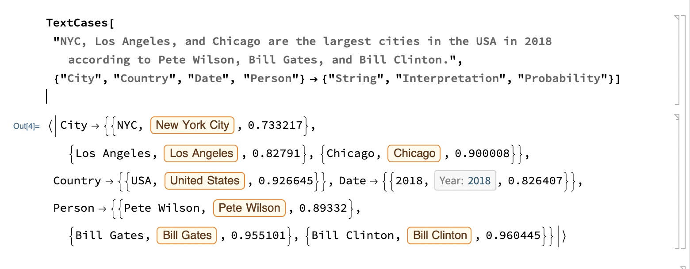
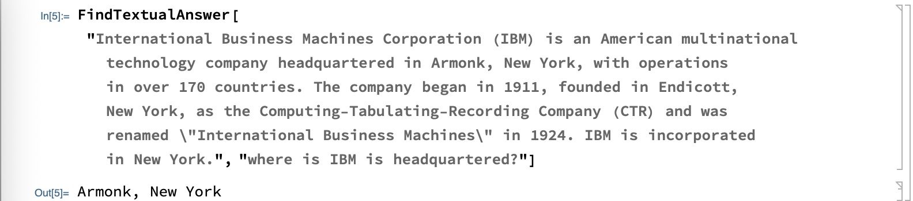

# Using Common Lisp with Wolfram/One

If you use [Wolfram/One](https://www.wolfram.com/wolfram-one/) then the material in this short chapter may interest you. The interface that I wrote is simple: I use **uiop:run-program** to spawn a new process to run the Wolfram Language command line tool that writes results to a temporary file. I then use **uiop:read-file-string** to read the results and parse them into a convenient form for use.

Before we build and use an interface to Wolfram/One, let's look at two screen shots of the Wolfram/One interface with examples that we will run later in Common Lisp. The first example finds entities in text:

{width=90%}


The second example uses a deep learning model to answer a question given text containing the answer to the question:

{width=90%}


Here is the **package.lisp** file for this example:

```lisp
(defpackage #:wolfram
  (:use #:cl #:uiop)
  (:export #:wolfram #:cleanup-lists
           #:find-answer-in-text #:entities))
```

And the **wolfram.asd** file:

```lisp
(asdf:defsystem #:wolfram
  :description "Wolfram Language interface experiments"
  :author "Mark Watson <markw@markwatson.com>"
  :license "Apache 2"
  :depends-on (#:uiop #:cl-json #:myutils)
  :components ((:file "package")
               (:file "wolfram")))
```

The implementation in **Wolfram.lisp** is simple enough. In lines 6-8 I create a Common Lisp *path* object in **/tmp** (and absolute pathname is required) and then use **file-namestring** to get just the file name as a string. In lines 8-10 we are creating an operating system shell and running the Wolfram Language command line tool with arguments to execute the query and write the results to the temporary file. In lines 11-15 we read the contents of the temporary file, delete the file, and decode the returned string as JSON data.

The Data returned form calling the Wolfram Language command line tool contains excess structure that we don't need (a sample of the raw returned data is shown later) so the function **cleanup-lists** shown in lines 17-19 discards heads of lists when the first value in a list or sublist is *Rule* or *List*. The function **recursive-remove** seen in lines 20-24 will remove all occurrences of an item from a nested list.

```lisp
(in-package #:wolfram)

;; General query utilities

(defun wolfram (statement)
  (let ((temp-file-path
         (file-namestring (uiop:tmpize-pathname "/tmp/wolfram"))))
    (uiop:run-program (concatenate 'string "wolframscript -code 'Export[\""
                                   temp-file-path "\"," statement
                                   ",\"ExpressionJSON\"]'"))
    (let* ((ret (uiop:read-file-string temp-file-path)))
      (delete-file temp-file-path)
      (with-input-from-string (s (myutils:replace-all
                                  (myutils:replace-all ret "\"'" "\"") "'\"" "\""))
        (json:decode-json s)))))

(defun cleanup-lists (r)
  (cdr (recursive-remove "Rule" (recursive-remove "List" r))))

(defun recursive-remove (item tree)
  (if (atom tree)
      tree
      (mapcar (lambda (nested-list) (recursive-remove item nested-list))
              (remove item tree :test #'equal))))

;; Higher level utilities for specific types of queries

(defun entities (text)
  (let* ((noquotes (myutils:replace-all (myutils:replace-all text "\"" " ") "'" " "))
         (query2
          (concatenate
           'string "TextCases['" noquotes
           "',  {'City', 'Country', 'Date', 'Person'} ->"
           " {'String', 'Interpretation', 'Probability'}]"))
         (query (myutils:replace-all query2 "'" "\"")))
    (remove-if #'(lambda (a) (null (cadr a)))
               (cleanup-lists (wolfram query)))))

(defun find-answer-in-text (text question)
  (let* ((nqtext (myutils:replace-all (myutils:replace-all text "\"" " ") "'" " "))
         (nqquestion (myutils:replace-all
                      (myutils:replace-all question "\"" " ") "'" " "))
         (query2 (concatenate 'string "FindTextualAnswer['" nqtext
                              "', '" nqquestion "']"))
         (query (myutils:replace-all query2 "'" "\"")))
    (wolfram query)))
```

The last two functions in the last code listing, **entities** and **find-answer-in-text** are higher level functions intended to work with the Wolfram Language procedures **TextCases** (see [Wolfram documentation for TextCases](https://reference.wolfram.com/language/ref/TextCases.html)) and **FindTextualAnswer** (see [Wolfram documentation for FindTextualAnswer](https://reference.wolfram.com/language/ref/FindTextualAnswer.html)).

The functions **cleanup-lists** and **recursive-remove** can be used to clean up results. First, we will just call function **wolfram** and show the raw results:

```
$ sbcl
* (ql:quickload "wolfram")
To load "wolfram":
  Load 1 ASDF system:
    wolfram
; Loading "wolfram"
[package myutils].................................
[package wolfram]
("wolfram")
* (setf example "TextCases['NYC, Los Angeles, and Chicago are the largest cities in the USA in 2018 according to Pete Wilson.', {'City', 'Country', 'Date', 'Person'} -> {'String', 'Interpretation', 'Probability'}]")
"TextCases['NYC, Los Angeles, and Chicago are the largest cities in the USA in 2018 according to Pete Wilson.', {'City', 'Country', 'Date', 'Person'} -> {'String', 'Interpretation', 'Probability'}]"
* (setf example-str (myutils:replace-all  example "'" "\""))
"TextCases[\"NYC, Los Angeles, and Chicago are the largest cities in the USA in 2018 according to Pete Wilson.\", {\"City\", \"Country\", \"Date\", \"Person\"} -> {\"String\", \"Interpretation\", \"Probability\"}]"
* (setf results (wolfram:wolfram example-str))
* (pprint results)

("Association"
 ("Rule" "City"
  ("List"
   ("List" "NYC" ("Entity" "City" ("List" "NewYork" "NewYork" "UnitedStates"))
    0.75583166)
   ("List" "Los Angeles"
    ("Entity" "City" ("List" "LosAngeles" "California" "UnitedStates"))
    0.84206486)
   ("List" "Chicago"
    ("Entity" "City" ("List" "Chicago" "Illinois" "UnitedStates"))
    0.91092855)))
 ("Rule" "Country"
  ("List" ("List" "USA" ("Entity" "Country" "UnitedStates") 0.9285077)))
 ("Rule" "Date"
  ("List"
   ("List" "2018" ("DateObject" ("List" 2018) "Year" "Gregorian" -7.0)
    0.8364356)))
 ("Rule" "Person"
  ("List"
   ("List" "Pete Wilson" ("Entity" "Person" "PeteWilson::s7259") 0.9274548))))
* 
```

Now we clean up the output:

```
* (defvar results-cleaned (wolfram:cleanup-lists results))
* (pprint results-cleaned)

(("City"
  (("NYC" ("Entity" "City" ("NewYork" "NewYork" "UnitedStates")) 0.75583166)
   ("Los Angeles" ("Entity" "City" ("LosAngeles" "California" "UnitedStates"))
    0.84206486)
   ("Chicago" ("Entity" "City" ("Chicago" "Illinois" "UnitedStates"))
    0.91092855)))
 ("Country" (("USA" ("Entity" "Country" "UnitedStates") 0.9285077)))
 ("Date" (("2018" ("DateObject" (2018) "Year" "Gregorian" -7.0) 0.8364356)))
 ("Person" (("Pete Wilson" ("Entity" "Person" "PeteWilson::s7259") 0.9274548))))
* 
```

Next we will try the two higher-level utility functions. The first example shows finding entities in text:

```lisp
CL-USER 21 > (pprint
               (wolfram:entities "Sedona Arizona is home to Mark Louis Watson"))

(("City"
  (("Sedona" ("Entity" "City" ("Sedona" "Arizona" "UnitedStates")) 0.8392784)))
 ("Person" (("Mark Louis Watson" "Mark Louis Watson" 0.9023427))))
```

The second example uses a Wolfram pre-trained deep learning model for question answering:

```lisp
CL-USER 22 > (pprint
               (wolfram::find-answer-in-text "International Business Machines Corporation (IBM) is an American multinational technology company headquartered in Armonk, New York, with operations in over 170 countries. The company began in 1911, founded in Endicott, New York, as the Computing-Tabulating-Recording Company (CTR) and was renamed \"International Business Machines\" in 1924. IBM is incorporated in New York."
                            "where is IBM is headquartered?"))

"Armonk, New York"
```

If you use Wolfram/One then these examples should get you started wrapping other Wolfram Language functionality for use in your Common Lisp applications.