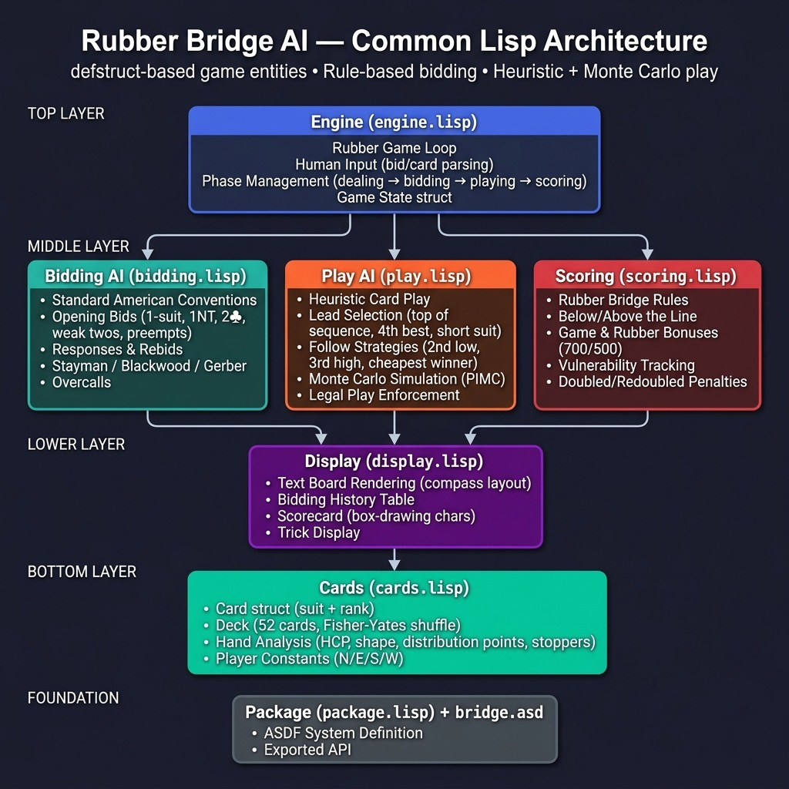

# Rubber Bridge AI — Common Lisp

A text-based rubber bridge game with AI opponents, implementing Standard American bidding conventions and heuristic card play AI.

## Architecture

## Architecture



```
┌──────────────────────────────────────────────────┐
│                 ENGINE (engine.lisp)              │
│  Rubber game loop, human input, phase mgmt       │
├──────────────┬──────────────┬────────────────────┤
│  BIDDING     │   PLAY       │   SCORING          │
│  (bidding.   │  (play.lisp) │  (scoring.lisp)    │
│   lisp)      │              │                    │
│              │  • Heuristic │  • Rubber bridge   │
│  • Standard  │    AI play   │  • Above/below     │
│    American  │  • Monte     │    the line        │
│  • Opening   │    Carlo     │  • Games & rubber  │
│    bids      │    sampling  │    bonuses         │
│  • Responses │  • Legal     │  • Vulnerability   │
│  • Overcalls │    plays     │    tracking        │
├──────────────┴──────────────┴────────────────────┤
│              DISPLAY (display.lisp)              │
│  Text rendering of board, hands, bids, tricks   │
├──────────────────────────────────────────────────┤
│              CARDS (cards.lisp)                  │
│  Card/Deck/Hand structures, HCP, distribution   │
├──────────────────────────────────────────────────┤
│              PACKAGE (package.lisp)              │
└──────────────────────────────────────────────────┘
```

## Quick Start

```lisp
;; Load the system
(asdf:load-system :bridge)

;; Play a full rubber interactively (you are South)
(bridge:play-bridge)

;; Run an auto-play deal (all AI, for testing)
(bridge:auto-play)
```

## Rubber Bridge Scoring

A **rubber** consists of multiple deals. Each side accumulates points:

- **Below the line**: Trick points for tricks bid and made (toward game)
- **Above the line**: Overtricks, slam bonuses, insult bonuses, penalties

A **game** is won when one side's below-the-line total reaches **100+**. Both sides' below-the-line scores reset. Winning a game makes that side **vulnerable**.

The **rubber** is won by the first side to win **2 games**:
- Win 2-0: **700 point** rubber bonus
- Win 2-1: **500 point** rubber bonus

## Features

### Bidding AI (Standard American Simplified)
- **Opening bids**: 1-suit (5-card majors), 1NT (15-17), 2♣ (strong), weak twos, preempts
- **Responses**: Major raises, NT responses, new suit bids, jump raises
- **Overcalls**: Simple overcalls, 1NT overcall with stoppers
- **Hand evaluation**: Milton Work HCP + length/shortness points

### Card Play AI
- **Heuristic play**: Opening leads (top of sequence, 4th best, short suit), second-hand low, third-hand high, cover honors
- **Following suit**: Win cheaply, duck when partner winning, signal
- **Monte Carlo** (prototype): Sample consistent deals, simulate with heuristic play, select card with best average outcome

### Game Flow
- **North declarer**: When your partner (North) wins the contract, your hands are automatically swapped so you play North's (declarer) hand while South's cards become dummy
- **Random deals**: Each game uses a fresh random seed for different hands every time
- **Dealer rotation**: Dealer rotates automatically each deal

## Bidding Input Format

| Input | Meaning |
|-------|---------|
| `1H`  | 1 Heart |
| `3NT` | 3 No Trump |
| `2S`  | 2 Spades |
| `PASS` or `P` | Pass |
| `DBL` or `X` | Double |
| `RDBL` or `XX` | Redouble |

## Card Play Input Format

| Input | Meaning |
|-------|---------|
| `AS`  | Ace of Spades |
| `KH`  | King of Hearts |
| `10C` | 10 of Clubs |
| `3D`  | 3 of Diamonds |
| `1`-`13` | Card by index number |

## Design Notes

The AI design follows the architecture established by GIB (Ginsberg's Intelligent Bridgeplayer) and modern bridge AI research:

1. **Bidding module** uses rule-based Standard American conventions
2. **Play module** uses heuristic card play with a Monte Carlo simulation layer
3. **Scoring** follows rubber bridge rules (below/above the line, game, rubber bonus)
