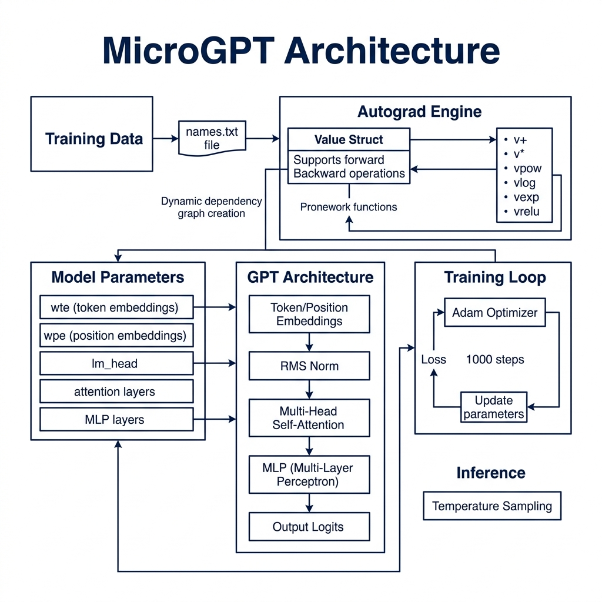

# microGPT – A Minimal Dependency‑Free GPT Implementation in Common Lisp


---

## Overview  

`microgpt.lisp` is a compact, self‑contained re‑implementation of Andrej Karpathy’s **microGPT** written entirely in Common Lisp.  
It demonstrates the core ideas of a transformer‑style language model—embedding lookup, multi‑head self‑attention, RMSNorm, a tiny feed‑forward network, and a simple training loop—without relying on external libraries.

The program can:

1. **Load a text corpus** (`names.txt`) and build a character‑level vocabulary.  
2. **Initialize model parameters** (embeddings, attention matrices, MLP weights) as small `value` objects that support automatic differentiation.  
3. **Train** the model for a configurable number of steps using Adam‑style updates.  
4. **Generate** short samples by autoregressively sampling from the learned distribution.

---

## File Structure  

| Section | Purpose |
|--------|---------|
| **Utility Functions** | Random Gaussian generator, list shuffling, line reading. |
| **Global Parameters** | Hyper‑parameters (`*n-layer*`, `*n-embd*`, `*block-size*`, …) and mutable globals (`*docs*`, `*uchars*`, `*state-dict*`, `*params*`). |
| **Autograd Core** | `value` struct + primitive ops (`v+`, `v*`, `vpow`, `vlog`, `vexp`, `vrelu`, …) and a reverse‑mode `backward` pass. |
| **Model Construction** | `make-matrix` creates weight tensors of `value`s; `init-model` populates `*state-dict*` with all required matrices. |
| **Forward Pass** | Functions `vlinear`, `vsoftmax`, `vrmsnorm`, and `gpt` implement the transformer block (RMSNorm → multi‑head attention → residual → MLP). |
| **Training Loop** | `run-training` performs tokenisation, forward passes, loss computation (negative log‑likelihood), back‑propagation, and Adam‑style parameter updates. |
| **Inference / Sampling** | `run-inference` runs the model in generation mode, sampling tokens with temperature‑scaled softmax. |
| **Entry Point** | `run-microgpt` prepares the dataset, builds the vocab, initializes the model, runs training, then prints a few generated samples. |

---

## Key Concepts  

### 1. Autograd with `value`  

Each scalar in the network is wrapped in a `value` object holding:

* `data` – the numeric value (single‑float).  
* `grad` – gradient accumulated during back‑propagation.  
* `children` – upstream nodes used to compute this node.  
* `local-grads` – partial derivatives w.r.t. each child.

Primitive operations (`v+`, `v*`, `vpow`, …) create new `value`s and record the computational graph.  
`backward` traverses the graph topologically, propagating gradients from the loss node outward.

### 2. Parameter Storage  

All trainable tensors live in a hash table `*state-dict*`.  
Keys are strings such as `"wte"` (token embeddings), `"layer0.attn_wq"` (query matrix for layer 0), etc.  
`make-matrix` builds a vector of vectors of `value`s, registers each weight in `*params*` (the ordered list used for Adam updates), and stores it in the dict.

### 3. Forward Pass (`gpt`)  

For a given token ID `tok-id` and position `pos-id`:

1. **Embedding Lookup** – token embedding (`wte`) + positional embedding (`wpe`).  
2. **RMSNorm** – stabilises activations.  
3. **Multi‑Head Attention** –  
   * Compute queries (`attn_wq`), keys (`attn_wk`), values (`attn_wv`).  
   * Cache keys/values per layer (`keys`, `vals`).  
   * Scaled dot‑product attention with softmax, then project back with `attn_wo`.  
   * Add residual connection.  
4. **Feed‑Forward MLP** – two linear layers separated by ReLU (`mlp_fc1` → `mlp_fc2`).  
5. **Output Projection** – final linear layer (`lm_head`) produces logits over the vocabulary.

All operations use the autograd‑aware primitives, so gradients flow automatically.

### 4. Training (`run-training`)  

* **Hyper‑parameters** – learning rate `lr`, Adam betas `b1`, `b2`, epsilon `eps`, total steps `steps`.  
* **Tokenisation** – each character is mapped to its index in `*uchars*`; a special BOS token (`*bos*`) marks sequence start/end.  
* **Loss** – for each position, compute cross‑entropy via `-log(p_target)`. Average over the block.  
* **Optimization** – Adam‑style moment estimates (`m`, `mv`) are updated per‑parameter; the parameter value is adjusted using bias‑corrected moments and a linear learning‑rate decay (`lr * (1 - step/steps)`).  
* **Progress Reporting** – prints `step | loss` each iteration.

### 5. Inference (`run-inference`)  

Generates 20 samples:

* Starts from BOS token.  
* At each step, obtains logits, rescales them (temperature ≈ 0.5), converts to probabilities, and draws a token via `random-choice`.  
* Stops when BOS appears again (end‑of‑sequence).  

Samples are printed as human‑readable strings.

---

## How to Run  

1. **Prepare a corpus** named `names.txt` (one line per example).  
2. Load the file in a Common Lisp REPL (SBCL, CLISP, etc.):

```lisp
(load "microgpt.lisp")
(microgpt:run-microgpt)
```

The program will:

Shuffle the lines, build the character vocabulary,
Initialise the model,
Train for the default 1000 steps (adjust steps inside run-training if desired),
Output a handful of generated names.


## Architecture


