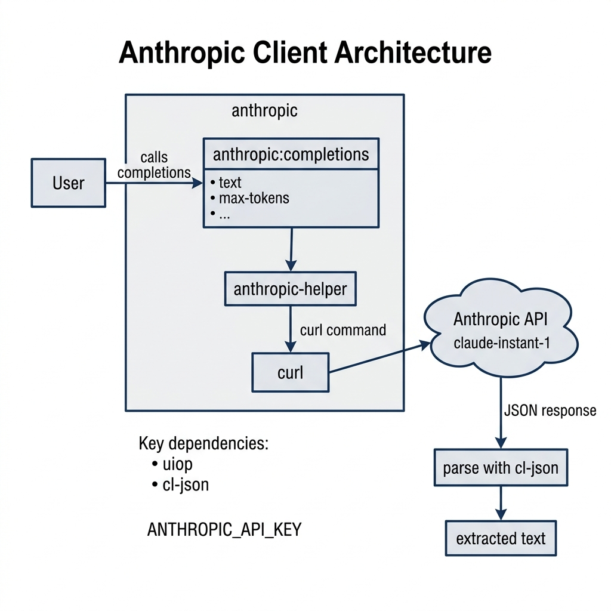

# Anthropic Claude Client Library

**Book Chapter:** [Using the OpenAI and Mistral APIs](https://leanpub.com/read/lovinglisp/using-the-openai-and-mistral-apis) — *Loving Common Lisp* (free to read online).

A Common Lisp client for the [Anthropic](https://www.anthropic.com/) Claude API. It sends text prompts to Claude and returns the model's completion as a string.

## Prerequisites

- **SBCL** with [Quicklisp](https://www.quicklisp.org/)
- An Anthropic API key — set the `ANTHROPIC_API_KEY` environment variable

## Dependencies

- `uiop`, `cl-json`, `drakma`

## Usage

```lisp
(ql:quickload :anthropic)

(anthropic:completions "The President went to Congress" 200)
;; => "I don't have enough context to comment on a specific President..."

(anthropic:completions "Mary is 30 and Bob is 25. Who is older?" 12)
;; => "Mary is older."
```

## Available Functions

- `(anthropic:completions text max-tokens)` — Send a prompt to the Anthropic API and return the text response. The `max-tokens` parameter controls the maximum length of the response.

## Architecture

