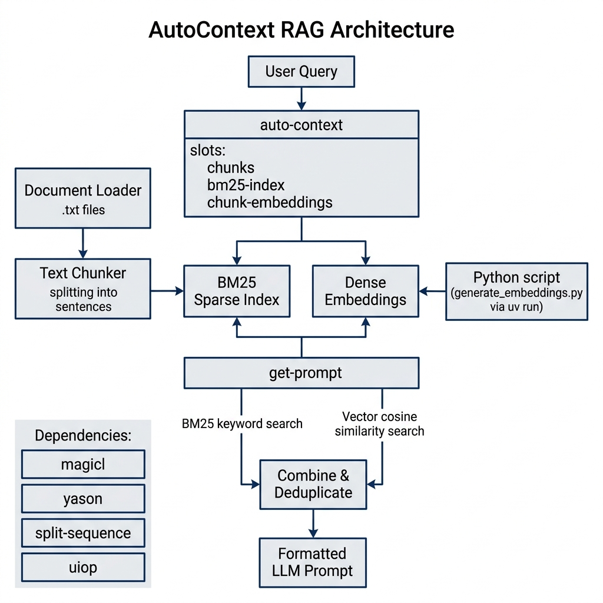

# AutoContext — Build Effective LLM Prompts from Large Text Datasets

**Book Chapter:** [AutoContext: Prepare Effective Prompts with Context for LLM Queries](https://leanpub.com/read/lovinglisp/autocontext-prepare-effective-prompts-with-context-for-llm-queries) — *Loving Common Lisp* (free to read online).

This example demonstrates how to build context for one-shot LLM prompts from large text datasets that would not fit in a single context window. It uses a combination of BM25 keyword scoring and deep-learning sentence embeddings to find the most relevant text chunks for a given query. The selected context is then used to construct a focused prompt for an LLM.

## Prerequisites

- **SBCL** with [Quicklisp](https://www.quicklisp.org/)
- Python package manager **uv** (for the embeddings helper script)
- Run SBCL with extra heap: `sbcl --dynamic-space-size 4096`

The Lisp side also needs [MAGICL](https://github.com/quil-lang/magicl) (matrix
algebra), `yason`, and `split-sequence`; all four are installed on demand by
Quicklisp when the system is loaded:

```text
$ sbcl --dynamic-space-size 4096
* (ql:quickload '(:magicl :yason :split-sequence))
```

(The `4096` is mebibytes — 4 GiB.)

## First-Time Setup

The Python embeddings script must be run once from the command line to download the transformer model from Hugging Face (this may take a few minutes):

```bash
echo "some text" | uv run generate_embeddings.py
```

## Dependencies

- ASDF system: `autocontext` (depends on `magicl`, `yason`, `split-sequence`, `uiop`, `litelm`)
- Python: `generate_embeddings.py` (uses a sentence-transformer model via `uv`)
- For `ask-with-context` / `ask-example`: a reachable model. The default,
  `autocontext:*chat-model*`, is `"ollama/qwen3.5:4b"`, so a local
  [Ollama](https://ollama.com) server needs no API key. Model access goes
  through [litelm](../litelm), and any other provider works by changing the
  `"provider/model"` string.

## Usage

```lisp
;; Start SBCL with extra memory
;; sbcl --dynamic-space-size 4096

(ql:quickload :autocontext)

;; Build the demo corpus and print the generated prompt. Returns the prompt
;; string as well, so it is easy to pipe into a model of your choosing.
(autocontext:run-example)

;; Or go all the way to an answer: build the corpus, retrieve context, and
;; have the model answer. Prints and returns the answer string.
(autocontext:ask-example)

;; For your own corpus and question, reuse a context object:
(defvar *ac* (make-instance 'autocontext:auto-context
                            :directory-path "/path/to/text/files/"))
(autocontext:ask-with-context *ac* "your question here")
```

## How It Works

1. **Chunking** — Large text files are split into manageable chunks.
2. **BM25 scoring** (`bm25.lisp`) — Chunks are ranked by keyword relevance using the BM25 algorithm.
3. **Embedding similarity** — A Python subprocess generates sentence embeddings via a transformer model, and cosine similarity is used to re-rank chunks.
4. **Context assembly** — The top-ranked chunks are merged, deduplicated by chunk index, and concatenated into a context string that fits within an LLM's token limit.

## Files

| File | Description |
|------|-------------|
| `main.lisp` | Entry point and orchestration (defines the `autocontext` package) |
| `bm25.lisp` | BM25 keyword relevance scoring |
| `generate_embeddings.py` | Python helper for sentence embeddings |

## Architecture


