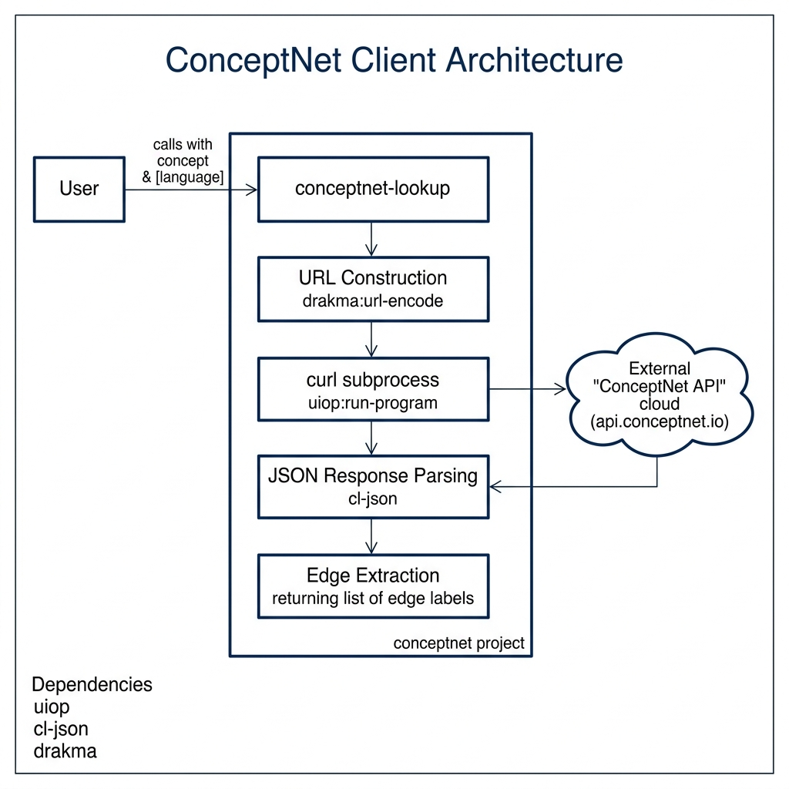

# ConceptNet Client Library

**Book Chapter:** [Natural Language Processing](https://leanpub.com/read/lovinglisp/natural-language-processing) — *Loving Common Lisp* (free to read online).

> **Note:** This example is no longer included in the current edition of the book but remains in the repository for reference.

A Common Lisp client for the [ConceptNet](https://conceptnet.io/) commonsense knowledge graph API. Given a concept (word or short phrase), it queries ConceptNet's REST API and returns the natural-language "surface text" descriptions of the relationships involving that concept — for example, "Arizona is a state in the United States."

## Prerequisites

- **SBCL** with [Quicklisp](https://www.quicklisp.org/)
- Internet access (queries the ConceptNet API at `api.conceptnet.io`)

## Dependencies

- `uiop`, `drakma`, `cl-json`

## Usage

```lisp
(ql:quickload :conceptnet)

;; Look up commonsense knowledge about a concept
(conceptnet:conceptnet "arizona")
;; => ("Arizona is a state." "Arizona is located in the United States." ...)

(conceptnet:conceptnet "prescott")
```

## Available Functions

- `(conceptnet:conceptnet query)` — Query ConceptNet for a concept and return a list of surface-text descriptions.

## Architecture


