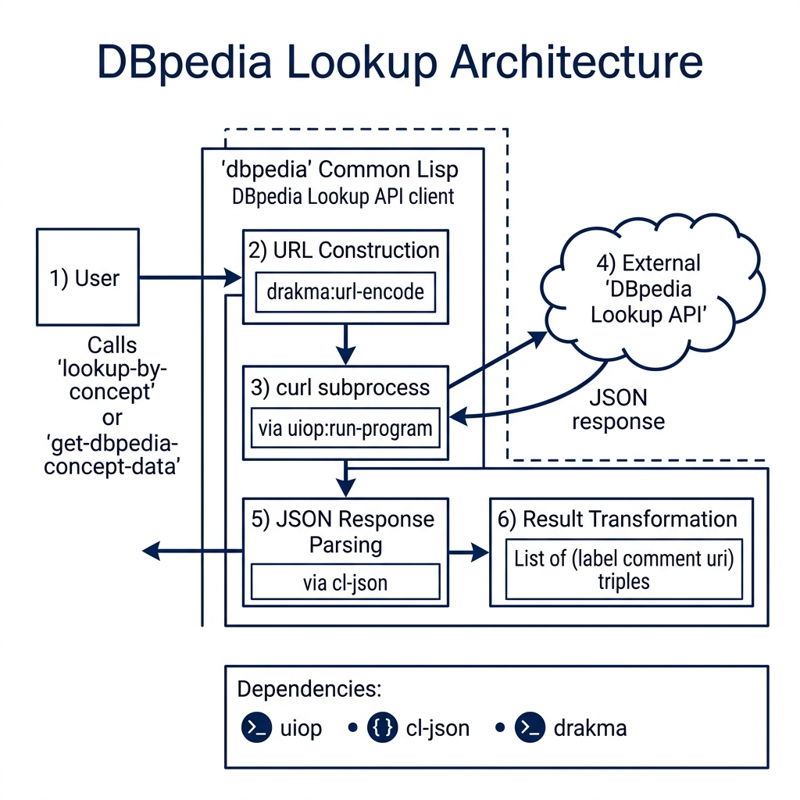

# DBpedia Lookup Client Library

**Book Chapter:** [Semantic Web and Linked Data](https://leanpub.com/read/lovinglisp/semantic-web-and-linked-data) — *Loving Common Lisp* (free to read online).

> **Note:** This example is no longer included in the current edition of the book but remains in the repository for reference.

A Common Lisp client for the [DBpedia Lookup](https://lookup.dbpedia.org/) service. Given a search string, it queries the DBpedia keyword-search API, parses the XML response, and returns structured `dbpedia-data` objects containing the URI, label, and description for each matching entity.

DBpedia is a project that extracts structured data from Wikipedia and makes it available as Linked Data on the Semantic Web.

## Prerequisites

- **SBCL** with [Quicklisp](https://www.quicklisp.org/)
- Internet access (queries `lookup.dbpedia.org`)

## Dependencies

- `drakma`, `babel`, `s-xml`

## Usage

```lisp
(ql:quickload "dbpedia")

;; Look up entities matching a keyword
(dbpedia:dbpedia-lookup "berlin")
;; => (#S(DBPEDIA-DATA :URI "http://dbpedia.org/resource/Berlin"
;;                     :LABEL "Berlin"
;;                     :DESCRIPTION "Berlin is the capital of Germany...")
;;    ...)
```

## Available Functions

- `(dbpedia:dbpedia-lookup search-string)` — Search DBpedia and return a list of `dbpedia-data` structs with `:uri`, `:label`, and `:description` slots.

## Architecture


