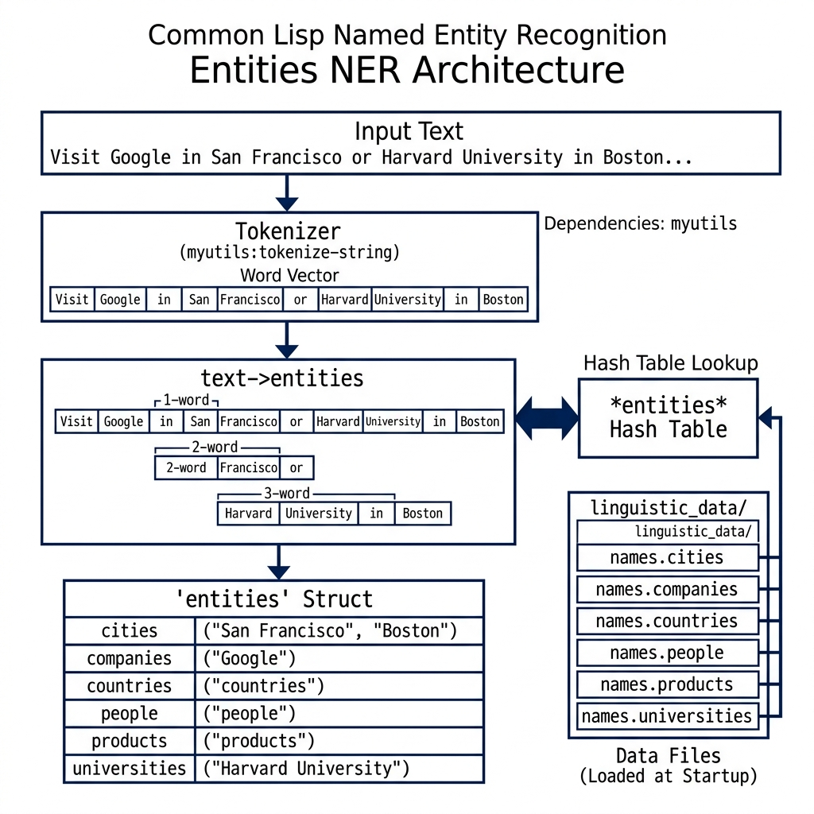

# Named Entity Recognition (NER)

**Book Chapter:** [Natural Language Processing](https://leanpub.com/read/lovinglisp/natural-language-processing) — *Loving Common Lisp* (free to read online).

A dictionary-based named entity recognition library implemented in pure Common Lisp. It scans input text for known entity names and classifies them into categories: **cities**, **companies**, **countries**, **people**, **products**, and **universities**. The recognizer considers 1-word, 2-word, and 3-word phrases to match multi-word entity names.

No external APIs or machine-learning models are needed — all lookups are performed against bundled data files loaded into a hash table at initialization time.

## Prerequisites

- **SBCL** with [Quicklisp](https://www.quicklisp.org/)
- The `myutils` library (sibling directory in this repository)

## Dependencies

- `myutils`

## Usage

```lisp
(ql:quickload "entities")

(entities:make-entities-object
  "President Bill Clinton ran for president of the USA")
;; => #S(ENTITIES :CITIES NIL :COMPANIES NIL :COUNTRIES ("USA")
;;               :PEOPLE ("Bill Clinton") :PRODUCTS NIL :UNIVERSITIES NIL)

(entities:make-entities-object
  "She studied at MIT and then joined Google in San Francisco.")
```

## Data Files

The `linguistic_data/` subdirectory contains lists of known entity names (one per line) for each category. These are loaded automatically when the system is first loaded.

## Available Functions

- `(entities:make-entities-object text)` — Analyze text and return an `entities` struct with categorized entity names.
- `(entities:text->entities text)` — Lower-level function that returns extracted entities from text.

## Architecture


