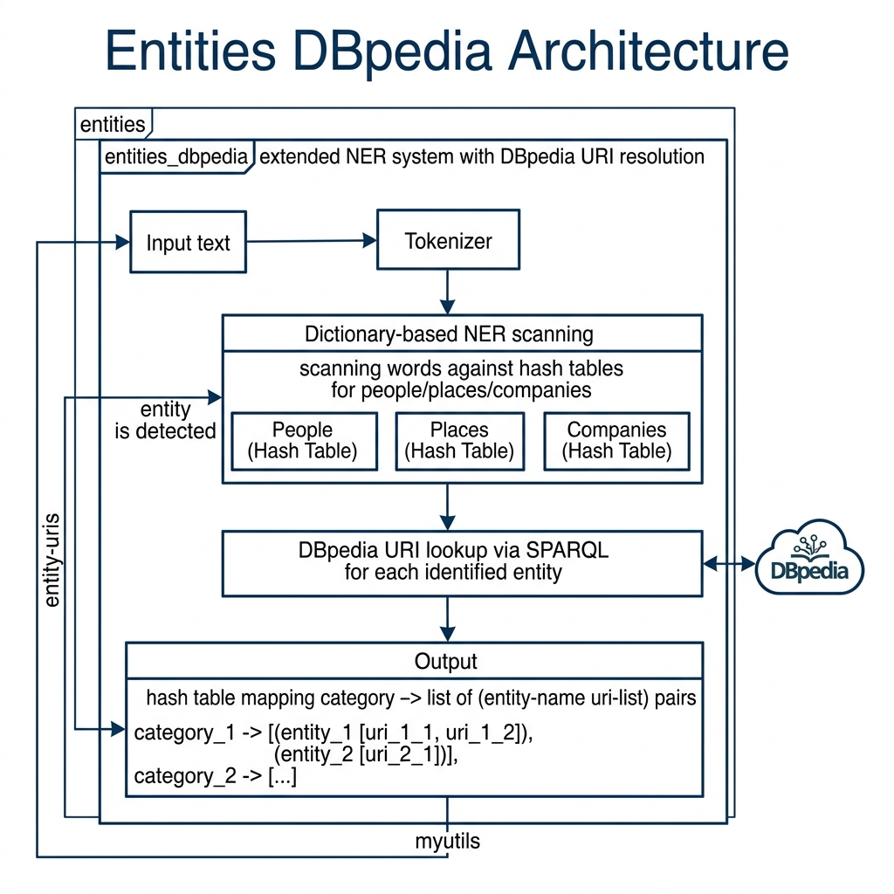

# Entity-to-DBpedia URI Resolution

**Book Chapter:** [Knowledge Graph Navigator Common Code and NLP Utilities](https://leanpub.com/read/lovinglisp/knowledge-graph-navigator-common-code-and-nlp-utilities) — *Loving Common Lisp* (free to read online).

This library finds named entities in free text and resolves each one to its corresponding DBpedia URI. It loads bundled data files mapping entity names (cities, companies, countries, people, music groups, political parties, trade unions, universities, and broadcast companies) to their DBpedia resource URIs. The result is a hash table you can iterate over to see which entities were found and their Linked Data identifiers.

## Prerequisites

- **SBCL** with [Quicklisp](https://www.quicklisp.org/)
- The `myutils` library (sibling directory in this repository)

## Dependencies

- `split-sequence`, `myutils`

## Usage

```lisp
(ql:quickload "entities_dbpedia")

(defvar an-entity-hash
  (entities_dbpedia:find-entities-in-text
    "Bill Clinton and George Bush went to Mexico and England
     and watched Univision. They shopped at Best Buy and
     listened to Al Stewart."))

;; Iterate over discovered entities and their DBpedia URIs
(entities_dbpedia:entity-iterator
  #'(lambda (key value)
      (format t "~A  =>  ~A~%" key value))
  an-entity-hash)
```

## Data Files

The `data/` subdirectory contains tab-separated files mapping entity names to DBpedia URIs for each category.

## Available Functions

- `(entities_dbpedia:find-entities-in-text text)` — Scan text for entities and return a hash table mapping entity names to DBpedia URIs.
- `(entities_dbpedia:entity-iterator fn hash)` — Iterate over entity results, calling `fn` with each key-value pair.

## Architecture


