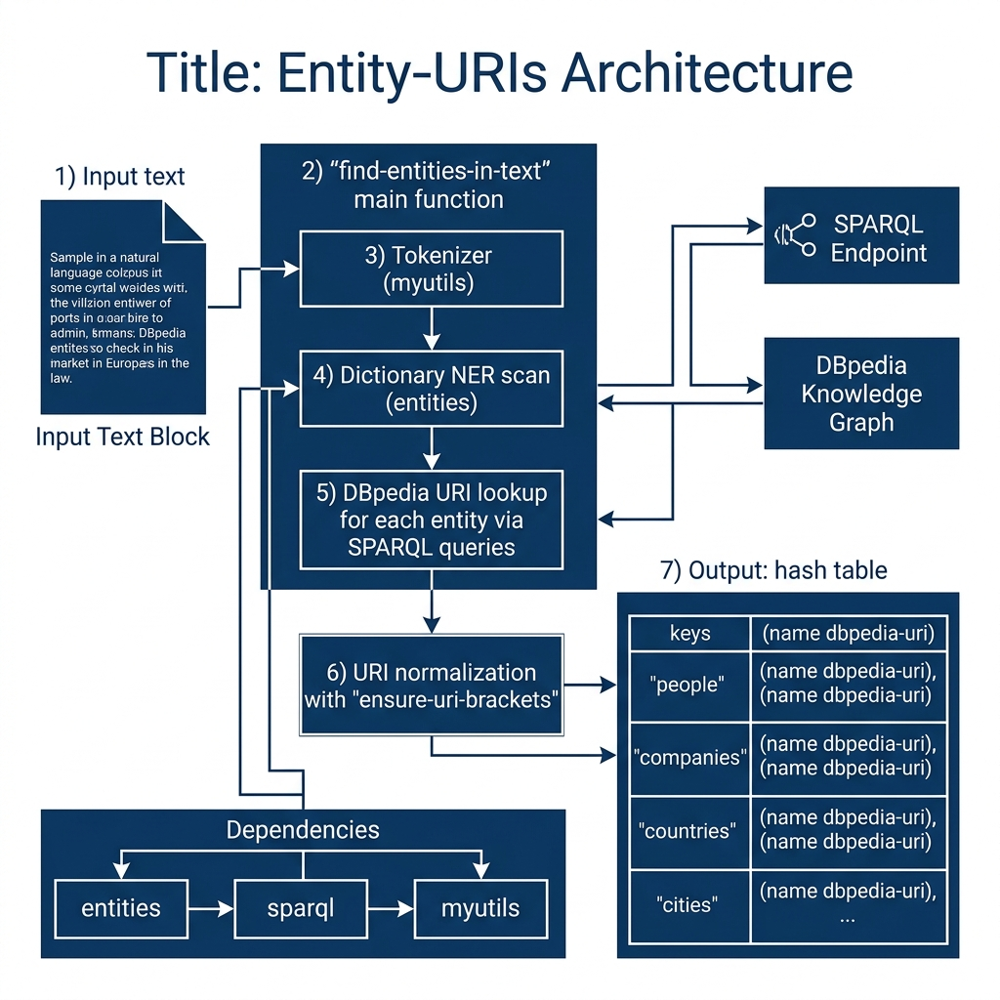

# Entity URI Utilities

**Book Chapter:** [Knowledge Graph Navigator Common Code and NLP Utilities](https://leanpub.com/read/lovinglisp/knowledge-graph-navigator-common-code-and-nlp-utilities) — *Loving Common Lisp* (free to read online).

This library provides utilities for discovering named entities in text and resolving them to DBpedia URIs. It loads data files mapping known entity names (cities, companies, countries, people, music groups, political parties, trade unions, universities, and broadcasters) to their DBpedia resource URIs. It also provides helper functions for normalizing and formatting URIs used in SPARQL queries.

This package is a dependency of several other libraries in this repository, including `kbnlp`, `kgn-common`, and `entities_dbpedia`.

## Prerequisites

- **SBCL** with [Quicklisp](https://www.quicklisp.org/)
- The `myutils` library (sibling directory in this repository)

## Dependencies

- `split-sequence`, `myutils`

## Usage

```lisp
(ql:quickload "entity-uris")

;; Pretty-print entities found in text with their DBpedia URIs
(entity-uris:pp-entities
  "Bill Clinton and George Bush went to Mexico and England
   and watched Univision. They shopped at Best Buy.")

;; Ensure a URI has angle brackets for SPARQL queries
(entity-uris:ensure-uri-brackets "http://dbpedia.org/resource/Berlin")
;; => "<http://dbpedia.org/resource/Berlin>"
```

## Data Files

The `data/` subdirectory contains tab-separated files mapping entity names to DBpedia URIs for each category.

## Available Functions

- `(entity-uris:pp-entities text)` — Find entities in text and pretty-print them with their DBpedia URIs.
- `(entity-uris:ensure-uri-brackets uri)` — Normalize a URI string so it is wrapped in angle brackets.

## Architecture


