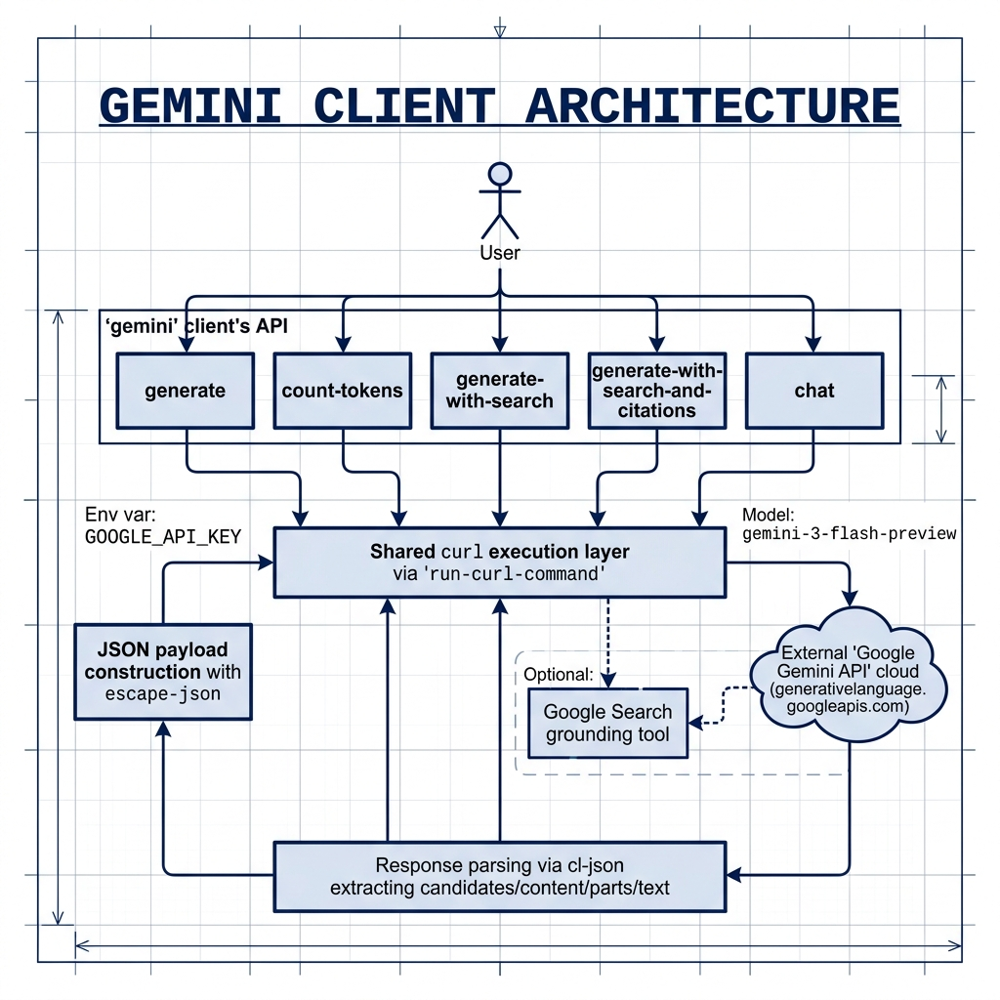

# Common Lisp library to access Google Gemini LLM APIs

**Book Chapter:** [Client Library for the Google Gemini LLM APIs](https://leanpub.com/read/lovinglisp/client-library-for-the-google-gemini-llm-apis) — *Loving Common Lisp* (free to read online).


This library provides a Common Lisp interface to Google's Gemini Large Language Models via the **Interactions API** (v1beta). It uses the new `steps` response schema (Api-Revision: 2026-05-20) and supports text generation, token counting, chat conversations, Google Search grounding, and multi-turn function calling.

This project was originally forked from a library for Perplexity AI in the book [Loving Common Lisp](https://leanpub.com/lovinglisp) by Mark Watson.

## Setting your GOOGLE_API_KEY API key

Define the `GOOGLE_API_KEY` environment variable with the value of your Google API key. You can obtain an API key from the [Google AI Studio](https://aistudio.google.com/app/apikey).

## Dependencies

This library depends on:
- `uiop`
- `cl-json`
- `dexador`
- `alexandria`


Ensure these are available in your Quicklisp local-projects or via ASDF.

## Usage

Load the library using Quicklisp or ASDF:
```common-lisp
(ql:quickload :gemini)
;; or
(asdf:load-system :gemini)
```

### Basic Generation

To generate text from a prompt:
```common-lisp
(gemini:generate "In one sentence, explain how AI works to a child.")
;; => "AI is like a super smart computer brain that learns from information to answer questions and do tasks."
```

### Generation with Google Search Grounding

```common-lisp
(gemini:generate-with-search "What sci-fi movies are playing in Flagstaff today?")

;; With citations:
(multiple-value-bind (text citations)
    (gemini:generate-with-search-and-citations "Who won the Super Bowl in 2024?")
  (format t "Answer: ~a~%~%Sources:~%" text)
  (loop for (title . url) in citations
        do (format t "- ~a: ~a~%" title url)))
```

### Multi-Turn Function Calling

```common-lisp
;; 1. Define a tool
(defparameter *get-weather-fn*
  (gemini:make-function-declaration
   "getWeather"
   "Get the weather in a given location"
   '(("location" "STRING" "The city and state, e.g. San Francisco, CA"))
   '("location")))

;; 2. Turn 1 — send query with tools
(multiple-value-bind (text function-calls interaction-id)
    (gemini:generate-with-tools "What's the weather in Barrow, AK?" (list *get-weather-fn*))
  (cond
    (function-calls
     ;; 3. Handle function calls and continue
     (let ((final (gemini:continue-with-function-responses
                   interaction-id
                   (list (list :name (getf (first function-calls) :name)
                               :id   (getf (first function-calls) :id)
                               :response "Very cold. 22°F."))
                   (list *get-weather-fn*))))
       (format t "Final: ~a~%" final)))
    (text
     (format t "Response: ~a~%" text))))
```

### Counting Tokens

To count the number of tokens a prompt will consume for a specific model:
```common-lisp
(gemini:count-tokens "How many tokens is this sentence?")
;; => 8 (example output, actual may vary)
```

## Available Functions
- `(gemini:generate prompt &optional model-id)`: Generates text from a prompt.
- `(gemini:generate-with-search prompt &optional model-id)`: Generates text with Google Search grounding.
- `(gemini:generate-with-search-and-citations prompt &optional model-id)`: Returns text and citation pairs.
- `(gemini:make-function-declaration name description parameters &optional required)`: Creates a tool declaration.
- `(gemini:generate-with-tools prompt declarations &key model-id google-search-p)`: Turn 1 with tools.
- `(gemini:continue-with-function-responses id responses declarations &key model-id google-search-p)`: Turn 2+.
- `(gemini:count-tokens prompt &optional model-id)`: Counts tokens for a prompt.

## API Details

- **Endpoint:** `POST https://generativelanguage.googleapis.com/v1beta/interactions`
- **Schema:** New `steps` array (Api-Revision: 2026-05-20) — replaces the legacy `outputs` array
- **Default model:** `gemini-3-flash-preview`


## Original Project Information

The original project from which this was adapted can be found in the repository https://github.com/mark-watson/loving-common-lisp. The `Makefile` mentioned in the original README for fetching library examples is specific to that book's comprehensive collection of projects. This current library is a focused adaptation for Gemini.

## Architecture


