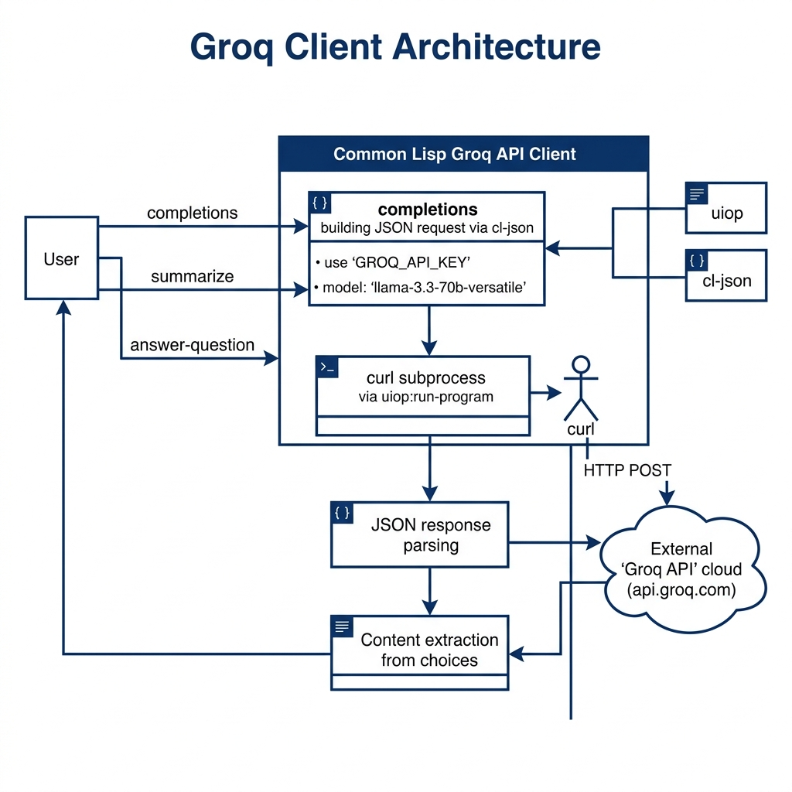

# Groq LLM Client Library

**Book Chapter:** [More Agents Using X's Grok and Perplexity APIs](https://leanpub.com/read/lovinglisp/more-agents-using-xs-grok-and-perplexity-apis) — *Loving Common Lisp* (free to read online).

A Common Lisp client for the [Groq](https://groq.com/) cloud LLM inference service. Groq provides fast inference for open-source models via their OpenAI-compatible API.

## Prerequisites

- **SBCL** with [Quicklisp](https://www.quicklisp.org/)
- A Groq API key — set `GROQ_API_KEY`

## Dependencies

- `uiop`, `cl-json`

## Usage

```lisp
(ql:quickload "groq")

(defvar resp (groq:groq-completion "Explain quantum computing in two sentences."))
(groq:groq-extract-content resp)

;; Interactive REPL loop (type "quit" to exit)
(groq:user-input)
```

## Available Functions

- `(groq:groq-completion content)` — Send a prompt and return the API response.
- `(groq:groq-extract-content response)` — Extract text content from a response.
- `(groq:user-input)` — Interactive REPL loop.

## Architecture


