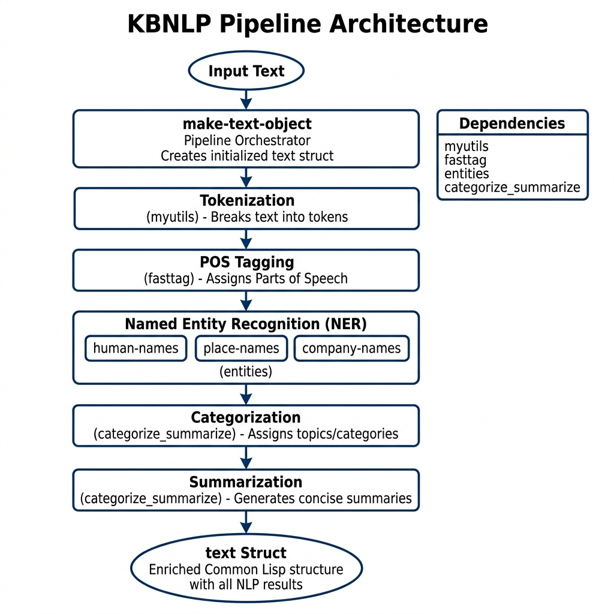

# kbnlp — Knowledge Base NLP Library

**Book Chapter:** [Natural Language Processing](https://leanpub.com/read/lovinglisp/natural-language-processing) — *Loving Common Lisp* (free to read online).

A comprehensive pure Common Lisp NLP library that combines part-of-speech tagging, named entity recognition, text categorization, and extractive summarization into a single `text` object. Given a string of text, `make-text-object` returns a struct containing human names, place names, company names, category tags, key words, and a summary.

This library builds on `fasttag` (POS tagger) and `entity-uris` (entity resolution) and is used by the Knowledge Graph Navigator application.

## Prerequisites

- **SBCL** with [Quicklisp](https://www.quicklisp.org/)
- Sibling libraries: `myutils`, `fasttag`, `entity-uris`

## Dependencies

- `myutils`, `fasttag`, `entity-uris`

## Usage

```lisp
(ql:quickload "kbnlp")

(kbnlp:make-text-object
  "President Bill Clinton ran for president of the USA.
   He campaigned on better public health care.")
;; => #S(TEXT :URL "" :TITLE "" :SUMMARY "..." :CATEGORY-TAGS (...)
;;           :KEY-WORDS (...) :KEY-PHRASES (...) :HUMAN-NAMES ("Bill Clinton")
;;           :PLACE-NAMES ("USA") :COMPANY-NAMES NIL :TEXT "..." :TAGS (...))
```

## Building a Standalone Executable

```bash
$ sbcl
* (ql:quickload "kbnlp")
* (defun main () (print (kbnlp:make-text-object "President Bill Clinton ran for president of the USA")))
* (sb-ext:save-lisp-and-die "kbnlptest" :toplevel #'main :executable t)
```

## Available Functions

- `(kbnlp:make-text-object text &key url title)` — Analyze text and return a `text` struct with NER, POS tags, categories, and summary.

## Data Files

The `linguistic_data/` subdirectory contains name lists, category tables, and other data loaded at initialization.

## Architecture


