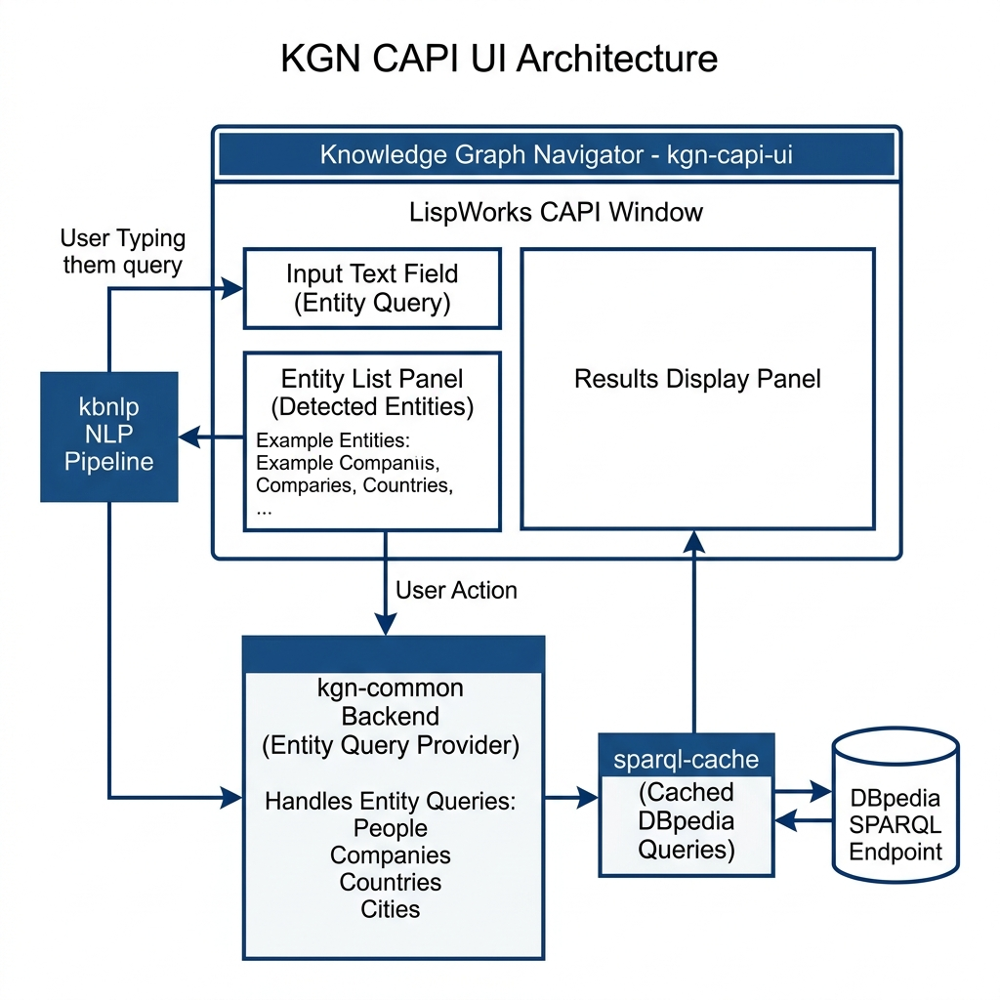

# Knowledge Graph Navigator — LispWorks CAPI GUI

**Book Chapter:** [Knowledge Graph Navigator User Interface Using LispWorks CAPI](https://leanpub.com/read/lovinglisp/knowledge-graph-navigator-user-interface-using-lispworks-capi) — *Loving Common Lisp* (free to read online).

A graphical desktop front-end for the Knowledge Graph Navigator, built using the LispWorks CAPI (Common Application Programming Interface) widget toolkit. It provides interactive dialogs for selecting discovered entities, a syntax-highlighted SPARQL display, and a graph viewer (via `lw-grapher`) for visualizing relationships returned from DBpedia.

## Prerequisites

- **LispWorks** (commercial Common Lisp with CAPI support)
- Sibling libraries: `kgn-common`, `sparql`, `kbnlp`, `lw-grapher`
- The `trivial-open-browser` Quicklisp library

> **Note:** This example requires LispWorks and will not run on SBCL or other free Common Lisp implementations.

## Dependencies

- `kgn-common`, `sparql`, `kbnlp`, `lw-grapher`, `trivial-open-browser`

## Usage

```lisp
(ql:quickload "kgn-capi-ui")
(kgn-capi-ui:kgn-capi-ui)
```

This launches the GUI. Enter a natural-language query; the system extracts entities, queries DBpedia via SPARQL, and displays results in a graphical navigator.

## Files

| File | Description |
|------|-------------|
| `kgn-capi-ui.lisp` | Main entry point and entity-selection dialogs |
| `user-interface.lisp` | CAPI layout, panes, and event wiring |
| `option-pane.lisp` | Custom option-pane widgets |
| `colorize.lisp` | SPARQL syntax highlighting for display |
| `package.lisp` | Package definition |

## Architecture


