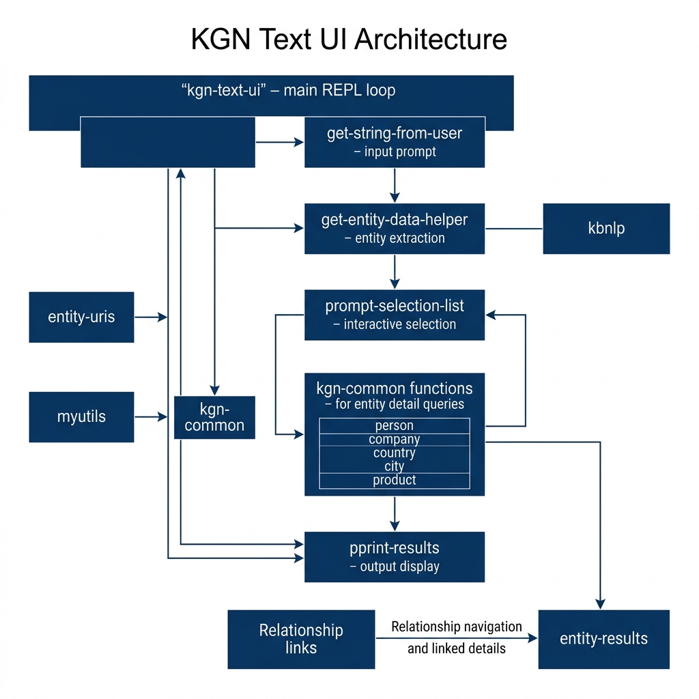

# Knowledge Graph Navigator — Text-Based UI

**Book Chapter:** [Knowledge Graph Navigator Text-Based User Interface](https://leanpub.com/read/lovinglisp/knowledge-graph-navigator-text-based-user-interface) — *Loving Common Lisp* (free to read online).

A terminal-based interactive front-end for the Knowledge Graph Navigator. It presents entity-selection menus in the console, letting you choose which discovered entities to explore further via DBpedia SPARQL queries. This provides the same core functionality as the LispWorks CAPI GUI version but runs in any Common Lisp REPL.

## Prerequisites

- **SBCL** with [Quicklisp](https://www.quicklisp.org/)
- Sibling libraries: `kgn-common`, `sparql`, `kbnlp`, `myutils`

## Dependencies

- `kgn-common`, `sparql`, `kbnlp`, `myutils`

## Usage

```lisp
(ql:quickload "kgn-text-ui")
(kgn-text-ui:kgn-text-ui)
```

Enter a natural-language query at the prompt. The system will:
1. Extract named entities from your query
2. Present numbered selection menus for each entity category (people, places, etc.)
3. Query DBpedia for the selected entities
4. Display the results in the terminal

## Architecture


