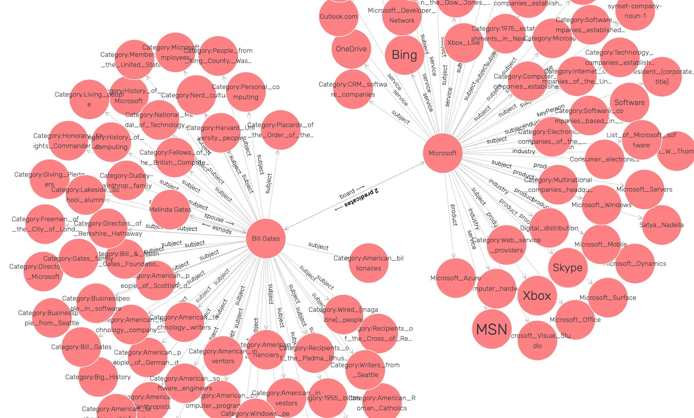

# Knowledge Graph Sampler

Given a list of entity URIs from DBPedia, generate N-Triple data like the sample file `sample-KG.nt`.

From my book URI: https://leanpub.com/lovinglisp

There is a **Makefile** in the repo https://github.com/mark-watson/loving-common-lisp that can be copied
to your **~/quicklisp/local-projects** directory. Then in **~/quicklisp/local-projects** run:

    make fetch

to get all of the library examples from my book.


Run sample program:

      (kgsampler::create-sample-KG)

Note: I used the free edition of GraphDB to load the N-Triple file and export to the Turtle file `sample-KG.ttl` that I find easier to read.

The sample program uses the following DBPedia entity URIs (change this to what you want):

```lisp
'("<http://dbpedia.org/resource/Bill_Gates>" "<http://dbpedia.org/resource/Steve_Jobs>"
     "<http://dbpedia.org/resource/Microsoft>" "<http://dbpedia.org/resource/Melinda_Gates>"
     "<http://dbpedia.org/resource/Apple_Inc.>"
     "<http://dbpedia.org/resource/California>" "<http://dbpedia.org/resource/Seatle>"
     "<http://dbpedia.org/resource/Software>" "<http://dbpedia.org/resource/Computer>"
     "<http://dbpedia.org/resource/Artificial_Intelligence>" "<http://dbpedia.org/resource/Economy>"
     "<http://dbpedia.org/resource/Politics>" "<http://dbpedia.org/resource/Corporation>")
   "sample-KG.nt")
```

Here I am using GraphDB to show a small part of the generated RDF triples:



Also, this example is set up for people and companies. I may expand it in the future to other types of entities as I need them.

I wrote this to pull small "mini Knowledge Graphs" from DBPedia. It runs O(N^2) where N is the number of input URIs so be carefull if seeding **create-sample-KG** with a large number of entity URIs.


