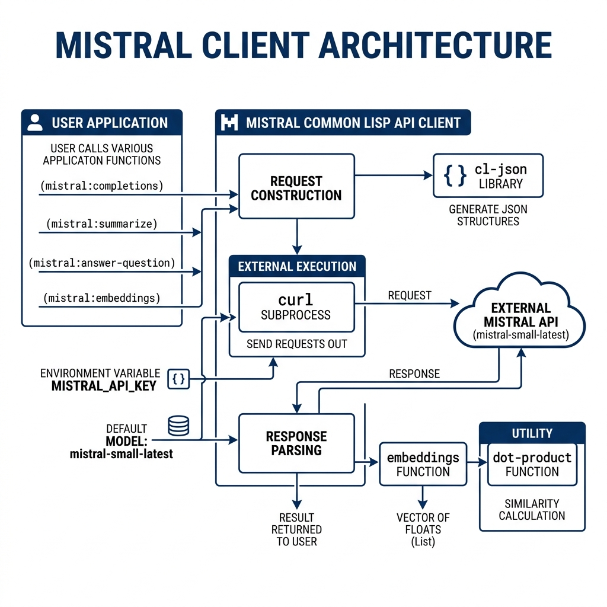

# Mistral LLM Client Library

**Book Chapter:** [Using the OpenAI and Mistral APIs](https://leanpub.com/read/lovinglisp/using-the-openai-and-mistral-apis) — *Loving Common Lisp* (free to read online).

A Common Lisp client for the [Mistral AI](https://mistral.ai/) chat completions API. It provides functions for text generation, summarization, and question answering using Mistral's hosted models.

## Prerequisites

- **SBCL** with [Quicklisp](https://www.quicklisp.org/)
- A Mistral API key — set the `MISTRAL_API_KEY` environment variable

## Dependencies

- `uiop`, `cl-json`

## Usage

```lisp
(ql:quickload :mistral)

;; Basic completion
(mistral:completions "The President went to Congress" 200)

;; Summarize text
(mistral:summarize "Long article text here..." 100)

;; Answer a question
(mistral:answer-question "What is the capital of France?" 50)
```

## Configuration

The default model is `mistral-small-latest`. You can change it:

```lisp
(setf mistral:*default-model* "mistral-medium-latest")
```

Or pass a model per call:

```lisp
(mistral:completions "Hello" 50 "mistral-large-latest")
```

## Available Functions

- `(mistral:completions text &optional max-tokens model)` — Generate a completion.
- `(mistral:summarize text &optional max-tokens model)` — Summarize text.
- `(mistral:answer-question question &optional max-tokens model)` — Answer a question.

## Architecture


