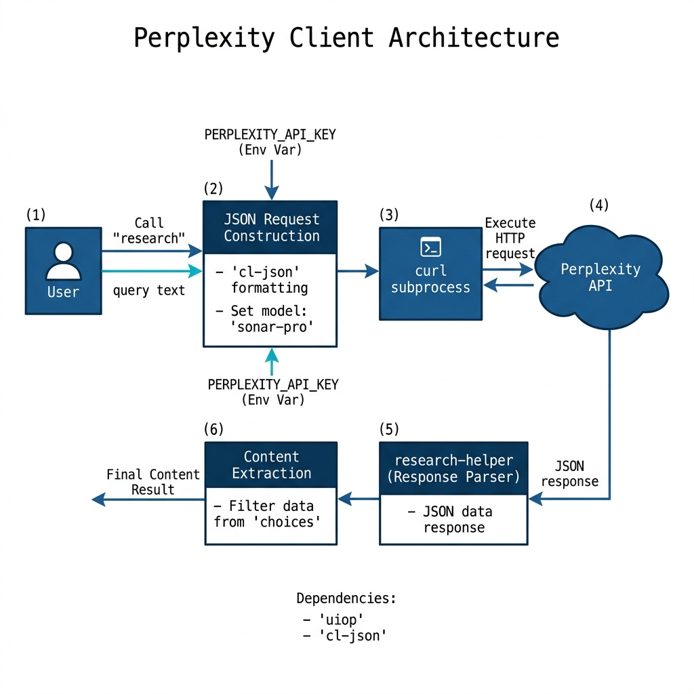

# Perplexity Sonar Search and LLM Client Library

**Book Chapter:** [Using the Perplexity Sonar Web Search and LLM APIs](https://leanpub.com/read/lovinglisp/using-the-perplexity-sonar-web-search-and-llm-apis) — *Loving Common Lisp* (free to read online).

A Common Lisp client for the [Perplexity AI](https://www.perplexity.ai/) Sonar API. Unlike standard LLM APIs, Perplexity Sonar combines web search with language model reasoning, so responses include up-to-date information retrieved from the internet.

## Prerequisites

- **SBCL** with [Quicklisp](https://www.quicklisp.org/)
- A Perplexity API key — set the `PERPLEXITY_API_KEY` environment variable

## Dependencies

- `uiop`, `cl-json`

## Usage

```lisp
(ql:quickload :perplexity)

;; Research a topic — Perplexity searches the web and synthesizes an answer
(perplexity:research "What are the latest developments in Common Lisp?")
```

## Configuration

The default model is `sonar-pro`. You can change it:

```lisp
(setf perplexity:*model* "sonar")
```

## Available Functions

- `(perplexity:research query)` — Send a search+LLM query and return the text response with web-sourced information.

## Architecture


