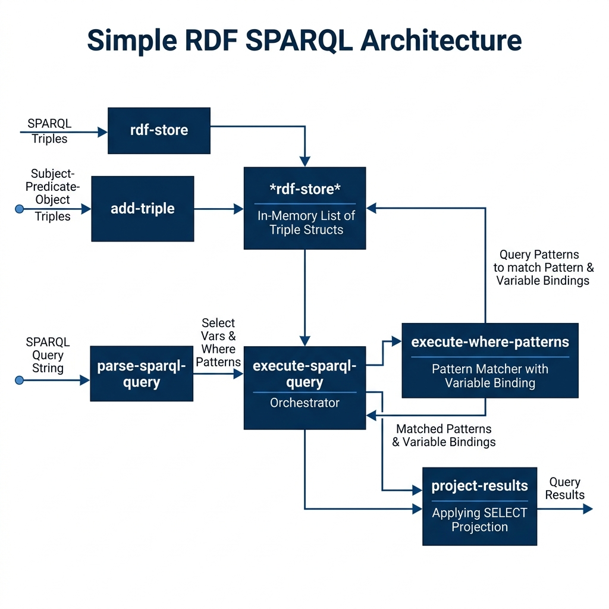

# Simple RDF Datastore with Partial SPARQL Support

**Book Chapter:** [Implementing a Simple RDF Datastore and Partial SPARQL Support in Common Lisp](https://leanpub.com/read/lovinglisp/implementing-a-simple-rdf-datastore-and-partial-sparql-support-in-common-lisp) — *Loving Common Lisp* (free to read online).

A self-contained, in-memory RDF triple store with a partial SPARQL query engine, implemented in pure Common Lisp with no external dependencies. It supports adding and removing triples, pattern matching with SPARQL-style variables (`?x`, `?y`), and executing multi-pattern `SELECT … WHERE` queries with automatic variable binding and join.

This is a pedagogical implementation designed to illustrate how RDF stores and SPARQL query processing work internally.

## Prerequisites

- **SBCL** with [Quicklisp](https://www.quicklisp.org/)

## Dependencies

None (pure Common Lisp).

## Usage

```lisp
(ql:quickload "simple_rdf_sparql")

;; Add triples
(simple_rdf_sparql:add-triple "Mark" "likes" "Common Lisp")
(simple_rdf_sparql:add-triple "Mark" "worksAt" "home")
(simple_rdf_sparql:add-triple "Alice" "likes" "Python")

;; Print all stored triples
(simple_rdf_sparql:print-all-triples)

;; Execute a SPARQL-style query
(simple_rdf_sparql:execute-sparql-query
  "SELECT ?person ?lang WHERE { ?person likes ?lang }")
;; => ((("?person" . "Alice") ("?lang" . "Python"))
;;     (("?person" . "Mark") ("?lang" . "Common Lisp")))

;; Run built-in tests
(simple_rdf_sparql:test)
```

## Available Functions

- `(add-triple subject predicate object)` — Store a triple.
- `(remove-triple subject predicate object)` — Remove a triple.
- `(print-all-triples)` — Print every triple in the store.
- `(execute-sparql-query query-string)` — Parse and execute a `SELECT … WHERE` query, returning bindings.
- `(test)` — Run built-in smoke tests.

## Architecture


