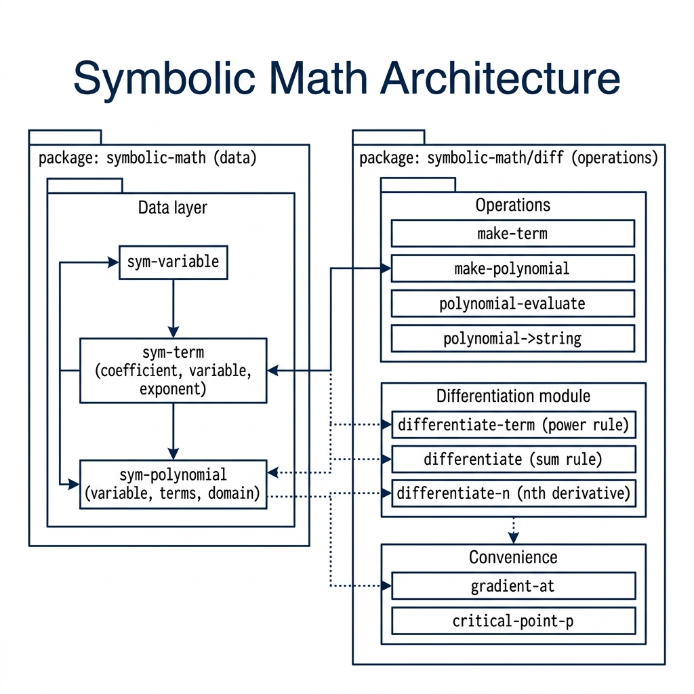

# Symbolic Math — Common Lisp

**Book Chapter:** [Symbolic Mathematics in Common Lisp](https://leanpub.com/read/lovinglisp/symbolic-mathematics-in-common-lisp) — *Loving Common Lisp* (free to read online).


A foundational library for **symbolic mathematics** in Common Lisp.
`data.lisp` defines the core data structures and operations used by the
rest of the system (`differentiation.lisp`, `integration.lisp`, etc.).

---

## Project Structure

```
symbolic-math/
├── symbolic-math.asd    ← ASDF system definition
├── data.lisp            ← data structures (this document)
├── differentiation.lisp ← symbolic differentiation (builds on data.lisp)
├── integration.lisp     ← symbolic integration    (builds on data.lisp)
├── architecture.png
└── README.md
```

---

## Data Structures

All types are implemented with `defstruct` (functional style, no CLOS).
The package is `SYMBOLIC-MATH`; load with `(load "data.lisp")`.

### 1. `sym-variable` — Symbolic Variable

Represents a mathematical variable such as *x*, *y*, or *t*.

| Slot | Type | Default | Description |
|------|------|---------|-------------|
| `name` | `symbol` | — | The variable name (e.g. `'x`) |
| `domain` | `keyword` | `:real` | One of `:real`, `:complex`, `:integer` |

**Constructor:** `make-variable name &key (domain :real)`

```lisp
(defparameter x (make-variable 'x))
(defparameter n (make-variable 'n :domain :integer))
```

**Predicate:** `variable-p obj` → boolean  
**Accessors:** `variable-name`, `variable-domain`  
**Equality:** `(variable= a b)` — true when name and domain both match

---

### 2. `sym-constant` — Named Constant

A symbolic constant with an optional closed-form name.

| Slot | Type | Description |
|------|------|-------------|
| `name` | `symbol` | Human-readable label (e.g. `'pi`) |
| `value` | `real` \| `:pi` \| `:e` | Exact or symbolic value |

**Constructor:** `make-constant name value`

```lisp
(defparameter PI-CONST (make-constant 'pi :pi))
(defparameter E-CONST  (make-constant 'e  :e))
(defparameter G        (make-constant 'g  9.80665))
```

**Predicate:** `constant-p obj`  
**Accessors:** `constant-name`, `constant-value`  
**Numeric evaluation:** `(constant-numeric-value c)`

The two symbolic values resolve to a `double-float`; a stored number is
returned unchanged, so its type is whatever you supplied.

```lisp
(constant-numeric-value PI-CONST)  ; => 3.141592653589793d0  (double-float)
(constant-numeric-value E-CONST)   ; => 2.718281828459045d0  (double-float)
(constant-numeric-value G)         ; => 9.80665              (single-float)
```

---

### 3. `sym-term` — Monomial

A single term of the form **c · xⁿ**.

| Slot | Type | Description |
|------|------|-------------|
| `coefficient` | `real` | Numeric coefficient *c* |
| `variable` | `sym-variable` | The variable *x* |
| `exponent` | `(integer 0 *)` | Non-negative integer exponent *n* |

**Constructor:** `make-term coefficient variable exponent`

```lisp
;; 3x²
(make-term 3 x 2)
;; -x
(make-term -1 x 1)
;; constant 5  (exponent = 0)
(make-term 5 x 0)
```

**Predicate:** `term-p obj`  
**Accessors:** `term-coefficient`, `term-variable`, `term-exponent`

| Function | Signature | Returns |
|----------|-----------|---------|
| `term=` | `(term= a b)` | `T` if structurally equal |
| `term-negate` | `(term-negate term)` | New term `-coefficient` |
| `term-scale` | `(term-scale term scalar)` | New term `scalar·coefficient` |
| `term->string` | `(term->string term)` | Human-readable string |

```lisp
(term->string (make-term 3 x 2))   ; => "3x^2"
(term->string (make-term -1 x 1))  ; => "-1x"
(term->string (make-term 5 x 0))   ; => "5"
```

The variable is down-cased, and a coefficient of one is **not** elided:
the term `x` prints as `1x`, and an exponent of one is written without `^1`.

---

### 4. `sym-polynomial` — Polynomial

A polynomial in **one variable** stored as an ordered list of `sym-term`
records (descending exponent).  Like-degree terms are **automatically
combined** on construction; zero-coefficient terms are dropped.

| Slot | Type | Description |
|------|------|-------------|
| `variable` | `sym-variable` | The indeterminate |
| `terms` | `list` of `sym-term` | Terms, descending exponent |
| `domain` | `keyword` | `:real` (default) or `:complex` |

**Constructor:** `make-polynomial variable terms &key (domain :real)`

```lisp
(let* ((x (make-variable 'x))
       ;; 3x² - x + 5
       (p (make-polynomial x (list (make-term  3 x 2)
                                   (make-term -1 x 1)
                                   (make-term  5 x 0))))
       ;; x + 2
       (q (make-polynomial x (list (make-term 1 x 1)
                                   (make-term 2 x 0)))))
  (list (polynomial->string (polynomial-add p q))
        (polynomial->string (polynomial-subtract p q))
        (polynomial->string (polynomial-scale p 2))))
;; => ("3x^2 + 7" "3x^2 + -2x + 3" "6x^2 + -2x + 10")
```

**Predicate:** `polynomial-p obj`  
**Accessors:** `polynomial-variable`, `polynomial-terms`, `polynomial-domain`

#### Inspection

| Function | Returns |
|----------|---------|
| `(polynomial-degree poly)` | Highest exponent; `-1` for zero polynomial |
| `(polynomial-leading-term poly)` | First (highest-degree) `sym-term`, or `NIL` |

#### Arithmetic

All arithmetic functions return **new** polynomials; inputs are never mutated.
`polynomial-add` and `polynomial-subtract` accept operands from different
domains and produce a result in the wider one (`:real` ⊂ `:complex`).

| Function | Description |
|----------|-------------|
| `(polynomial-add p q)` | *p* + *q* |
| `(polynomial-subtract p q)` | *p* − *q* |
| `(polynomial-negate poly)` | −*p* |
| `(polynomial-scale poly scalar)` | *scalar* · *p* |
| `(polynomial-normalize poly)` | Re-sort and drop zero terms |

#### Evaluation

```lisp
;; with p = 3x² - x + 5
(polynomial-evaluate p 0)  ; => 5
(polynomial-evaluate p 1)  ; => 7
(polynomial-evaluate p 2)  ; => 15
```

#### Display

```lisp
(polynomial->string p)  ; => "3x^2 + -1x + 5"
```

#### Convenience Constructors

| Function | Description |
|----------|-------------|
| `(zero-polynomial var &key domain)` | The zero polynomial (no terms) |
| `(constant-polynomial var val)` | Constant polynomial *val* |
| `(identity-polynomial var)` | *x* (degree-1, coefficient 1) |

`zero-polynomial` takes a `:domain` keyword defaulting to `:real`; the
differentiation and integration layers pass the domain of their input
through so that reducing a complex polynomial to zero does not silently
reset it to `:real`.

---

### 5. `sym-integral` — Definite or Indefinite Integral

Stores an unevaluated integral expression together with its bounds.

| Slot | Type | Description |
|------|------|-------------|
| `integrand` | any (typically `sym-polynomial`) | The expression ∫ *f*(*x*) |
| `variable` | `sym-variable` | Variable of integration |
| `lower` | `real` \| `sym-constant` \| `NIL` | Lower bound (NIL → indefinite) |
| `upper` | `real` \| `sym-constant` \| `NIL` | Upper bound (NIL → indefinite) |

**Constructor:** `make-integral integrand variable &key lower upper`

Either both `lower` and `upper` must be provided, or neither.

```lisp
;; Indefinite: ∫ (3x² - x + 5) dx
(make-integral p x)

;; Definite: ∫₀¹ (3x² - x + 5) dx
(make-integral p x :lower 0 :upper 1)

;; Definite with a sym-constant bound: ∫₀^π p dx
(make-integral p x :lower 0 :upper (make-constant 'pi :pi))
```

**Predicate:** `integral-p obj`  
**Accessors:** `integral-integrand`, `integral-variable`, `integral-lower`, `integral-upper`

| Function | Returns |
|----------|---------|
| `(integral-definite-p i)` | `T` if the integral has explicit bounds |
| `(integral->string i)` | Human-readable Unicode representation |

```lisp
(integral->string (make-integral p x))          ; => "∫(3x^2 + -1x + 5) dx"
(integral->string (make-integral p x :lower 0 :upper 1))
;; => "∫[0,1](3x^2 + -1x + 5) dx"
(integral->string (make-integral p x :lower 0 :upper (make-constant 'pi :pi)))
;; => "∫[0,π](3x^2 + -1x + 5) dx"
```

A `sym-constant` bound is rendered with its mathematical glyph (`:pi` → `π`),
and the variable name is down-cased.

---

## Differentiation

The `SYMBOLIC-MATH/DIFF` package (`differentiation.lisp`) implements the
power rule and the sum rule.

| Function | Description |
|----------|-------------|
| `(differentiate-term term)` | Power rule on one `sym-term`; `NIL` for a constant |
| `(differentiate poly)` | Derivative of a polynomial |
| `(differentiate-n poly n)` | *n*-th derivative |
| `(gradient-at poly value)` | Numeric value of the derivative at a point |
| `(critical-point-p poly value &key tolerance)` | `T` when \|p'(value)\| < tolerance |

```lisp
;; with p = 3x² - x + 5
(differentiate p)          ; => 6x - 1
(gradient-at p 1)          ; => 5
(critical-point-p p 1/6)   ; => T
```

## Integration

The `SYMBOLIC-MATH/INTEG` package (`integration.lisp`) implements the
reverse power rule and the Fundamental Theorem of Calculus.

| Function | Description |
|----------|-------------|
| `(integrate-term term)` | Reverse power rule on one `sym-term` |
| `(integrate poly)` | Antiderivative, without `+C` |
| `(integrate-n poly n)` | *n*-th iterated antiderivative |
| `(evaluate-definite poly lower upper)` | Numeric ∫[lower,upper] poly dx |
| `(evaluate-integral integral)` | Numeric value of a definite `sym-integral` |
| `(make-indefinite-integral poly)` | `sym-integral` shell, no bounds |
| `(make-definite-integral poly lower upper)` | `sym-integral` shell with bounds |

`evaluate-integral` is the bridge between the shell objects and the numeric
evaluator: it validates that the integral is definite and that its integrand
is a polynomial, then delegates to `evaluate-definite`.

```lisp
;; with p = 3x² - x + 5
(evaluate-definite p 0 1)                        ; => 5.5d0
(evaluate-integral (make-definite-integral p 0 1))  ; => 5.5d0
```

Division in `integrate-term` is exact, so integrating `-x` yields the
rational coefficient `-1/2` rather than a float.

---

## Packages

| Package | File | Notes |
|---------|------|-------|
| `SYMBOLIC-MATH` | `data.lisp` | Exports the whole public API |
| `SYMBOLIC-MATH/DIFF` | `differentiation.lisp` | `(:use #:cl #:symbolic-math)` |
| `SYMBOLIC-MATH/INTEG` | `integration.lisp` | `(:use #:cl #:symbolic-math)` |

Both dependent packages declare `(:shadow #:run-smoke-test)`. Because
`SYMBOLIC-MATH` exports `run-smoke-test` and the other packages `:use` it,
a bare `(defun run-smoke-test ...)` would otherwise redefine
`SYMBOLIC-MATH:RUN-SMOKE-TEST` instead of defining a package-local function,
leaving all three files sharing one smoke test.

---

## Loading & Quick Test

```lisp
;; Preferred: load the ASDF system (its :serial t orders the three files)
(asdf:load-system :symbolic-math)
;; or, with Quicklisp:
(ql:quickload :symbolic-math)

;; Load a single file directly (it bootstraps data.lisp for you)
(load "data.lisp")
(in-package :symbolic-math)

;; Run the built-in smoke test
(run-smoke-test)
```

Each package has its own smoke test:

```lisp
(symbolic-math:run-smoke-test)         ; data layer
(symbolic-math/diff:run-smoke-test)    ; differentiation
(symbolic-math/integ:run-smoke-test)   ; integration
```

Expected output of the data-layer test:

```
=== Symbolic Math Data Layer Smoke Test ===

p         : 3x^2 + -1x + 5
q         : 1x + 2
p + q     : 3x^2 + 7
p - q     : 3x^2 + -2x + 3
2 * p     : 6x^2 + -2x + 10
degree(p) : 2
p(0)      : 5
p(1)      : 7
p(2)      : 15
indef     : ∫(3x^2 + -1x + 5) dx
def       : ∫[0,1](3x^2 + -1x + 5) dx
pi-int    : ∫[0,π](3x^2 + -1x + 5) dx

===========================================
```

---

## Design Notes

- **No CLOS** — all types use `defstruct` for a functional, value-oriented style.
- **Immutability** — arithmetic functions always return fresh structs.
- **Single-variable polynomials** — multi-variable support is future work; `differentiation.lisp` and `integration.lisp` build directly on these structures.
- **Automatic normalisation** — `make-polynomial` combines like terms and sorts on every call, so the representation is always canonical.
- **Domain tracking** — `zero-polynomial` and `polynomial-add` preserve or widen the `:real`/`:complex` domain instead of dropping it.
- **Bound flexibility** — integral bounds accept plain numbers or `sym-constant` structs, making it straightforward to express bounds like *π* or *e* symbolically.
- **Exact rationals** — `integrate-term` divides with `/`, so coefficients stay exact until you ask for a float.

## Architecture


