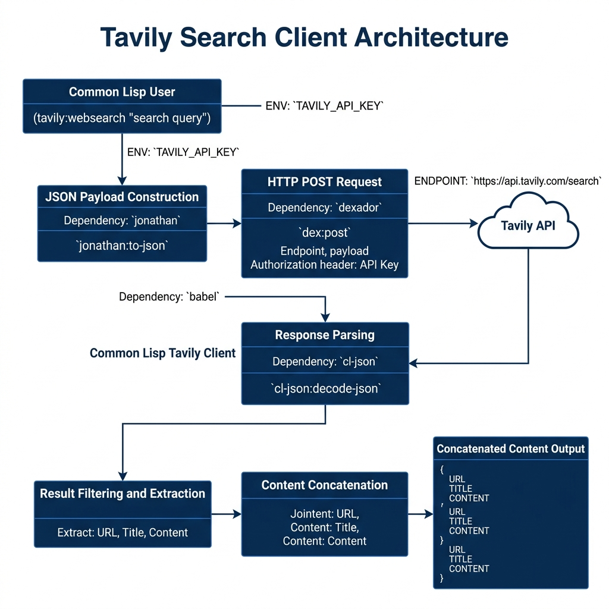

# Tavily Web Search Client Library

**Book Chapter:** [Client Library for the Tavily Web Search APIs](https://leanpub.com/read/lovinglisp/client-library-for-the-tavily-web-search-apis) — *Loving Common Lisp* (free to read online).

A Common Lisp client for the [Tavily](https://tavily.com/) Search API. Tavily is an AI-optimized search engine designed for use by LLM agents and RAG pipelines. This library sends search queries and returns structured results containing the URL, title, and content snippet for each hit.

## Prerequisites

- **SBCL** with [Quicklisp](https://www.quicklisp.org/)
- A Tavily API key — set the `TAVILY_API_KEY` environment variable. You can obtain a key at [tavily.com](https://tavily.com/).

## Dependencies

- `uiop`, `cl-json`, `dexador`, `jonathan`, `babel`

## Usage

```lisp
(ql:quickload :tavily)

;; Perform a web search
(tavily:websearch "Fun things to do in Sedona Arizona")
;; => (("https://..." "Top Activities in Sedona" "Here are the best things...") ...)
```

## Available Functions

- `(tavily:websearch query)` — Search the web via Tavily and return a list of `(url title content)` results (up to 5 by default).

## Architecture


